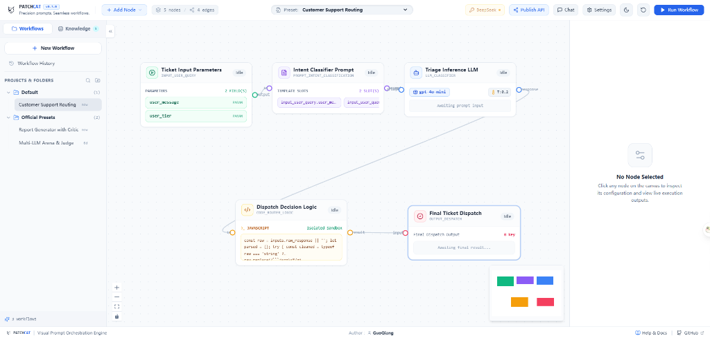
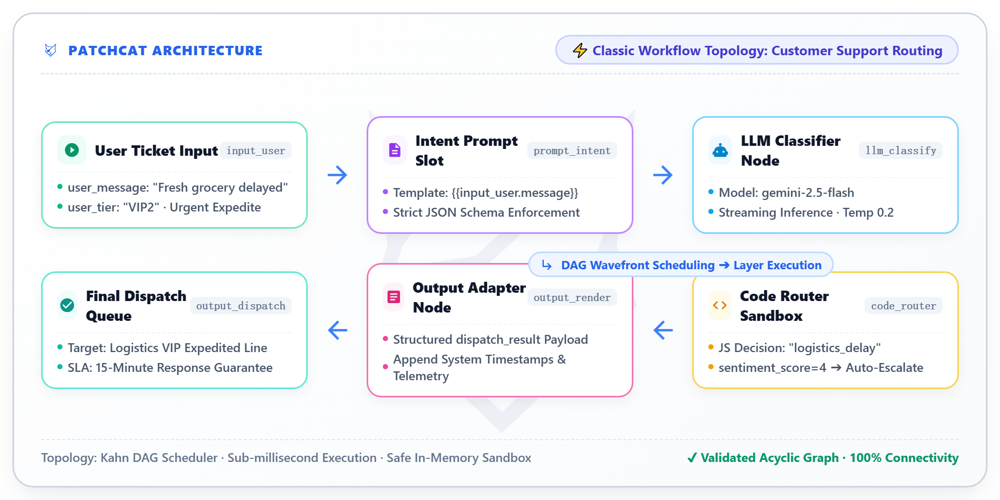

<div align="center">
  <a href="https://github.com/GuoBug/PatchCat">
    
  </a>

  # PatchCat

  <p>
    <strong>Precision prompts. Seamless workflows.</strong>
  </p>

  <p>
    <em>The open-source, visual prompt orchestration and multi-agent workflow engine built for next-generation AI applications.</em>
  </p>

  <p>
    <a href="https://github.com/GuoBug/PatchCat/releases"></a>
    <a href="https://opensource.org/licenses/MIT"></a>
    <a href="https://www.typescriptlang.org/"></a>
    <a href="https://react.dev/"></a>
    <a href="https://reactflow.dev/"></a>
    <a href="https://vite.dev/"></a>
    <a href="https://github.com/GuoBug/PatchCat/actions"></a>
  </p>

  <p>
    <strong><a href="README.md">English</a></strong> | <strong><a href="README_CN.md">简体中文</a></strong> | <strong><a href="docs/quick-start.md">📖 Quick Start Guide</a></strong>
  </p>

  <p>
    <a href="https://GuoBug.github.io/PatchCat/" target="_blank">
      
    </a>
    <a href="https://codespaces.new/GuoBug/PatchCat" target="_blank">
      
    </a>
  </p>
</div>

---

## 🌟 What is PatchCat?

**PatchCat** is a modern, lightweight, yet enterprise-grade **visual prompt orchestration platform and DAG execution engine**. Designed for AI engineers, prompt designers, and developers building agentic workflows, PatchCat makes it effortless to chain prompts, LLMs, autonomous agents, code transformations, and conditional routers into robust, parallelized pipelines.

With **zero mandatory backend setup** (Client-Only BYOK Mode) and direct connectivity to **Google Gemini, DeepSeek, OpenAI, SiliconFlow, and local Ollama**, PatchCat delivers high-performance prompt engineering right inside your browser with enterprise-grade telemetry and zero data leakage.

<p align="center">
  
</p>

<p align="center">
  <em>PatchCat Visual DAG Canvas — Drag-and-drop workflow builder with real-time LLM token streaming</em>
</p>

<p align="center">
  
</p>


---

## 🥊 Feature Matrix & Comparison

Why choose **PatchCat** over heavyweight orchestration tools?

| Feature / Metric | **PatchCat 🐱 (Ours)** | **Flowise** | **Dify** | **Langflow** |
| :--- | :--- | :--- | :--- | :--- |
| **Architecture** | **100% Client-Side / Edge** | Node.js + Backend DB | Python + Celery + Redis + Postgres | Python + Backend DB |
| **Deployment Weight** | **Zero Setup (Static Web / 0MB)** | Heavy (Docker Compose) | Enterprise Heavy (~2GB+ Docker) | Heavy (Pip / Docker) |
| **Data Privacy** | **Zero Data Leakage (BYOK In-Browser)** | Server-stored Keys | Server-stored Keys | Server-stored Keys |
| **Local LLM Support** | **Direct Ollama Web API** | Proxy Bridge Required | Docker Network Configuration | Backend Proxy |
| **Execution Engine** | **Kahn Topological DAG Scheduler** | Sequential Graph | Async Event Worker | Directed Graph |
| **Cold Start Latency**| **< 300 ms** | 10 ~ 30 s | 30 ~ 60 s | 15 ~ 30 s |
| **Memory Footprint** | **< 35 MB (Browser Tab)** | ~300 MB | ~1.5 GB | ~500 MB |
| **Code Node Sandbox**| **Native JS / Isolated Worker** | VM2 Sandbox | Python Sandbox | Restricted Python |

---

## 🚀 Key Features

### 1. 🤖 Autonomous AI Agent & ReAct Tool Calling (Phase 4)
- **Built-in ReAct Loop**: Enclosed `Think -> Act -> Observe -> Think` cycle with cycle prevention and maxIterations safeguards.
- **Universal Tool Calling Client**: Full support for OpenAI, Gemini, and DeepSeek standard tool schemas with streaming `delta.tool_calls` assembly.
- **Multi-Type Tool Dispatcher**: Route to sandboxed JavaScript (`builtin_code`), external REST endpoints (`builtin_http`), or delegate to canvas nodes (`canvas_node`).
- **Loop & Sub-Workflow Primitives**: Dynamic array batch iterator (`LoopNode`) and composite workflow encapsulation (`SubWorkflowNode`).

### 2. 🎨 Visual DAG Canvas & Topology Scheduler
- **Drag-and-Drop Workflow Builder**: Built on `@xyflow/react` (React Flow v12) with 12 specialized node components (`Input`, `Prompt`, `LLM`, `Agent`, `Loop`, `Sub-Workflow`, `Code`, `Output`, `Knowledge`, `Condition`, `Aggregator`, `HTTP`).
- **Dynamic Conditional Routing & Skipping**: IF/ELSE multi-branch evaluation with dynamic downstream skipping and variable aggregation.
- **Interactive Chat Debug & API Publishing**: Slide-over Chat panel (`Ctrl+Shift+D`) and instant FastAPI REST endpoint generation with API Key auth.

### 2. ⚡ Multi-Vendor Model Hub & Dynamic Discovery
- **Direct Cloud & Local LLM Connectivity**:
  - 🔵 **Google Gemini**: Full support for `gemini-2.5-flash`, `gemini-2.5-pro`, `gemini-2.0-flash`, with dynamic model discovery.
  - 🐳 **DeepSeek**: Seamless integration with DeepSeek-R1 (with live reasoning/thought streaming) and DeepSeek-V3.
  - 🟢 **OpenAI**: Native support for GPT-4o, GPT-4o-mini, and custom models.
  - ⚡ **SiliconFlow**: High-speed hosted open-source models.
  - 🦙 **Ollama & Local Models**: Direct connection to local LLM instances (Llama 3, Qwen 2.5, Mistral).
  - 🛠️ **Custom OpenAI-Compatible Endpoints**: Connect to any proxy, OneAPI, or self-hosted vLLM instance.
- **Cross-Vendor Model Auto-Remapping**: Intelligently adapts preset templates to your currently selected provider without broken requests.
- **Transient 503 Auto-Retry & Diagnostics**: Built-in exponential backoff for high-concurrency spikes and actionable Chinese/English error diagnostics.

### 3. 🧠 Real-Time SSE Stream & DeepSeek Reasoning Display
- **Live Token Streaming**: Token-by-token real-time canvas rendering with fluid animations.
- **Dual-Stream Reasoning Inspection**: Dedicated visualization panel for DeepSeek R1 and Gemini thinking chains.
- **Precise Token & Latency Telemetry**: Accurate per-node execution duration and token usage calculation.

### 4. 💻 Dynamic JavaScript Code Node & Sandbox
- **In-Browser Safe Execution**: Execute custom JavaScript scripts directly in browser sandbox with `inputs` and `console.log` capture.
- **Automatic JSON Markdown Stripping**: Effortlessly parse structured outputs from LLMs wrapped in ` ```json ` blocks.
- **Smart Decision Routing**: Conditionally dispatch workflows based on intent, urgency, and confidence scores.

### 5. 🛡️ 3-Tier Enterprise Logging & Strict Privacy Sanitization
- **Configurable 3-Level Logging**:
  - **`Summary (概要)`**: System lifecycle (`START`, `COMPLETE`, `ERROR`), HTTP status codes, latency, and failure traces.
  - **`Detailed (详细)`**: Node IDs, runtime parameters (`model`, `temperature`, `max_tokens`), and DAG layer wave timing.
  - **`Dev (开发)`**: Full prompt inputs, intermediate outputs, and LLM responses.
- **Zero-Exposure Security Sanitization (`sanitizeData`)**:
  - Automatic recursive masking of all API Keys (`sk-***`, `AIzaSy***`), Bearer tokens, and password fields across all log levels.
- **Collapsible Visual Console Drawer**: Built-in IDE-style terminal drawer with search, type filters, JSON payload inspector, and one-click JSON/TXT export.

### 6. 🔗 Dynamic Variable Slot Resolver
- **Mustache-Style Syntax**: Interpolate data with `{{nodeId.propertyPath}}`.
- **Deep Object & Array Navigation**: Access nested fields such as `{{classifier.result.tags[0].name}}`.
- **Fallback Defaults**: Built-in fallback syntax `{{nodeId.output | "default_value"}}` to safeguard against missing values.

### 7. 💾 Multi-Turn Conversation Memory & Dual-Tier Storage Architecture
- **IndexedDB Asynchronous Persistence**: High-capacity, non-blocking browser client storage overcoming 5MB `sessionStorage` limits and tab-closure data loss.
- **Workflow-Scoped Isolation**: Messages are strictly partitioned by `${workflowId}::${sessionId}` to prevent cross-canvas contamination during testing.
- **Tier-1 Global Policy & 2-Tier Configuration**: Configure global defaults in Settings (`SettingsPage.tsx`) for sliding window rounds (1–20), token budget limit (500–16,000), and pruning strategies (`hybrid`, `window`, `token_budget`).
- **Dynamic Context Injection**: Automatically prunes historical dialogue and injects formatted multi-turn context into `{{chat_history}}`, `{{conversation_history}}`, and `{{history}}` variable slots.
- **Storage Architecture FAQ & Q&A**: Embedded interactive card disclosing client-side IndexedDB benefits, self-hosted SQLite (`patchcat.db`) zero-config persistence, and browser sandbox File System Access API authorization constraints.

---

## ⚡ Quick Start

### Prerequisites
- [Node.js](https://nodejs.org/) `>= 18.0.0`
- [npm](https://www.npmjs.com/) `>= 9.0.0`

### 1. Clone & Install Dependencies
```bash
# Clone the repository
git clone https://github.com/GuoBug/PatchCat.git
cd PatchCat

# Install dependencies
npm install
```

### 2. Launch Development Server
```bash
npm run dev
```
Open your browser and navigate to `http://localhost:5173`.

### 3. Configure Your Model Provider (BYOK)
1. Click the **API Key** button in the top navigation bar.
2. Select your preferred provider (**Google Gemini**, **DeepSeek**, **OpenAI**, **SiliconFlow**, or **Ollama**).
3. Enter your API Key and click **测试连通性 (Test Connection)** to fetch available models.
4. Click **▶ Run Workflow** to execute the pipeline!

---

## 🛠️ CLI Commands & Quality Assurance

PatchCat maintains rigorous code quality with 100% test coverage across core scheduling, variable resolution, and logging engines:

```bash
# Run all unit tests (Topological Sort, Engine, LLM Client, Logger, Routing)
npm test

# Run TypeScript type check
npm run typecheck

# Build for production
npm run build

# Preview production build locally
npm run preview
```

---

## 🧩 Built-in Workflow Presets

PatchCat comes with ready-to-use industrial presets:

| Preset Name | Description | Nodes Involved |
| :--- | :--- | :--- |
| **Customer Support Routing** | Multi-class intent classification, urgency grading, and automated VIP queue dispatch. | `Input` ➔ `Prompt` ➔ `LLM Classifier` ➔ `Code Router` ➔ `Output Dispatch` |
| **Self-Reflective Report Generator** | Drafter generation combined with an expert Critic review loop for polished outputs. | `Input Topic` ➔ `Drafter Prompt` ➔ `LLM Generator` ➔ `Critic Prompt` ➔ `LLM Critic` ➔ `Final Report` |
| **Multi-Agent Arbitration Pipeline** | Parallel execution of policy check and sentiment analysis for dispute resolution. | `Input Order` ➔ `Prompt Builder` ➔ `LLM Policy` + `LLM Sentiment` (Parallel) ➔ `Code Arbitrator` ➔ `Report` |

---

## 🏗️ Technical Stack

| Layer | Technology |
| :--- | :--- |
| **Frontend Framework** | [React 19](https://react.dev/) + [TypeScript 5.8](https://www.typescriptlang.org/) |
| **Build & Tooling** | [Vite 6](https://vite.dev/) |
| **Canvas & Nodes** | [@xyflow/react (React Flow v12)](https://reactflow.dev/) |
| **State Management** | [Zustand](https://github.com/pmndrs/zustand) + [Immer](https://immerjs.github.io/immer/) |
| **Styling & UI** | [Tailwind CSS v4](https://tailwindcss.com/) + [Lucide Icons](https://lucide.dev/) |
| **Execution Engine** | Native In-Browser Kahn's DAG Scheduler + SSE Stream Client |
| **Testing** | Node.js Native Test Runner (`node --test`) |

---

## 🗺️ Roadmap

- [x] Visual DAG Canvas with Kahn's Algorithm & Parallel Wave Execution
- [x] Multi-Provider Hub (Google Gemini, DeepSeek, OpenAI, SiliconFlow, Ollama)
- [x] DeepSeek R1 Thought/Reasoning Stream Visualization
- [x] Dynamic JavaScript Code Node & Real-Time Transformation Sandbox
- [x] 3-Tier Enterprise Logging Console & Secret Sanitization
- [x] Template Import & Export (JSON Schema Draft-07)
- [ ] RAG & Vector Knowledge Base Node Integration
- [ ] Multi-Agent Autonomous Conversation Loops
- [ ] One-Click Workflow Export as Standalone REST API Endpoint
- [ ] Local Python Server Backend (FastAPI + vLLM Sandbox)

---

## 🤝 Contributing

We welcome contributions from the global open-source community!
- 🐛 Found a bug? [Submit an Issue](https://github.com/GuoBug/PatchCat/issues)
- 💡 Have a feature idea? [Start a Discussion](https://github.com/GuoBug/PatchCat/discussions)
- 🚀 Want to contribute code? Read the [Contributing Guide](CONTRIBUTING.md) ([中文版](CONTRIBUTING_CN.md))
- 🛡️ Found a security vulnerability? See our [Security Policy](SECURITY.md)
- 📜 Community standards: [Code of Conduct](CODE_OF_CONDUCT.md)

---

## 📄 License

Distributed under the **[MIT License](LICENSE)**. Free for commercial and personal use.

---

<div align="center">
  <sub>Built with ❤️ by the PatchCat Team & Community.</sub>
</div>
