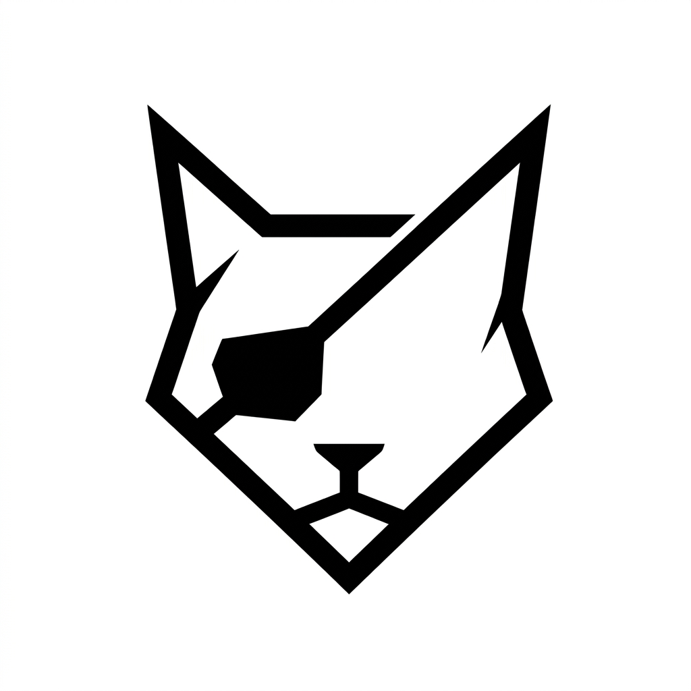

<div align="center">
  <a href="https://github.com/gu0bug/PatchCat">
    
  </a>

  # PatchCat (中文文档)

  <p>
    <strong>精准提示词编排 · 丝滑智能体工作流</strong>
  </p>

  <p>
    <em>专为新一代 AI 应用打造的开源可视化提示词编排与多智能体 DAG 执行引擎。</em>
  </p>

  <p>
    <a href="https://github.com/gu0bug/PatchCat/releases"></a>
    <a href="https://opensource.org/licenses/MIT"></a>
    <a href="https://www.typescriptlang.org/"></a>
    <a href="https://react.dev/"></a>
    <a href="https://reactflow.dev/"></a>
    <a href="https://vite.dev/"></a>
    <a href="https://github.com/gu0bug/PatchCat/actions"></a>
  </p>

  <p>
    <strong><a href="README.md">English</a></strong> | <strong><a href="README_CN.md">简体中文</a></strong> | <strong><a href="docs/quick-start-zh.md">📖 快速入门指南 (5分钟教程)</a></strong>
  </p>

  <p>
    <a href="https://gu0bug.github.io/PatchCat/" target="_blank">
      
    </a>
    <a href="https://codespaces.new/gu0bug/PatchCat" target="_blank">
      
    </a>
  </p>
</div>

---

## 🌟 什么是 PatchCat？

**PatchCat** 是一个现代化、轻量化且具备企业级特性的**可视化提示词编排平台与有向无环图（DAG）执行引擎**。专为 AI 工程师、Prompt 架构师以及多智能体开发者打造，让您可以像搭积木一样串联 Prompt 模板、大语言模型（LLM）、JavaScript 数据转换与分支条件路由，构建高并发、可并行的智能化工作流。

系统原生支持**零后端依赖模式（Client-Only BYOK）**，所有数据与 API Key 均仅保存在浏览器本地，直连 **Google Gemini、DeepSeek、OpenAI、SiliconFlow（硅基流动）以及本地 Ollama**，在浏览器端即可获得极致低延迟的实时流式体验与严密的隐私安全保障。

```
       ┌────────────────┐       ┌────────────────────────┐       ┌───────────────────────┐
       │   用户入参输入   │ ────> │    Prompt 插槽组装     │ ────> │   意图识别大模型节点   │
       │ (用户工单/原始Query) │       │   ({{input.query}})    │       │ (Gemini / DeepSeek)   │
       └────────────────┘       └────────────────────────┘       └───────────────────────┘
                                                                             │
                                                                             ▼
       ┌────────────────────────┐       ┌────────────────────────┐       ┌───────────────────────┐
       │   最终路由派发队列     │ <──── │    输出适配器节点      │ <──── │   路由决策代码沙箱    │
       │ (物流专线/SLA时效标记) │       │ (Rendered JSON / Text) │       │ (JavaScript 动态决策) │
       └────────────────────────┘       └────────────────────────┘       └───────────────────────┘
```

---

## 🥊 竞品横向对比矩阵

为什么在众多重型编排工具中选择 **PatchCat**？

| 核心特性 / 指标 | **PatchCat 🐱 (本项目)** | **Flowise** | **Dify** | **Langflow** |
| :--- | :--- | :--- | :--- | :--- |
| **系统架构** | **100% 纯前端 / 边缘端** | Node.js + 后端数据库 | Python + Celery + Redis + Postgres | Python + 后端数据库 |
| **部署成本与体积** | **零门槛（静态网页 / 0MB）** | 较重 (Docker Compose) | 企业级重型 (~2GB+ Docker) | 较重 (Pip / Docker) |
| **数据隐私与安全** | **零泄漏 (浏览器端 BYOK 本地直连)** | 服务端存储密钥 | 服务端存储密钥 | 服务端存储密钥 |
| **本地模型支持** | **原生直连本地 Ollama Web API** | 需要中转代理配置 | 依赖 Docker 网络配置 | 后端代理转发 |
| **执行调度引擎** | **Kahn 拓扑分层调度算法** | 顺序图执行 | 异步 Event 队列 Worker | 有向图递归 |
| **冷启动延迟**| **< 300 毫秒** | 10 ~ 30 秒 | 30 ~ 60 秒 | 15 ~ 30 秒 |
| **运行内存占用** | **< 35 MB (单浏览器标签页)** | ~300 MB | ~1.5 GB | ~500 MB |
| **脚本沙箱** | **原生 JS / 隔离 Web Worker** | VM2 沙箱 | Python 沙箱 | 受限 Python |

---

## 🚀 核心特性

### 1. 🎨 可视化 DAG 画布与 Kahn 拓扑调度器
- **拖拽式工作流画布**：基于 `@xyflow/react`（React Flow v12）打造，包含定制的 5 大核心节点（`Input 输入`, `Prompt 提示词`, `LLM 大模型`, `Code 脚本`, `Output 输出`）。
- **Kahn 拓扑分层算法**：全自动计算节点上下游依赖，将无依赖的同层节点划分为并行波次（`Promise.all`）并发加速。
- **实时环路检测与安全告警**：画布编辑时毫秒级检测拓扑死锁与循环依赖，提供醒目的顶部告警横幅并拦截执行。
- **随时中断支持**：基于 `AbortController` 实现优雅的主动取消与流式中断。

### 2. ⚡ 多大模型服务商集成与动态模型发现
- **主流云端与本地大模型直连**：
  - 🔵 **Google Gemini**：完整支持 `gemini-2.5-flash`、`gemini-2.5-pro`、`gemini-2.0-flash` 等官方模型，支持一键动态拉取可用模型列表。
  - 🐳 **DeepSeek**：原生支持 DeepSeek-R1（带实时思维链推理过程渲染）与 DeepSeek-V3。
  - 🟢 **OpenAI**：支持 GPT-4o、GPT-4o-mini 等全系列模型。
  - ⚡ **SiliconFlow（硅基流动）**：高性价比的开源大模型托管服务。
  - 🦙 **Ollama 本地大模型**：零网络开销直连本地模型（Llama 3, Qwen 2.5, Mistral）。
  - 🛠️ **自定义 OpenAI 兼容接口**：适配 OneAPI、NewAPI、vLLM 或各类中转服务。
- **跨服务商模型智能自适应映射 (`resolveTargetModel`)**：切换服务商时，预设模板中的非本厂商模型名称将自动无缝映射为当前服务商的默认模型，杜绝 400/404 报错。
- **瞬态 503 自动重试与中文错误诊断**：内置针对 Google 免费层高并发负载波动的自动避让重试机制，提供操作指引详尽的中文诊断提示。

### 3. 🧠 实时 SSE 流式输出与 DeepSeek 思考链展示
- **字级流式吐字渲染**：实时 Token 级流式推送到画布节点，具备顺滑的动效呈现。
- **双流思维链抽屉**：专为 DeepSeek-R1 / Gemini Thinking 打造的独立思考过程展示区。
- **精准度量与耗时统计**：精确记录每个节点的毫秒级延迟与 Prompt/Completion Token 消耗。

### 4. 💻 动态 JavaScript 代码节点与沙箱
- **浏览器端安全沙箱**：直接在浏览器沙箱内运行自定义 JavaScript 脚本，注入上游 `inputs` 并完整捕获 `console.log` 输出。
- **Markdown JSON 代码块自动脱壳**：轻松解析大模型返回的 ` ```json ... ``` ` 内容并转换为结构化对象。
- **智能条件路由**：根据意图、情绪评级、风险等级等动态决定工单队列、SLA 承诺与服务分派。

### 5. 🛡️ 三级企业级日志系统与严格隐私脱敏
- **三级可配置日志登记**：
  - **`概要 (Summary)`**：记录系统启停（`START` / `COMPLETE` / `ERROR`）、请求方法/状态码/耗时/Token数、异常崩溃栈。
  - **`详细 (Detailed)`**：在概要基础上，补充节点 ID、模型参数（`model`, `temperature`, `max_tokens`）、拓扑波次时序。
  - **`开发 (Development)`**：在详细基础上，完整捕获节点输入文本（Prompt）、LLM 输出全文与中间变量。
- **严格安全脱敏清洗器 (`sanitizeData`)**：
  - 在所有日志级别中自动递归对 `sk-***`、`AIzaSy***`、`Bearer` 令牌及各类密码字段进行全量掩码，绝对杜绝密钥泄漏！
- **可视化可折叠控制台抽屉**：类似现代 IDE 的底部控制台，支持上下拖拽调节高度、分类过滤、实时搜索、JSON 查看及一键导出 JSON/TXT。

### 6. 🔗 动态插槽变量解析引擎
- **Mustache 风格插槽语法**：`{{nodeId.propertyPath}}` 动态注入上游节点数据。
- **深层对象与数组访问**：支持访问如 `{{classifier.result.tags[0].name}}` 等复杂嵌套属性。
- **容错默认值语法**：支持 `{{nodeId.output | "默认值"}}`，防止上游字段为空导致的执行失败。

---

## 📸 界面预览与功能展示

| 可视化工作流画布 | 多级别安全日志控制台 |
| :---: | :---: |
|  |  |

---

## ⚡ 快速开始

### 环境准备
- [Node.js](https://nodejs.org/) `>= 18.0.0`
- [npm](https://www.npmjs.com/) `>= 9.0.0`

### 1. 克隆项目并安装依赖
```bash
# 克隆代码仓库
git clone https://github.com/gu0bug/PatchCat.git
cd PatchCat

# 安装项目依赖
npm install
```

### 2. 启动本地开发服务器
```bash
npm run dev
```
打开浏览器访问 `http://localhost:5173`。

### 3. 配置您的模型 API Key（自带 Key 模式）
1. 点击顶栏右侧的 **API Key** 设置图标。
2. 选择您常用的服务商（**Google Gemini**、**DeepSeek**、**OpenAI**、**SiliconFlow** 或 **Ollama**）。
3. 填入 API Key 并点击 **测试连通性 (Test Connection)**。
4. 点击右上角 **▶ Run Workflow** 即可立即运行完整工作流！

---

## 🛠️ CLI 命令与质量工程

PatchCat 具备严密的单元测试保障，核心拓扑调度、变量解析、LLM 客户端与日志系统均达到 100% 覆盖：

```bash
# 运行全量单元测试 (拓扑排序, 执行引擎, LLM Client, 日志脱敏, 代码路由)
npm test

# 运行 TypeScript 类型检查
npm run typecheck

# 生产环境打包构建
npm run build

# 本地预览构建产物
npm run preview
```

---

## 🧩 预置工业级工作流模板

PatchCat 内置了开箱即用的工业级场景模板：

| 模板名称 | 场景说明 | 涉及节点流 |
| :--- | :--- | :--- |
| **智能客服工单路由 (Customer Support Routing)** | 多分类意图识别、情绪等级评定与 VIP 极速队列自动派单。 | `用户入参` ➔ `提示词模板` ➔ `意图识别大模型` ➔ `路由决策脚本` ➔ `工单分派结果` |
| **自反思研报生成与 Critic 专家审阅** | 初稿生成结合专业 Critic 反思批评回路，实现多轮高质量润色输出。 | `研究主题` ➔ `初稿 Prompt` ➔ `生成大模型` ➔ `审阅 Prompt` ➔ `Critic 大模型` ➔ `最终研报` |
| **多智能体电商退款争议仲裁流水线** | 政策合规核查与客户情绪分析并行处理，代码自动裁决并生成仲裁函。 | `工单输入` ➔ `Prompt 组装` ➔ `政策 LLM` + `情绪 LLM` (并行) ➔ `仲裁代码` ➔ `裁决报告` |

---

## 🏗️ 技术架构体系

| 分层 | 采用技术 |
| :--- | :--- |
| **前端核心** | [React 19](https://react.dev/) + [TypeScript 5.8](https://www.typescriptlang.org/) |
| **构建工具** | [Vite 6](https://vite.dev/) |
| **画布引擎** | [@xyflow/react (React Flow v12)](https://reactflow.dev/) |
| **状态管理** | [Zustand](https://github.com/pmndrs/zustand) + [Immer](https://immerjs.github.io/immer/) |
| **样式与组件** | [Tailwind CSS v4](https://tailwindcss.com/) + [Lucide Icons](https://lucide.dev/) |
| **执行内核** | 纯浏览器端 Kahn 拓扑 DAG 调度器 + SSE 流式解析器 |
| **自动化测试** | Node.js 原生测试套件 (`node --test`) |

---

## 🗺️ 产品规划路线 (Roadmap)

- [x] 基于 Kahn 算法的可视化 DAG 画布与并行波次调度
- [x] 多大模型服务商 Hub（Google Gemini, DeepSeek, OpenAI, 硅基流动, Ollama）
- [x] DeepSeek R1 深度思考链流式可视化
- [x] 动态 JavaScript 代码节点与沙箱执行
- [x] 三级企业级日志系统与严格密钥脱敏清洗
- [x] 工作流模板导入/导出（遵循 JSON Schema Draft-07 标准）
- [ ] RAG 检索增强与向量知识库节点集成
- [ ] 多智能体自主协同与多轮会话回路
- [ ] 一键将可视化工作流发布为独立 REST API 端点
- [ ] 本地 Python 后端服务支持（FastAPI + vLLM 代码沙箱）

---

## 🤝 参与贡献

我们非常欢迎来自开源社区的每一位开发者参与贡献！
- 🐛 发现 Bug？欢迎 [提交 Issue](https://github.com/gu0bug/PatchCat/issues)
- 💡 有新的功能想法？欢迎 [发起 Discussion](https://github.com/gu0bug/PatchCat/discussions)
- 🚀 贡献代码？Fork 本仓库并提交 Pull Request。

---

## 📄 开源协议

本项目基于 **[MIT License](LICENSE)** 开源，无论是个人学习、学术研究还是商业项目均可免费使用。

---

<div align="center">
  <sub>由 PatchCat 团队与开源社区共同倾心打造 · Built with ❤️</sub>
</div>
