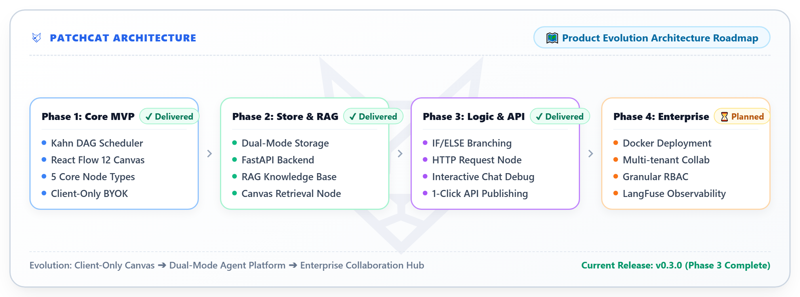
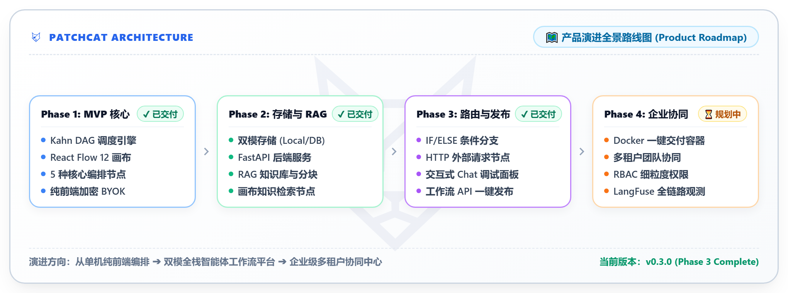

# 🗺️ PatchCat Product Roadmap

> **Current Stage**: `v0.4.2` (Released ✅)  
> **Last Updated**: 2026-09-13  
> **Positioning**: A local-first, zero-setup, visual high-performance AI prompt workflow orchestrator  

[English](#english) | [简体中文](#简体中文)

---

## English

### 🧭 Version Evolution Overview

  

---

### 🔮 Future Milestone Details

#### Phase 5 — v0.6.0: Advanced RAG & Vector Intelligence

| Feature | Description |
|:---|:---|
| **Hybrid Search (BM25 + Dense)** | Reciprocal Rank Fusion (RRF) weighted retrieval across lexical and semantic vectors |
| **Reranker Integration** | Cohere / BGE / Jina cross-encoder reranker for context recall refinement |
| **Rolling Background Summarization**| Background LLM rolling compression of older conversation turns |
| **Canvas Explicit Memory Node** | Graph-level buffer/summary/vector memory nodes wireable to LLM contexts |

#### Phase 6 — v1.0.0: Production & Enterprise Delivery

| Feature | Description |
|:---|:---|
| **Docker Private Deployment** | Standard `docker-compose.yml` with frontend + backend + PostgreSQL pgvector |
| **User System & RBAC** | Registration, login, role-based access control |
| **Workflow Version Control** | Git-style versioning with diff and rollback |
| **LangFuse / OpenTelemetry Tracing** | Full execution trace integration for observability |
| **Execution History Dashboard** | Persistent run history with token usage analytics |
| **Team Workspace & Sharing** | Collaborative editing, read-only preview links, encrypted export |

---

### 📜 Completed Milestones

- [x] **Phase 0**: Core Topological Scheduler & Visual Canvas (2026-08-28 ~ 08-31)
- [x] **Phase 0.5**: Multi-Model Ecosystem, Sanitized Logging & i18n (2026-09-01 ~ 09-02 AM)
- [x] **Phase 1**: Drawer-Style Multi-Workflow Management & Dual-Mode Storage (2026-09-02 PM)
- [x] **Phase 2**: RAG Knowledge Base & Canvas Retrieval Node (2026-09-03)
- [x] **Phase 2.5**: Knowledge Base UX Polish, Document Parsers & Visualization (2026-09-04 ~ 09-08)
- [x] **Phase 3**: Conditional Routing, External Integration & Interactive Debugging (2026-09-09)
- [x] **Phase 3.1**: Multi-Turn Conversation Memory & Dual-Tier Storage Architecture (2026-09-11)
- [x] **Phase 4**: Agent Capabilities, ReAct Autonomous Loop & Tool Use (2026-09-13)

---

---

## 简体中文

### 🧭 版本演进路线总览

  

---

### 🔮 未来里程碑详细规划

#### Phase 5 — v0.6.0：高级 RAG 与向量智能

| 功能 | 描述 |
|:---|:---|
| **混合检索 (BM25 + 稠密向量)** | 基于 RRF 加权倒排与稠密融合，全面提升召回精准率 |
| **Reranker 重排序集成** | Cohere / BGE / Jina 交叉编码器重排序模型深度适配 |
| **滚动后台摘要提炼** | 轻量模型对淘汰轮次后台滚动长效提炼，兼顾成本与长期记忆 |
| **画布显式 Memory 节点** | 支持画线挂载至任意 LLM 节点的独立记忆节点 |

#### Phase 6 — v1.0.0：生产交付与企业级功能

| 功能 | 描述 |
|:---|:---|
| **Docker 私有化部署** | 标准 `docker-compose.yml`（前后端 + PostgreSQL pgvector） |
| **用户系统 & RBAC** | 注册、登录、基于角色的访问控制 |
| **工作流版本控制** | Git 风格版本管理，支持 diff 与回滚 |
| **LangFuse / OpenTelemetry 链路追踪** | 全链路执行追踪，提供可观测性 |
| **执行历史仪表盘** | 持久化运行记录与 Token 消耗分析 |
| **团队工作空间与分享** | 协同编辑、只读预览链接、加密导出包 |

---

### 📜 已交付历史里程碑

- [x] **Phase 0**：核心拓扑调度引擎与可视化画布构建 (2026-08-28 ~ 08-31)
- [x] **Phase 0.5**：多模型生态适配、三层脱敏日志与国际化 (2026-09-01 ~ 09-02 上午)
- [x] **Phase 1**：抽屉式多流程管理与双模存储架构 (2026-09-02 下午)
- [x] **Phase 2**：RAG 知识库体系与画布检索节点全链路闭环 (2026-09-03)
- [x] **Phase 2.5**：知识库可视化管理、文档解析器与体验增强 (2026-09-04 ~ 09-08)
- [x] **Phase 3**：条件路由、外部集成与交互式调试 (2026-09-09)
- [x] **Phase 3.1**：多轮会话记忆与底层存储持久化架构 (2026-09-11)
- [x] **Phase 4**：AI 智能体能力层、ReAct 自主循环与多模态工具调用 (2026-09-13)
