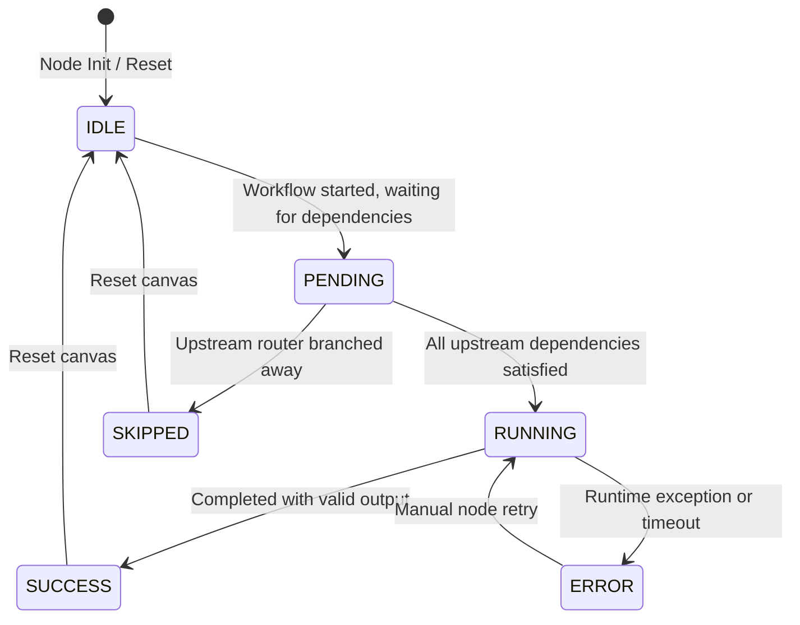

# PRD-001: Workflow Canvas Specification / 画布交互与状态流转规范

[English Version](#english-version) | [中文版本](#中文版本)

---

## English Version

### 1. Overview & Objectives
The core interface of the AI Prompt Flow Orchestrator is a visual DAG (Directed Acyclic Graph) canvas. This document defines the interaction rules, node definitions, port/handle contracts, and the lifecycle state machine for nodes.

The goal is to provide a smooth, intuitive, and fault-tolerant workflow editing experience that accommodates high-resolution viewports and graphs of varying topological complexities.

### 2. Canvas Interaction Standards
- **Zoom**: Range from `0.1x` to `2.0x` via mouse scroll and `Ctrl + +/-` shortcuts.
- **Pan**: Middle-click dragging, spacebar + left-click dragging, and trackpad gesture support.
- **Fit View**: Instantly auto-focus all active nodes with a `50px` dynamic safety margin.
- **MiniMap**: Bottom-right overview with semantic color-coding and draggable viewport frame.
- **Multi-Selection**: `Shift + left-click marquee drag` and `Ctrl + click` multi-select.
- **Grid Snapping**: Default `16px` dot/grid snapping with horizontal/vertical alignment tools.
- **Undo / Redo**: Global `Ctrl + Z` and `Ctrl + Y / Ctrl + Shift + Z` history snapshot restoration.
- **Edge & Handle Rules**: Strict directional connection (Output Handle $\rightarrow$ Input Handle). Type-safe matching, self-loop blocking, and duplicate edge prevention.

### 3. Core Node Type Matrix

| Node Type | Type Key | Core Responsibility | Default Inputs | Default Outputs |
| :--- | :--- | :--- | :--- | :--- |
| **Input Node** | `input` | Global workflow parameters | `schema`, `defaultValues` | `output` (user inputs) |
| **Prompt Node** | `prompt` | Dynamic prompt template formatting | `template`, `variables` | `promptText` |
| **LLM Node** | `llm` | Large Language Model generation | `model`, `systemPrompt`, `prompt`, `temperature` | `response`, `usage` |
| **Code Node** | `code` | Data transformation logic | `runtime` (JS/Python), `code`, `inputs` | `result`, `stdout` |
| **Router Node** | `router` | Conditional branch routing | `expression`, `condition` | `branch_a`, `branch_b`, `default` |
| **Output Node** | `output` | Final response aggregation | `format`, `content` | `finalOutput` |

### 4. Node Lifecycle State Machine

- **IDLE**: Neutral border (gray). No active execution.
- **PENDING**: In execution queue; waiting for upstream data.
- **RUNNING**: Active calculation / API streaming; animated blue glow.
- **SUCCESS**: Execution complete; highlighted green border.
- **ERROR**: Failed / timed out; red border with error modal.
- **SKIPPED**: Not executed due to conditional branching; low opacity.

---

## 中文版本

### 1. 概述与设计目标
AI 提示流编排器（AI Prompt Flow Orchestrator）的核心界面由可视化 DAG 画布构成。本规范定义了画布的交互准则、原生节点体系、端口（Port/Handle）契约及节点生命周期状态机的流转机制。

### 2. 画布核心交互规范
- **视口操作**：支持 `0.1x` 到 `2.0x` 缩放、鼠标中键/空格拖拽平移、一键 Fit View 聚焦及小地图导航。
- **节点操作**：支持框选、对齐吸附、撤销重做（Undo/Redo）。
- **连线规则**：严格遵循有向单向流（Output Handle $\rightarrow$ Input Handle），防自环、防重边。

### 3. 核心节点定义矩阵
包含 6 大标准节点：`input`（输入节点）、`prompt`（提示词节点）、`llm`（大模型节点）、`code`（代码处理节点）、`router`（条件路由节点）、`output`（输出响应节点）。

### 4. 节点状态机流转
定义了 `IDLE`（空闲）、`PENDING`（排队中）、`RUNNING`（运行中）、`SUCCESS`（成功）、`ERROR`（失败）与 `SKIPPED`（跳过）六大生命周期状态。
