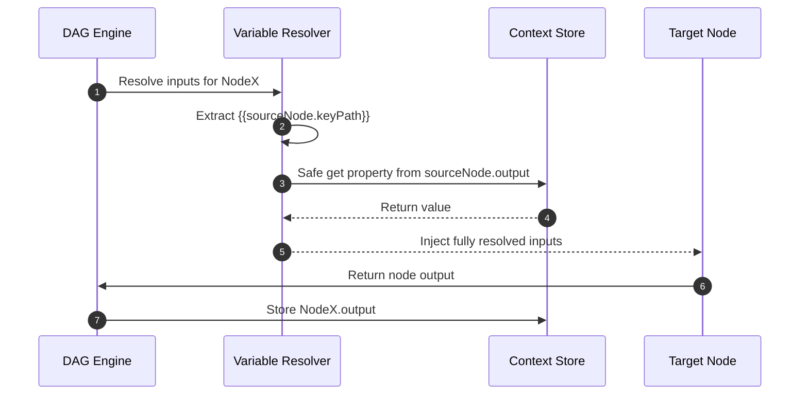

# PRD-002: DAG Execution Engine Specification / DAG 拓扑排序与变量解析规范

[English Version](#english-version) | [中文版本](#中文版本)

---

<a name="english-version"></a>
## English Version

### 1. Overview
The workflow canvas is abstracted into a **Directed Acyclic Graph (DAG)**. This document specifies the execution engine's scheduling algorithm (Kahn's algorithm for topological sorting and cycle detection), the variable slot resolution syntax (`{{nodeId.outputKey}}`), and the layer-by-layer concurrency model.

### 2. Topological Sorting & Cycle Detection Algorithm

#### 2.1 Kahn's Algorithm for Layered Scheduling
Before execution, the graph is analyzed to compute dependency layers (execution waves). Nodes within the same layer have no inter-dependencies and can be executed completely in parallel.

```
Algorithm KahnLayeredSchedule(Graph G = (V, E)):
1. Calculate in_degree[v] for all active nodes v ∈ V.
2. Initialize Queue Q with all nodes where in_degree[v] == 0 (Layer 0).
3. Initialize executionLayers = [], visitedCount = 0.
4. While Q is not empty:
   a. currentLayer = []
   b. For each node u in Q:
      i.   Append u to currentLayer; visitedCount++
      ii.  For each outgoing edge (u, v):
           - in_degree[v] = in_degree[v] - 1
           - If in_degree[v] == 0: Append v to nextLayer
   c. Append currentLayer to executionLayers
   d. Q = nextLayer
5. If visitedCount != |V|:
   - Throw CycleDetectedException with cyclic node IDs.
```

#### 2.2 Cycle Detection & Error Handling
- **Pre-flight Check**: Intercept cycle creation when user attempts to draw a circular edge.
- **Runtime Abort**: If a cycle is detected at runtime, abort immediately and return cyclic node path (`NodeA -> NodeB -> NodeA`).

### 3. Dynamic Variable Slot Resolver

#### 3.1 Syntax and Namespace
Supports Mustache-style placeholder templates: ``.
- Global input access: `{{input_1.user_prompt}}`
- LLM response: `{{llm_classifier.response}}`
- Deep nested object access: `{{code_parser.result.items[0].name}}`
- Fallback default value: `{{llm_node.summary | "No summary available"}}`

#### 3.2 Resolution Sequence



---

<a name="中文版本"></a>
## 中文版本

### 1. 概述
AI 提示流编排器将画布抽象为有向无环图 (DAG)。本规范详细规定了核心调度算法（基于 Kahn 算法的拓扑分层排序与环检测）、变量引用解析体系（`{{nodeId.outputKey}}` 插槽机制）及并发执行策略。

### 2. 拓扑排序与分层调度算法
- 计算所有节点入度，将入度为 0 的节点划分为第 0 层。
- 逐层出队并减少邻接节点入度，生成并发执行计划。
- 若遍历节点总数小于总节点数，抛出循环依赖异常并指出涉环节点。

### 3. 动态变量插槽解析规范
- 语法支持 Mustache 语法：`{{sourceNode.propertyPath | fallback}}`。
- 安全深层路径访问，自动防范原型链污染（Prototype Pollution）。
