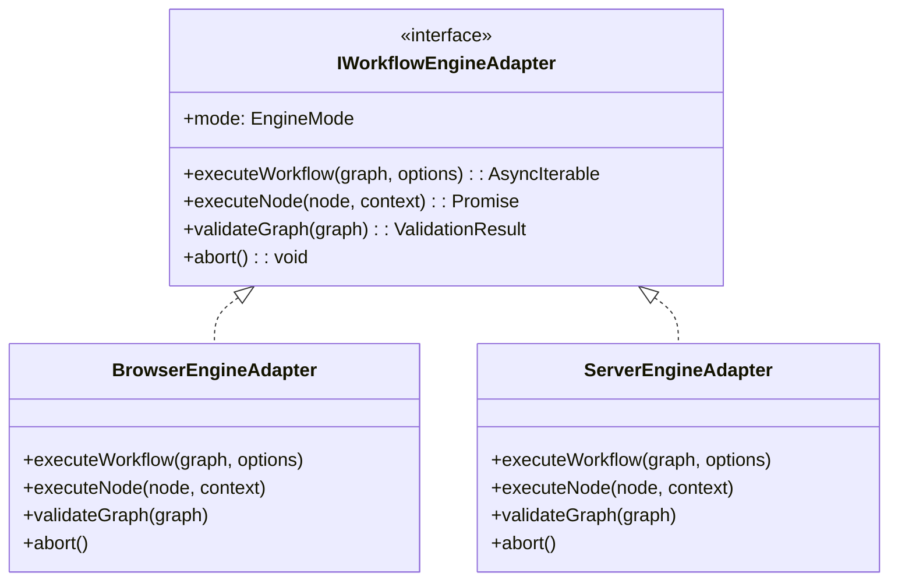

# PRD-003: Dual-Mode Engine Adapter Specification / 双引擎规范

[English Version](#english-version) | [中文版本](#中文版本)

---

## English Version

### 1. Overview & Motivation
To achieve maximum portability and instant user onboarding, AI Prompt Flow Orchestrator implements a **Dual-Mode Engine Architecture**:
1. **Client-Only Mode (Static Web / GitHub Pages)**: Zero-backend runtime executing entirely within the browser. Supports built-in Mock simulations and Bring-Your-Own-Key (BYOK) direct LLM calls.
2. **Local-Server Mode (Local FastAPI Backend)**: High-performance local backend enabling Python code sandboxes, local Ollama/vLLM models, and persistent execution logging.

Both engines implement the identical `IWorkflowEngineAdapter` contract, ensuring the UI and state management are 100% environment-agnostic.

### 2. Feature Comparison Matrix

| Feature | Client-Only Mode (Browser) | Local-Server Mode (FastAPI) |
| :--- | :--- | :--- |
| **Deployment** | Static hosting (GitHub Pages, Vercel) | Local Python / Docker container |
| **Data Privacy** | 100% in-browser (LocalStorage/Memory) | Local SQLite / File persistence |
| **LLM Calls** | Direct browser `fetch()` (OpenAI/Anthropic/Gemini) | Backend proxy with load balancing |
| **Code Sandbox** | Web Worker JavaScript sandbox | Isolated Python runtime sandbox |
| **Streaming** | Async Generator / Event dispatch | Server-Sent Events (SSE) |
| **Mock Engine** | Built-in offline fixture simulation | Full scale load testing |

### 3. Unified Engine Adapter Protocol

### 4. Auto-Discovery & Graceful Fallback
1. On startup, the UI probes `GET http://localhost:8000/api/v1/health`.
2. If online: Automatically connects to Local-Server mode with full capabilities.
3. If offline: Silently falls back to Client-Only mode with zero disruption.

---

## 中文版本

### 1. 概述与设计背景
为了实现极致的灵活性与开箱即用的体验，系统设计了双模执行引擎架构：
- **Client-Only 模式**：纯前端静态运行，支持 Mock 模式与 BYOK 自带 Key 直连。
- **Local-Server 模式**：本地 FastAPI 后端，提供 Python 沙箱与 Ollama 本地模型接入。
- 两套引擎遵循统一的 `IWorkflowEngineAdapter` 接口协议。

### 2. 双引擎对比
纯前端模式主打零门槛体验与数据隐私，本地后端模式主打完整 Python 代码执行与高并发持久化能力。

### 3. 自动嗅探与心跳
前端启动时自动检测本地服务健康状态，在线即升配，离线则降级，图数据完全兼容。
