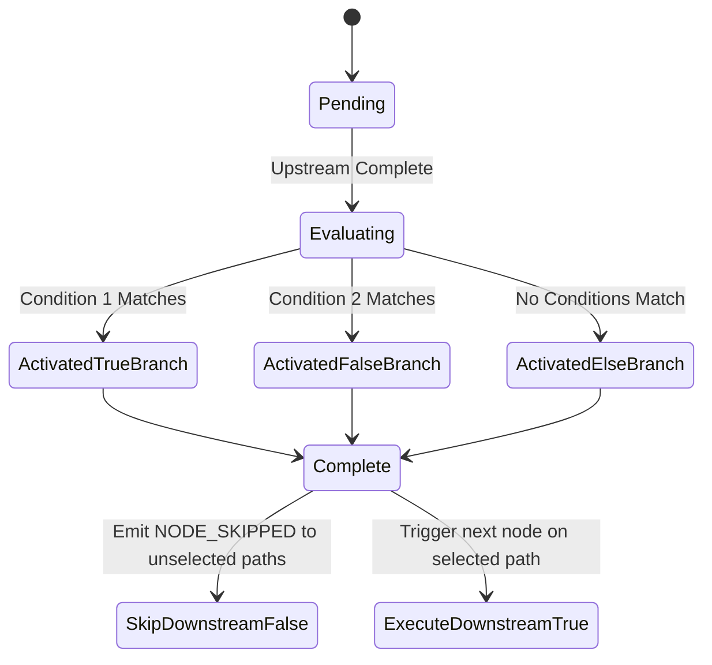
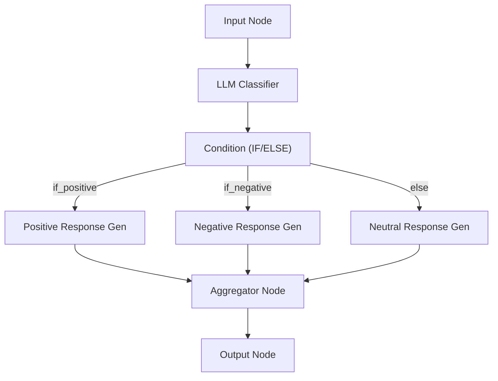
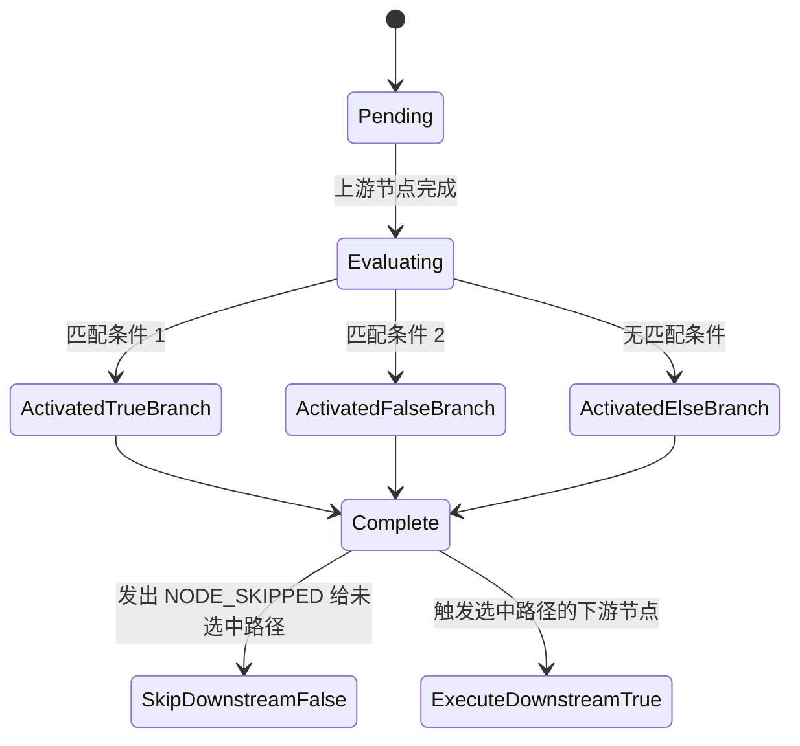
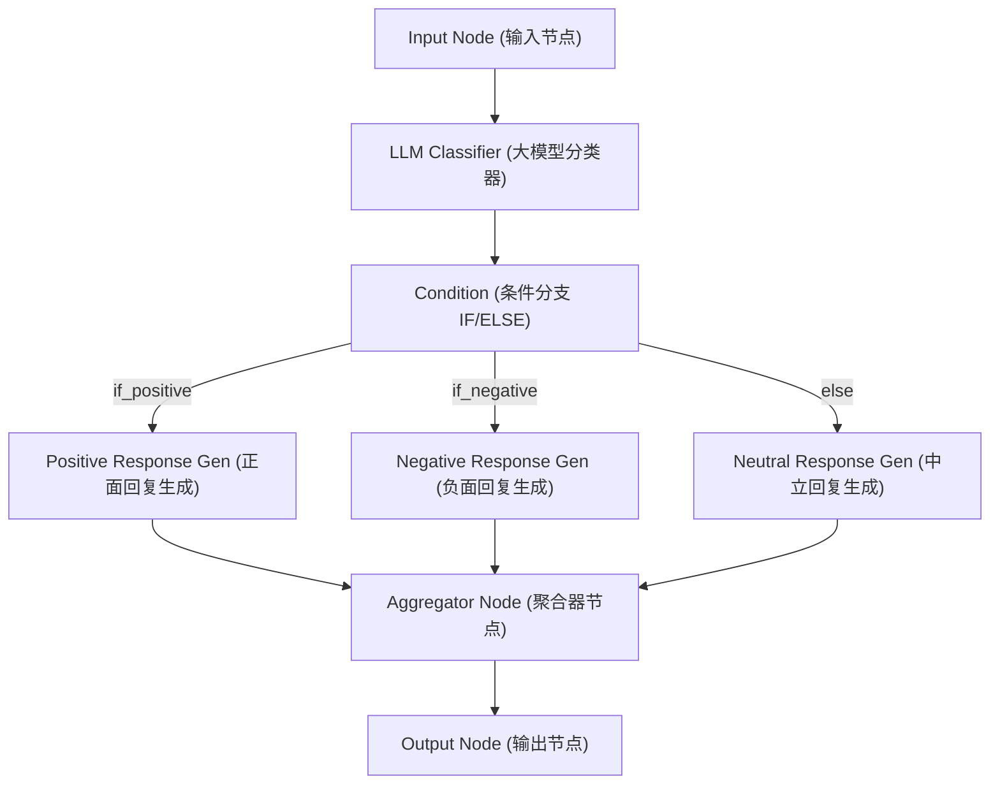

[English Version](#english-version) | [中文版本](#中文版本)

---

# English Version

## 1. Overview
This document specifies the requirements for two new critical node types in PatchCat v0.3.0: the **IF/ELSE Conditional Branch Node** and the **Variable Aggregator Node**. These nodes enable dynamic routing and workflow execution paths based on real-time data, which are essential for building complex, real-world AI applications.

## 2. Scope
1. **IF/ELSE Conditional Branch Node** (`condition` node type): Routes execution flow based on upstream node outputs.
2. **Variable Aggregator Node** (`aggregator` node type): Merges outputs from multiple upstream branches back into a single data flow.

## 3. IF/ELSE Conditional Branch Node

### 3.1 Purpose
To evaluate upstream data against defined rules and direct the workflow execution down specific paths dynamically.

### 3.2 Visual Specifications
- **Node type key**: `condition`
- **Visual style**: Orange/amber theme with a diamond icon (metaphor for decision-making).

### 3.3 Configuration
- `conditions`: An array of condition rules, where each rule contains:
  - `variable`: Reference to upstream output (e.g., `{{llm_1.response}}`).
  - `operator`: Supported operators: `equals`, `not_equals`, `contains`, `not_contains`, `greater_than`, `less_than`, `is_empty`, `is_not_empty`, `regex_match`.
  - `value`: Comparison value (string or number).
  - `targetHandle`: Which output handle to activate (e.g., `branch_true`, `branch_false`).
- `logicalOperator`: `AND` | `OR` for combining multiple conditions if evaluating a combined rule.
- `defaultBranch`: Handle ID for the fallback/else branch.

### 3.4 Handles
- **Left**: Single `in` handle to receive upstream data.
- **Right**: Multiple output handles - `if_true`, `if_false`, `elif_1`, `elif_2`, ... `else` (dynamically configurable based on branches).

### 3.5 Execution Logic
- Evaluate conditions from top to bottom.
- The first matching condition activates its corresponding branch.
- Downstream nodes on non-matching branches are **SKIPPED** (engine emits `NODE_SKIPPED` event).
- If no conditions match, the execution falls back to the `else` branch.

### 3.6 Engine Changes
- `browser-engine.ts`: Must support conditional execution. After a condition node resolves, only the downstream nodes of the activated branch should execute.
- `topological-sort.ts`: Must include all branches in the topology, but the runtime engine skips paths that are not activated.
- **NodeStatus**: Introduce and properly handle a `skipped` status.

### 3.7 Property Panel
A visual condition builder UI featuring:
- Dropdowns for selecting operators.
- Text inputs for variable references and comparison values.
- Buttons to add, remove, or reorder condition rows.

## 4. Variable Aggregator Node

### 4.1 Purpose
To merge outputs from multiple upstream branches back into a single data flow. This is the essential companion to the IF/ELSE node for reconvergence.

### 4.2 Visual Specifications
- **Node type key**: `aggregator`
- **Visual style**: Purple/violet theme with a merge/funnel icon.

### 4.3 Configuration
- `mode`: Defines how inputs are aggregated:
  - `first_available`: Use the output from whichever branch actually executed.
  - `merge_all`: Combine all available outputs into a structured object.
  - `wait_all`: Wait for all branches, including `null` for skipped branches.
- `outputKey`: Name for the merged output field.

### 4.4 Handles
- **Left**: Multiple `in` handles (one per incoming branch).
- **Right**: Single `out` handle.

### 4.5 Execution Logic
- **`first_available` mode**: Take the output from whichever connected branch was NOT skipped.
- **`merge_all` mode**: Combine all non-skipped branch outputs into an object keyed by the source node ID.
- **`wait_all` mode**: Wait for all inputs to resolve, using `null` for any skipped branches.

## 5. Type System Updates
The following updates are required in the core definitions:
- **`NodeType`**: Add `'condition'` and `'aggregator'`.
- **Factory Functions**: Update `getDefaultNodeConfig()` and `getDefaultNodeLabel()` to support the new types.
- **Interface**: Define `ConditionRule` interface.

```typescript
interface ConditionRule {
  variable: string;
  operator: 'equals' | 'not_equals' | 'contains' | 'not_contains' | 'greater_than' | 'less_than' | 'is_empty' | 'is_not_empty' | 'regex_match';
  value: string | number;
  targetHandle: string;
}
```

## 6. Acceptance Criteria
1. **[UI]** User can drag an IF/ELSE node onto the canvas and configure 2+ conditions via the property panel.
2. **[Execution]** During execution, only the matching branch's downstream nodes execute; other branches show 'skipped' status.
3. **[Execution]** Variable Aggregator correctly reconverges data from conditional branches based on the configured mode.
4. **[Validation]** Cycle detection still works correctly with conditional branches in the DAG.
5. **[Validation]** Pre-flight validation warns if a condition node has unconnected branches.
6. **[Templates]** A built-in preset named "Conditional Customer Routing" demonstrating IF/ELSE and Aggregator logic is available.
7. **[Testing]** ≥15 new unit test cases covering condition evaluation, branch skipping, and aggregator modes.

## 7. Architecture Diagrams

### 7.1 Condition Node Execution State Machine


### 7.2 Example Workflow DAG: Branching & Reconvergence


---

# 中文版本

## 1. 概述
本文档详细说明了 PatchCat v0.3.0 中两个关键新节点类型的需求：**IF/ELSE 条件分支节点** (Conditional Branch Node) 和 **变量聚合器节点** (Variable Aggregator Node)。这两个节点支持基于实时数据的动态路由和工作流执行路径控制，是构建复杂的现实世界 AI 应用所必需的核心功能。

## 2. 范围
1. **IF/ELSE 条件分支节点** (`condition` 节点类型)：基于上游节点的输出路由执行流。
2. **变量聚合器节点** (`aggregator` 节点类型)：将多个上游分支的输出重新合并到单一数据流中。

## 3. IF/ELSE 条件分支节点

### 3.1 目的
根据定义的规则评估上游数据，并动态引导工作流沿着特定的路径执行。这是任何现实工作流必不可少的能力。

### 3.2 视觉规范
- **节点类型标识**：`condition`
- **视觉风格**：橙色/琥珀色主题，使用菱形图标（代表决策隐喻）。

### 3.3 配置项
- `conditions`：条件规则数组，每条规则包含：
  - `variable`：对上游输出的引用（例如：`{{llm_1.response}}`）。
  - `operator`：支持的运算符：`equals`（等于）, `not_equals`（不等于）, `contains`（包含）, `not_contains`（不包含）, `greater_than`（大于）, `less_than`（小于）, `is_empty`（为空）, `is_not_empty`（不为空）, `regex_match`（正则匹配）。
  - `value`：比较值（字符串或数字）。
  - `targetHandle`：要激活的输出句柄（例如：`branch_true`, `branch_false`）。
- `logicalOperator`：用于组合多个条件的逻辑运算符（`AND` | `OR`）。
- `defaultBranch`：后备/默认分支 (else) 的句柄 ID。

### 3.4 句柄 (Handles)
- **左侧**：单个 `in` 句柄，用于接收上游数据。
- **右侧**：多个输出句柄 - `if_true`, `if_false`, `elif_1`, `elif_2`, ... `else`（可配置分支数量）。

### 3.5 执行逻辑
- 自上而下评估条件。
- 第一个匹配的条件激活其对应分支。
- 未匹配分支的下游节点将被**跳过 (SKIPPED)**（引擎需发出 `NODE_SKIPPED` 事件）。
- 如果没有匹配的条件，则执行后备的 `else` 分支。

### 3.6 引擎改造需求
- `browser-engine.ts`：必须支持条件执行。条件节点解析后，仅应执行激活分支的下游节点。
- `topological-sort.ts`：拓扑排序仍需包含所有分支，但运行时引擎会跳过未激活的路径。
- **NodeStatus**：需要引入并正确处理 `skipped`（已跳过）状态。

### 3.7 属性面板
可视化的条件构建器 UI：
- 用于选择运算符的下拉菜单。
- 用于变量引用和比较值的文本输入框。
- 添加、删除或重新排序条件行的按钮。

## 4. 变量聚合器节点

### 4.1 目的
将来自多个上游分支的输出重新合并到单一数据流中。它是 IF/ELSE 节点用于重新收敛 (reconvergence) 的必备搭档。

### 4.2 视觉规范
- **节点类型标识**：`aggregator`
- **视觉风格**：紫色/紫罗兰色主题，使用合并/漏斗图标。

### 4.3 配置项
- `mode`：聚合模式：
  - `first_available`：使用实际执行的那个分支的输出。
  - `merge_all`：合并所有可用输出。
  - `wait_all`：等待所有分支（包括已跳过分支的 `null` 值）。
- `outputKey`：合并后输出字段的名称。

### 4.4 句柄 (Handles)
- **左侧**：多个 `in` 句柄（每个传入分支一个）。
- **右侧**：单个 `out` 句柄。

### 4.5 执行逻辑
- **`first_available` 模式**：从任何**未被跳过**的已连接分支中获取输出。
- **`merge_all` 模式**：将所有未跳过分支的输出组合成一个以源节点 ID 为键的对象。
- **`wait_all` 模式**：等待所有输入，被跳过的分支则使用 `null`。

## 5. 类型系统更新
需要对核心定义进行以下更新：
- **`NodeType`**：增加 `'condition'` 和 `'aggregator'`。
- **工厂函数**：更新 `getDefaultNodeConfig()` 和 `getDefaultNodeLabel()` 以支持新类型。
- **接口**：定义 `ConditionRule` 接口。

```typescript
interface ConditionRule {
  variable: string;
  operator: 'equals' | 'not_equals' | 'contains' | 'not_contains' | 'greater_than' | 'less_than' | 'is_empty' | 'is_not_empty' | 'regex_match';
  value: string | number;
  targetHandle: string;
}
```

## 6. 验收标准
1. **[UI]** 用户可以拖拽一个 IF/ELSE 节点到画布上，并通过属性面板配置 2 个及以上的条件。
2. **[执行]** 在执行过程中，只有匹配分支的下游节点会执行；其他分支显示为“已跳过 (skipped)”状态。
3. **[执行]** 变量聚合器能够根据配置的模式，正确地将来自条件分支的数据重新收敛。
4. **[验证]** 在包含条件分支的 DAG 中，循环检测功能仍然正常工作。
5. **[验证]** 执行前校验 (Pre-flight validation) 会对存在未连接分支的条件节点发出警告。
6. **[模板]** 提供一个名为“条件化客服路由 (Conditional Customer Routing)”的内置预设模板，演示 IF/ELSE 和聚合器逻辑。
7. **[测试]** 新增至少 15 个单元测试用例，覆盖条件评估、分支跳过和聚合器模式等场景。

## 7. 架构图

### 7.1 条件节点执行状态机


### 7.2 示例工作流 DAG：分支与收敛

