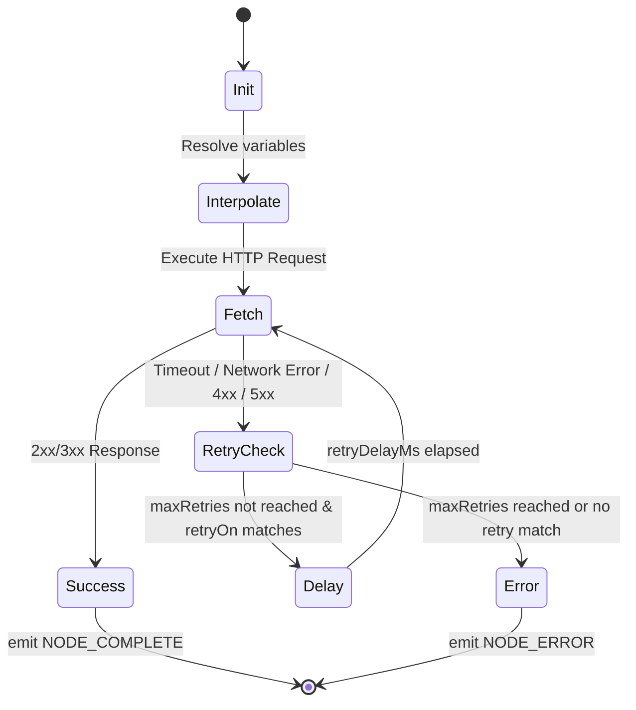
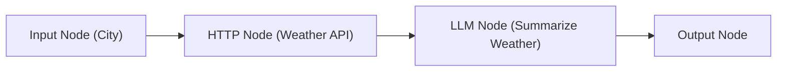
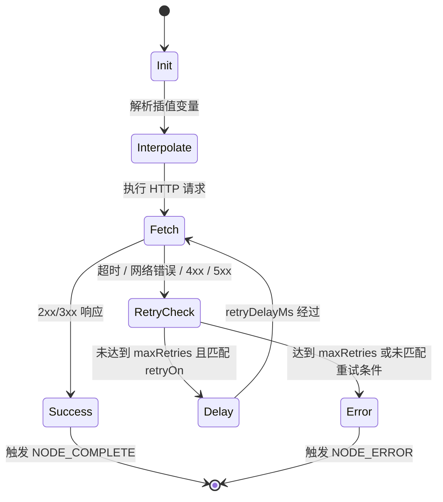

[English Version](#english-version) | [中文版本](#中文版本)

---

## English Version

### 1. Overview

**Purpose**: Enable workflows to call external REST APIs, webhooks, and third-party services. This is the bridge between AI workflows and the outside world.

**Node type key**: `http`

**Visual style**: Green/teal theme with globe/network icon

### 2. Node Configuration

- `method`: GET | POST | PUT | PATCH | DELETE
- `url`: URL string (supports variable interpolation `{{nodeId.field}}`)
- `headers`: Key-value pairs for request headers (supports variables)
- `queryParams`: Key-value pairs for URL query parameters
- `body`: Request body with format selector:
  - `none` | `json` | `form-data` | `x-www-form-urlencoded` | `raw`
- `bodyContent`: Template string or JSON object (supports variable interpolation)
- `timeout`: Request timeout in milliseconds (default: 30000)
- `retryConfig`: `{ maxRetries: number, retryDelayMs: number, retryOn: number[] (HTTP status codes) }`
- `responseType`: `json` | `text` | `auto`
- `authType`: `none` | `bearer` | `basic` | `api-key`
- `authConfig`: `{ token/username/password/key depending on authType }`

### 3. Handles

- **Left**: single `in` handle
- **Right**: `response` handle (success path) + `error` handle (failure path, optional)

### 4. Execution Logic

1. Resolve all variable interpolations in URL, headers, body.
2. Execute `fetch()` with configured method, headers, body.
3. On success: parse response based on `responseType`, emit `NODE_COMPLETE`.
4. On failure: retry per `retryConfig`, then emit `NODE_ERROR`.
5. Respect `AbortSignal` for cooperative cancellation.

### 5. Output Schema

```typescript
{
  status: number;        // HTTP status code
  statusText: string;    
  headers: Record<string, string>;
  data: unknown;         // Parsed response body
  latencyMs: number;
}
```

### 6. Security Considerations

- **CORS**: Browser-side execution means CORS restrictions apply. Document this clearly and suggest server proxy mode if necessary.
- **Credential sanitization**: Auth tokens must be masked in logs (leverage existing `sanitizeData`).
- **URL validation**: Block `file://`, `javascript:` schemes.
- **Private IP blocking**: Optionally warn when targeting localhost/private IPs.

### 7. Property Panel UI

- Method selector dropdown (with color-coded badges: GET=green, POST=blue, PUT=orange, DELETE=red)
- URL input with variable autocomplete
- Tabbed sections: Params | Headers | Body | Auth | Settings
- Response preview area showing last execution result

### 8. Type System Updates

- Add `'http'` to `NodeType`
- Add to `getDefaultNodeConfig()` and `getDefaultNodeLabel()`

### 9. Diagrams

#### HTTP Node Execution Flow



#### Example Workflow: Weather Summarization



### 10. Acceptance Criteria

1. User can configure GET/POST/PUT/DELETE requests with dynamic URL, headers, and body.
2. Variable interpolation works correctly in URL, headers, and body fields.
3. Response data is accessible by downstream nodes via `{{http_1.data}}`.
4. Authentication credentials are properly sanitized in all log levels.
5. Timeout and retry logic works correctly.
6. CORS limitations are clearly documented with workaround suggestions (use server proxy mode).
7. Built-in preset: 'Weather API Integration' demonstrating HTTP → LLM summarization.
8. Unit tests: ≥10 new test cases.

---

## 中文版本

### 1. 概述

**用途**：使工作流能够调用外部 REST API、Webhooks 和第三方服务。这是 AI 工作流与外部世界之间的桥梁。

**节点类型 Key**：`http`

**视觉样式**：以绿色/青色为主题，带有地球/网络图标。

### 2. 节点配置

- `method`: GET | POST | PUT | PATCH | DELETE
- `url`: URL 字符串（支持变量插值 `{{nodeId.field}}`）
- `headers`: 请求头键值对（支持变量）
- `queryParams`: URL 查询参数键值对
- `body`: 请求体，带有格式选择器：
  - `none` | `json` | `form-data` | `x-www-form-urlencoded` | `raw`
- `bodyContent`: 模板字符串或 JSON 对象（支持变量插值）
- `timeout`: 请求超时时间，单位毫秒（默认：30000）
- `retryConfig`: `{ maxRetries: number, retryDelayMs: number, retryOn: number[] (HTTP 状态码) }`
- `responseType`: `json` | `text` | `auto`
- `authType`: `none` | `bearer` | `basic` | `api-key`
- `authConfig`: `{ token/username/password/key depending on authType }`（根据 authType 决定）

### 3. 连接点 (Handles)

- **左侧**：单个 `in` 锚点
- **右侧**：`response` 锚点（成功路径）+ `error` 锚点（失败路径，可选）

### 4. 执行逻辑

1. 解析 URL、请求头和请求体中的所有插值变量。
2. 使用配置的请求方法、头部和请求体执行 `fetch()`。
3. 成功时：根据 `responseType` 解析响应，并触发 `NODE_COMPLETE`。
4. 失败时：根据 `retryConfig` 进行重试，如果仍失败则触发 `NODE_ERROR`。
5. 遵守 `AbortSignal`，以支持协同取消机制。

### 5. 输出 Schema

```typescript
{
  status: number;        // HTTP 状态码
  statusText: string;    
  headers: Record<string, string>;
  data: unknown;         // 解析后的响应体数据
  latencyMs: number;
}
```

### 6. 安全考量

- **CORS**：浏览器端执行意味着受到跨域限制。需要在文档中明确指出，并在必要时建议使用服务器代理模式。
- **凭证脱敏**：在所有日志中必须对认证 Token 进行脱敏处理（利用现有的 `sanitizeData` 逻辑）。
- **URL 验证**：拦截 `file://` 和 `javascript:` 等协议。
- **私有 IP 拦截**：在请求本地主机 (localhost) 或私有 IP 地址时可选择性发出警告。

### 7. 属性面板 UI

- 请求方法下拉选择器（带有颜色标记徽章：GET=绿色，POST=蓝色，PUT=橙色，DELETE=红色）。
- 带变量自动补全的 URL 输入框。
- 标签页面板：Params | Headers | Body | Auth | Settings。
- 响应预览区域，展示最后一次执行结果。

### 8. 类型系统更新

- 将 `'http'` 添加至 `NodeType` 枚举或类型中。
- 在 `getDefaultNodeConfig()` 和 `getDefaultNodeLabel()` 中添加相应的初始化和默认标签处理逻辑。

### 9. 图表

#### HTTP 节点执行流



#### 示例工作流：天气总结


### 10. 验收标准

1. 用户可以配置 GET/POST/PUT/DELETE 请求，具有动态 URL、请求头和请求体。
2. URL、请求头和请求体字段能够正确解析插值变量。
3. 下游节点能够通过 `{{http_1.data}}` 正确获取响应数据。
4. 认证凭证在所有日志级别均能被正确脱敏。
5. 超时控制和重试逻辑运行正确。
6. 明确记录并反馈 CORS 限制，并提供解决方案建议（如使用服务器代理模式）。
7. 内置预设示例：“天气 API 集成”，演示 HTTP → LLM 总结流程。
8. 单元测试：新增 ≥10 个测试用例。
