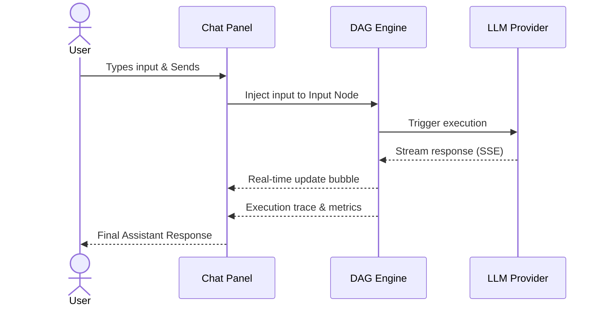
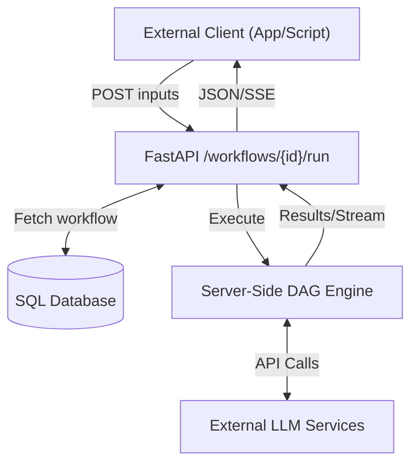
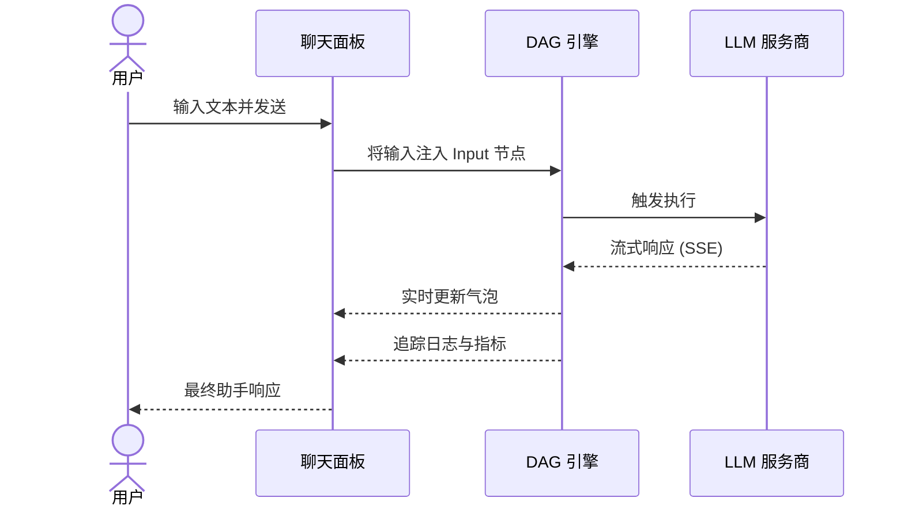
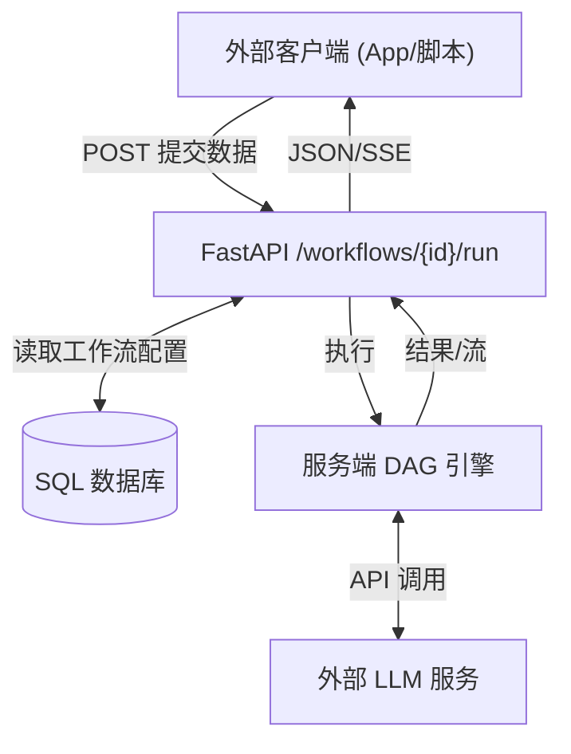

[English Version](#english-version) | [中文版本](#中文版本)

---

<a id="english-version"></a>
# PRD-009: Chat Debug Panel & Workflow API Publishing (English Version)

## 1. Overview
This PRD outlines two major capabilities for PatchCat v0.3.0:
1. **Chat Debug Panel**: An interactive chat-style UI for testing workflows, enabling rapid prompt iteration akin to a ChatGPT experience.
2. **Workflow API Publishing**: A one-click solution to expose any orchestrator workflow as a REST API endpoint via the FastAPI backend.

These features transition PatchCat from a purely visual design tool into a full-fledged execution and deployment environment.

## 2. Chat Debug Panel

### 2.1 Purpose
To provide an intuitive, iterative testing interface without requiring users to repeatedly click "Run". This allows developers and prompt engineers to engage with their DAG workflows conversationally.

### 2.2 Location & UI Design
- **Toggle Mechanism**: Right side of the canvas, accessible via a toolbar button or keyboard shortcut (`Ctrl+Shift+D`).
- **Layout**: Slide-over panel (similar to the PropertyPanel).
- **Components**:
  - Message bubbles (User input & Assistant output).
  - User input textarea at the bottom with a 'Send' button.
  - Per-message metrics: Token usage badge, execution duration.
  - Expandable trace: Clickable execution trace within the chat message to view per-node results.
  - Header actions: 'Clear History' button and 'Export Conversation' (JSON/Markdown).

### 2.3 Execution Model
1. User submits input text.
2. The UI automatically injects the input into the workflow's `Input` node.
3. Triggers full DAG execution via the browser-side Kahn's topological sort scheduler.
4. Streams LLM node responses in real-time within the chat bubble (reusing existing SSE streaming).
5. The final `Output` node result represents the assistant's response.
6. *Multi-input handling*: If a workflow contains multiple `Input` nodes, a form or tabbed view appears above the chat input to collect required fields.

### 2.4 Conversation History
- **State Management**: Chat history stored in-memory per session (cleared on page refresh), with optional localStorage persistence per workflow.
- **Data Structure**:
  ```typescript
  interface ChatEntry {
    id: string;
    timestamp: number;
    userInput: Record<string, string>;
    workflowOutputs: Record<string, any>;
    tokenUsage: { prompt: number; completion: number; total: number };
    durationMs: number;
    error?: string;
  }
  ```

### 2.5 Error Handling
- Failed workflows display an inline error message in the chat bubble with red styling.
- Expandable trace explicitly highlights the failed node and the associated error stack/message.

## 3. Workflow API Publishing

### 3.1 Purpose
To seamlessly transition workflows from design to production by generating one-click REST API endpoints.

### 3.2 Prerequisites
- Requires the application to run in server mode (`storageMode === 'server'`).

### 3.3 API Specifications
**Endpoint**: `POST /api/v1/workflows/{workflow_id}/run`

**Request Schema**:
```json
{
  "inputs": {
    "query": "user input text",
    "custom_field": "value"
  },
  "stream": false,
  "api_key": "optional-user-api-key"
}
```

**Response Schema (Synchronous)**:
```json
{
  "workflow_id": "uuid",
  "status": "completed",
  "outputs": { "final_answer": "response text" },
  "token_usage": { "prompt": 100, "completion": 200, "total": 300 },
  "duration_ms": 1234,
  "created_at": "2026-09-09T12:00:00Z"
}
```
**Response Schema (Streaming)**:
Server-Sent Events (SSE) streaming `ExecutionEvent` types.

### 3.4 Authentication & Limits
- Configurable simple API key authentication (per-workflow or global).
- Optional per-workflow request rate limiting.

### 3.5 UI Integration
- **Publish Button**: Visible in the toolbar (server mode only).
- **Publish Modal**: Displays the API endpoint URL, toggle for enable/disable access, and API key management (generate/revoke).
- **Snippets**: Ready-to-copy integration code for `curl`, `Python`, and `JavaScript`.

### 3.6 Backend Implementation
- New router in `server/app/api/v1/endpoints/workflow_run.py`.
- Loads workflow definition directly from the SQL database.
- Executes logic using the server-side DAG engine counterpart.

## 4. Mermaid Diagrams

### 4.1 Chat Panel Interaction Flow


### 4.2 API Publishing Architecture


## 5. Acceptance Criteria
1. Chat panel opens/closes smoothly with animation, without interfering with the main canvas.
2. User can type input and observe streaming LLM responses directly in the chat bubble.
3. Chat history persists within the session and accurately displays token usage per message.
4. Execution trace is expandable within each chat message, showing individual node results.
5. API endpoint `POST /api/v1/workflows/{id}/run` executes the workflow and returns expected results.
6. API endpoint correctly supports both synchronous (JSON) and streaming (SSE) response modes.
7. API authentication securely validates API keys.
8. 'Publish API' modal correctly renders copy-paste ready curl, Python, and JavaScript snippets.
9. **Unit Tests**: Minimum of 12 new test cases implemented (6 for Chat Panel components + 6 for FastAPI endpoints).

---

<a id="中文版本"></a>
# PRD-009: 聊天调试面板与工作流 API 发布 (中文版本)

## 1. 概述
本需求文档（PRD）概述了 PatchCat v0.3.0 的两项核心功能：
1. **聊天调试面板**：提供交互式聊天风格的测试界面，使用户能像使用 ChatGPT 一样快速迭代提示词。
2. **工作流 API 发布**：提供一键式解决方案，通过 FastAPI 后端将任意工作流暴露为 REST API 端点。

这两项功能使 PatchCat 从纯视觉设计工具转变为完整的执行与部署环境，体现了关键节点双向共创的开发理念。

## 2. 聊天调试面板

### 2.1 目标
提供直观、迭代式的测试界面，无需重复点击“运行”按钮。开发人员和提示词工程师可以通过对话式交互测试 DAG 工作流。

### 2.2 位置与 UI 设计
- **触发机制**：画布右侧，可通过工具栏按钮或快捷键（`Ctrl+Shift+D`）切换。
- **布局**：侧滑面板（类似于属性面板）。
- **组件**：
  - 消息气泡（用户输入与助手输出）。
  - 底部用户输入文本框与“发送”按钮。
  - 消息指标：每次执行的 Token 消耗徽章、执行耗时。
  - 可展开的执行追踪：点击可查看该消息中每个节点的执行结果。
  - 顶部操作：“清空历史记录”按钮和“导出对话”（JSON/Markdown 格式）。

### 2.3 执行模型
1. 用户输入文本并发送。
2. UI 自动将输入注入到工作流的 `Input`（输入）节点中。
3. 触发基于浏览器的 Kahn 拓扑排序调度器执行完整 DAG。
4. 在聊天气泡中实时流式渲染 LLM 节点的响应（复用现有的 SSE 流）。
5. 最终的 `Output`（输出）节点结果作为助手的响应呈现。
6. *多输入处理*：若工作流包含多个 `Input` 节点，将在输入框上方显示表单或选项卡以收集所需字段。

### 2.4 对话历史
- **状态管理**：会话级别的内存存储（刷新页面清除），可选支持基于 localStorage 的持久化。
- **数据结构**：同英文版 `ChatEntry` 接口。

### 2.5 错误处理
- 工作流执行失败时，在聊天气泡中显示红色样式的错误信息。
- 可展开的追踪面板将高亮显示失败的节点及相关的错误堆栈/信息。

## 3. 工作流 API 发布

### 3.1 目标
通过生成一键式的 REST API 端点，实现工作流从设计到生产环境的无缝过渡。

### 3.2 前置条件
- 需要应用程序运行在服务器模式（`storageMode === 'server'`）。

### 3.3 API 规范
**接口**：`POST /api/v1/workflows/{workflow_id}/run`

**请求参数**与**响应结构**（含同步 JSON 及流式 SSE）参考英文版 3.3 节。

### 3.4 鉴权与限流
- 可配置的简单 API Key 鉴权（支持工作流级别或全局级别）。
- 可选的工作流级别请求限流配置。

### 3.5 UI 集成
- **发布按钮**：位于工具栏（仅在服务器模式下可见）。
- **发布弹窗**：显示 API 端点 URL，启用/禁用访问开关，以及 API Key 管理（生成/撤销）。
- **代码片段**：提供可直接复制的 `curl`、`Python` 和 `JavaScript` 集成代码。

### 3.6 后端实现
- 在 `server/app/api/v1/endpoints/workflow_run.py` 中新增路由。
- 从 SQL 数据库加载工作流图定义。
- 借助服务端 DAG 引擎执行逻辑并返回结果。

## 4. Mermaid 图表

### 4.1 聊天面板交互流程


### 4.2 API 发布架构


## 5. 验收标准
1. 聊天面板带有流畅的切换动画，且不干扰主画布操作。
2. 用户可输入文本并在气泡中看到 LLM 的流式响应。
3. 会话内持久化保留聊天历史，并准确展示每条消息的 Token 消耗。
4. 聊天消息内包含可展开的执行追踪面板，展示独立节点的结果。
5. API 接口 `POST /api/v1/workflows/{id}/run` 能够执行工作流并返回预期结果。
6. API 接口正确支持同步（JSON）和流式（SSE）两种响应模式。
7. API 鉴权功能可以安全验证 API Key。
8. “发布 API”弹窗正确展示可直接复制的 curl、Python 和 JavaScript 代码片段。
9. **单元测试**：需实现至少 12 个新测试用例（6个聊天面板组件测试 + 6个 FastAPI 端点测试）。
