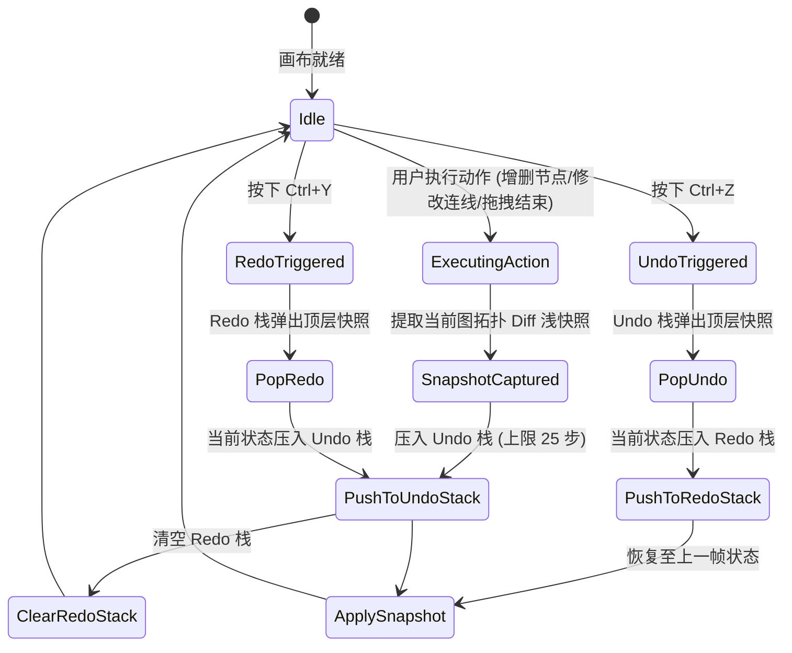
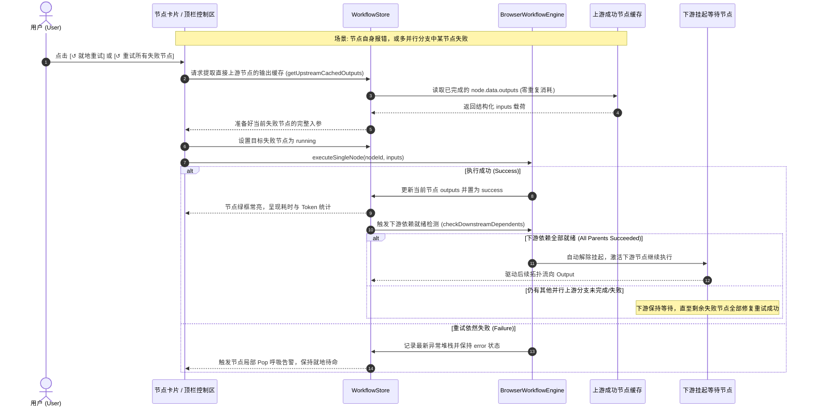

# PRD-012: 画布高频交互生产力、全节点精准说明与错误聚焦体系

[English Version](#english-version) | [中文版本](#中文版本)

---

<a name="中文版本"></a>
## 中文版本

### 1. 背景与业务目标 (Context & Business Objectives)

在完成了 `v0.4.4` 的**底层运行时加固（死锁打破器、看门狗、Token熔断）**与**全局配置中枢治理**后，系统的工程底座已高度确定且可靠。

然而，在日常画布高频搭建与排错调试的实际场景中，系统依然存在制约生产力与小白体验的关键卡点：
1. **节点与术语认知负荷**：12 类节点与底层拓扑术语（DAG、向量检索、Token Budget 等）缺乏直观的微交互说明，小白用户上手存在犹豫成本。
2. **错误定位与反馈割裂**：当变量缺失或解析异常时，传统的全局警报通知无法直观指向画布中具体的节点和字段。
3. **高频搭建重复劳动**：无法框选批量复制粘贴节点与关联连线，多分支流水线搭建效率受限。
4. **容错撤销机制缺失**：用户误删节点或误拉连线时，缺乏类似现代 IDE 的 `Ctrl+Z` 历史回退能力。
5. **调试重跑成本昂贵**：复杂链路上某个末端节点由于网络或配置报错后，用户不得不从节点 1 全流程重新运行，浪费时间与模型 Token。

**PRD-012 旨在贯彻“专业底座 + 渐进式易用（Progressive Usability）”理念，全面落地画布高频交互生产力。**

> [!NOTE]
> **本期暂缓项目说明（Deferred Items）**：
> 按照产品演进规划，以下 4 项暂不进入本次迭代：
> - ❌ 新手三步引导遮罩（Spotlight Tour）
> - ❌ 场景化模板画廊（Template Showcase Modal）
> - ❌ 断电历史草稿恢复（Draft Auto-Recovery）
> - ❌ 节点的“渐进式无代码化规则积木”（Visual Rule Builder / Snippets）

---

### 2. 核心功能规范 (Functional Specifications)

#### 2.1 全节点与技术术语精准悬停说明系统 (Comprehensive Tooltip System)

##### 规范原则
- **极简专业**：每个节点必须具备准确、简短的功能说明，**严格遵守一句话（复杂节点最多两句话）的硬约束**，杜绝冗长堆砌与过度低幼化措辞。
- **触发场景**：
  1. 顶部栏 `+ Add Node` 下拉菜单中每个节点的悬停说明；
  2. 画布上各节点卡片顶部标题/图标的悬停说明；
  3. 右侧属性抽屉中高频专业参数（Temperature, Token Budget, Top-K, Watchdog）旁的帮助图标悬停说明。

##### 12 类节点标准说明文案库

| 节点类型 | 图标与主题 | 标准悬停说明 (中文) | 标准悬停说明 (English) |
| :--- | :--- | :--- | :--- |
| **Input (输入)** | 🟢 翡翠绿 / `PlayCircle` | 定义工作流的初始输入参数与默认值，作为整条流水线的数据源头。 | Defines initial workflow input parameters and default values as the data source. |
| **Prompt (提示词)** | 🟣 紫罗兰 / `FileText` | 编写结构化提示词模板，支持通过 `{{nodeId.outputKey}}` 动态注入上游数据。 | Composes structured prompt templates, dynamically resolving `{{nodeId.outputKey}}` variables. |
| **LLM (大语言模型)** | 🔵 天空蓝 / `Bot` | 接入主流大语言模型，将提示词发送至云端或本地端点并流式生成回答。 | Calls cloud or local LLMs to generate streaming responses from composed prompts. |
| **Code (代码沙箱)** | 🟡 琥珀黄 / `Code2` | 在隔离沙箱中运行轻量 JavaScript 脚本，用于复杂数据清洗、格式转换与逻辑计算。 | Runs lightweight JavaScript in an isolated sandbox for data transformation and cleaning. |
| **Output (输出)** | 🌸 樱花粉 / `CheckCircle2` | 汇聚并格式化展示最终运行产物，支持 Markdown 实时渲染与一键导出。 | Formats and displays final deliverables with Markdown preview and one-click export. |
| **Condition (条件分支)** | 🟠 珊瑚橙 / `GitFork` | 基于规则表达式判断输入数据，动态分流下游执行路径并自动对无效分支进行跳过剪枝。 | Evaluates input rules to dynamically route execution and prune inactive downstream branches. |
| **Aggregator (变量聚合)** | 🔷 荧光青 / `GitMerge` | 汇聚并等待多个并行或条件分支的输出数据，按优先级合并为单一标准输出。 | Synchronizes multiple incoming branches and merges their outputs into a single consolidated payload. |
| **HTTP (接口请求)** | 🌐 靛青蓝 / `Globe` | 发起标准 HTTP REST API 请求，支持自定义 Headers、Query 参数与 JSON 报文以打通外部系统。 | Sends external HTTP REST requests with custom headers, query params, and JSON payloads. |
| **Knowledge (知识库RAG)** | 🪸 蓝绿色 / `Database` | 基于语义相似度在向量知识库中检索高相关度文本切片（RAG），为后续模型推理提供背景依据。 | Semantically searches vector knowledge bases for top-K text chunks to ground LLM reasoning (RAG). |
| **Agent (智能体)** | 🔮 幻彩紫 / `Sparkles` | 运行 ReAct 目标规划自主循环，模型根据任务自主决定思考并动态调用工具，直至输出最终成果。内置循环死锁监测与单步超时看门狗。 | Runs an autonomous ReAct loop where the model plans, calls tools, and synthesizes results. Includes built-in loop deadlock breakers and execution watchdogs. |
| **Loop (循环控制)** | 🔄 科技蓝 / `Repeat` | 对输入数组或批处理列表逐项执行子拓扑处理并聚合结果，内置最大迭代次数保护以防无限循环。 | Iterates through array items to execute batch sub-topologies, bounded by maximum iteration safety caps. |
| **Sub-Workflow (子工作流)** | 🌺 蔷薇红 / `Workflow` | 将另一个完整工作流封装为当前画布的黑盒节点，具备独立作用域隔离，实现大型复杂工程的模块化解耦。 | Encapsulates an entire workflow as a nested node with isolated variable scope for modular orchestration. |

##### 核心工程术语标准悬停词典
* **DAG (有向无环图)**：`单向流动的拓扑执行网络。任务按前后依赖关系严格依次调度，杜绝闭环死锁与无限循环。`
* **拓扑调度排序 (Topological Sorting)**：`根据连线自动计算依赖权重，将所有节点排布为最优并行波次依次执行的算法。`
* **语义向量检索 (Vector Embedding)**：`基于高维语义相似度计算的检索技术。超越传统死板字面匹配，能够按意图查找意思相近的文本。`
* **Token Budget (Token 限额保护)**：`单次执行允许消耗的最大 Token 总量。超出设定值后立即触发安全硬熔断，防范费用失控。`
* **Temperature (模型温度)**：`控制模型输出的发散度 (0.0~2.0)。数值越低输出越确定严谨，数值越高回答越丰富多样。`

---

#### 2.2 错误精准诊断与节点视口聚焦微动 (Pinpoint Error & Visual Pop Feedback)

##### 交互流程与机制
1. **直接客观的诊断语言**：抛弃非严肃用语，统一规范为人机友好的技术诊断：
   - 变量缺失：`参数未就绪: 变量 {{input_1.user_name}} 在上游输出中未定义`
   - 环路死锁：`拓扑闭环检测: 检测到环路依赖 [llm_1 -> code_1 -> llm_1]`
   - 请求超时：`HTTP 请求超时: 目标端点超过 30s 未响应`
2. **全局通知带“定位”动作**：点击 Toast 或控制台日志中的 `[🔍 定位节点]` 按钮：
   - 画布视口通过平滑过渡（`setCenter` / `fitView` 带 400ms easeOut）居中对齐出错节点；
   - 目标节点执行**轻量物理微动 Pop 动效**：节点卡片微微放大（`scale-103`），叠加发光的琥珀/赤红高亮边框光圈，持续 1500ms 后平滑淡化恢复；
   - 自动在右侧抽屉展开该节点，并将出错字段的输入框赋予焦点并红色边框警告。

---

#### 2.3 画布高频生产力三件套 (Canvas Ergonomics Core)

##### 1. 批量框选与复制粘贴 (`Ctrl+C` / `Ctrl+V`)
* **框选与捕获**：支持按住 `Shift` 拖拽框选，或点击选中多个节点；
* **内部连线识别**：按下 `Ctrl+C` 时，系统不仅复制选中的节点，还会自动识别并打包**仅在这批选中节点之间互联的内部连线（Internal Edges）**；
* **实例化与粘贴 (`Ctrl+V`)**：
  * 为每个粘贴出的新节点生成唯一随机 ID（如 `llm_1_copy_abc`）；
  * 保持这批节点之间的相对坐标布局不变，整体沿右下方平移 `(+50px, +50px)`，或对齐到当前鼠标指针坐标；
  * 重建内部连线，将其 `source` 和 `target` 重新映射到生成的新节点 ID 上，确保流程立即可用；
  * 自动将画布的选中态转移至新粘贴出的节点集合上。

##### 2. 画布撤销与重做历史栈 (`Ctrl+Z` / `Ctrl+Y`)
* **命令式状态栈**：在 `workflow-store` 中封装轻量时间旅行历史记录器 `HistoryManager`；
* **捕获的原子操作**：
  * 新增/删除节点（包含批量删除与粘贴）；
  * 新增/删除连线；
  * 节点拖拽移动结束（`onNodeDragStop`，拖拽过程中不频繁记栈）；
  * 属性配置的核心数据修改；
* **保护机制**：历史栈深度固定为 **25 步**，采用 Immer 结构共享浅拷贝，避免连续操作导致内存暴增。

##### 3. 单节点就地局部重试与并行故障恢复 (In-Place Local Retry & Parallel Failure Recovery)
* **核心业务痛点**：当长链路第 6 个节点因网络闪断或参数小改报错时，禁止强制从节点 1 全盘重跑，杜绝前序已成功节点的数十秒等待与成千上万 Token 浪费。
* **重跑目标定界（跑自身 vs 跑前一个）**：
  * **默认严格直接重跑报错节点自身 (In-Place Self-Retry)**：
    - **原理**：直接上游所有父节点的输出（`node.data.outputs`）在内存中已确切存在且有效。当前节点重试时，缓存解析器（Cache Resolver）直接将这些已缓存数据注入当前节点作为入参。
    - **为何不从前一个节点开始执行？**
      1. **防范 Token 浪费与等待惩罚**：前一个节点若为消耗 2000 Tokens 的大模型或深度 RAG 检索，无谓重跑会导致巨额算力与时间浪费；
      2. **保持输入确定性，杜绝随机性漂移**：大语言模型生成具有采样温度发散性（Temperature），重跑前序模型节点会导致下游 Prompt 上下文发生变化，破坏用户当前的排错基准。
    - **何时才会从前序节点跑？** 若用户发现“报错是因为前一个节点的 Prompt 写得不好”，用户只需**直接在该前序节点卡片上点击“就地重试”**，系统会以该前序节点为源头重新计算并向后级联刷新。
* **多节点并行报错处理机制 (Parallel Multi-Node Failure Handling)**：
  * **拓扑场景**：例如 Node A 扇出到 Node B (DeepSeek) 与 Node C (Gemini) 并行执行，下游汇聚于 Node D (Aggregator)。若波次 2 中 B 遭遇 HTTP 429 速率限制报错，C 遭遇超时报错：
  * **1. 节点级故障隔离 (Node-Level State Isolation)**：
    - Node B 与 Node C 分别独立记录各自的 `status = 'error'` 与独立错误报文；
    - 下游 Node D 因依赖项未完全就绪，保持 `blocked / waiting` 挂起状态，不会发生非预期异常。
  * **2. 细粒度单点各个击破**：
    - 用户可在 Node B 卡片上单独点击 `↺ 重试`，排查其 Key 或并发配置；
    - 亦可在 Node C 卡片上单独点击 `↺ 重试`，两者独立并发调度，互不干扰。
  * **3. 顶栏一键批量重试所有失败节点 (Batch Retry All Failed Nodes)**：
    - 当整图中存在 $\ge 2$ 个报错节点时，顶栏控制区与警报条动态显式提供：`[ 2 个节点执行失败 ]  [ ↺ 重试所有失败节点 (Retry All Failed) ]`；
    - 引擎一键筛选所有 `status === 'error'` 且上游输入已就绪的节点，以独立并行波次发起并发重跑，**已成功的 Node A 绝不重新执行**。
  * **4. 下游汇聚自动接续流转 (Automatic Downstream Resumption)**：
    - 当 Node B 和 Node C 通过重试全部转为 `status === 'success'` 后，下游处于挂起状态的 Node D 自动检测到所有上游依赖已全部就绪；
    - 引擎自动唤醒 Node D 及其下游拓扑继续执行，最终平滑流向 Output 节点，形成无缝自愈闭环。


##### 4. 节点级 React ErrorBoundary 局部错误隔离
* **防白屏底线**：在 `BaseNode` 外层统一包裹 `NodeErrorBoundary`；
* **故障隔离**：当某个自定义节点内部因为畸形数据或 Markdown 渲染异常抛错时，只在当前节点内部渲染暗红色降级卡片（显示异常堆栈与一键重置按钮）；
* **全局免疫**：其余所有节点、连线、导航栏、侧边栏正常可交互，彻底杜绝整屏崩溃。

---

#### 2.4 执行流态与成果交付 (Execution Flow & Delivery)

1. **连线水流脉冲动效 (Execution Dataflow Indicator)**：
   * 采用纯 CSS GPU 硬件加速的 SVG 虚线流动动画（`stroke-dasharray` / `stroke-dashoffset`），仅在关联节点处于 `running` 状态时激活；
   * 零 Canvas 轮询开销，大画布下帧率稳定在 60 FPS。
2. **Output 交付多格式一键导出**：
   * 在最终 Output 节点面板提供三个清晰的导出按钮：
     - `📋 复制 Markdown` (适合直接粘贴至知识库或飞书文档)
     - `💾 复制纯文本` (去除标记符的清洁纯文本)
     - `{ } 复制原始 JSON` (开发者直接取参集成)

---

### 3. 高保真界面与交互原型设计 (High-Fidelity UI Mockups)

#### 3.1 节点悬停说明与添加菜单原型

```
┌────────────────────────────────────────────────────────────────────────────────────────┐
│  + Add Node  ▼                                                                         │
├────────────────────────────────────────────────────────────────────────────────────────┤
│  🟢 Input (输入)           ───▶ ┌───────────────────────────────────────────────────┐  │
│  🟣 Prompt (提示词)            │  定义工作流的初始输入参数与默认值，作为整条流水   │  │
│  🔵 LLM (大模型)                │  线的数据源头。                                   │  │
│  🟡 Code (代码沙箱)            └───────────────────────────────────────────────────┘  │
│  🌸 Output (输出)                                                                     │
│  🟠 Condition (条件分支)       ┌───────────────────────────────────────────────────┐  │
│  🔷 Aggregator (变量聚合)  ───▶ │  汇聚并等待多个并行或条件分支的输出数据，按优先级 │  │
│  🌐 HTTP (接口请求)             │  合并为单一标准输出。                             │  │
│  🪸 Knowledge (知识库RAG)      └───────────────────────────────────────────────────┘  │
│  🔮 Agent (智能体)                                                                    │
│  🔄 Loop (循环控制)                                                                   │
│  🌺 Sub-Workflow (子工作流)                                                           │
└────────────────────────────────────────────────────────────────────────────────────────┘
```

#### 3.2 错误诊断与物理 Pop 视口聚焦动效原型

```
┌────────────────────────────────────────────────────────────────────────────────────────┐
│  [Toast Alert] ⚠️ 参数未就绪: 变量 {{input_1.user_name}} 在上游不存在   [ 🔍 定位节点 ] │
└────────────────────────────────────────────────────────────────────────────────────────┘
                                           │ (点击定位后：视口平滑居中对齐)
                                           ▼
                 ┌───────────────────────────────────────────────────────┐
             ░░░ │ 🟣 [Prompt 节点: prompt_builder]         [错误: 变量缺失]  │ ░░░
           ░░░   ├───────────────────────────────────────────────────────┤   ░░░
          ░░░    │ 模板内容:                                             │    ░░░ ◄── 1500ms 琥珀/赤红发光光圈
          ░░░    │ 你好 {{input_1.user_name}}，请处理以下咨询...         │    ░░░     搭配 scale-103 轻微 Pop 动效
           ░░░   ├───────────────────────────────────────────────────────┤   ░░░
             ░░░ │ ⚠️ 关联字段 input_1.user_name 标红高亮并获得焦点      │ ░░░
                 └───────────────────────────────────────────────────────┘
```

#### 3.3 节点多选批量复制与粘贴偏移原型

```
  [ 原始选中区域: 按住 Shift 框选 ]                      [ 按下 Ctrl+V 粘贴后的新实例 ]
  ┌──────────────┐       ┌──────────────┐               ┌──────────────┐       ┌──────────────┐
  │  Prompt #1   │──────▶│    LLM #1    │               │ Prompt #1_cp │──────▶│  LLM #1_cp   │
  └──────────────┘       └──────────────┘               └──────────────┘       └──────────────┘
         ▲                      ▲                              ▲                      ▲
         └────── 内部连线保留 ───┘                              └── 内部连线自动重映射 ─┘
                                                       (相对原位置偏移 +50px, +50px 错开排布)
```

#### 3.4 节点单步就地局部重试原型 (In-Place Local Retry)

```
┌────────────────────────────────────────────────────────────────────────────────────────┐
│ 🔮 Agent 智能体节点: agent_dispatch_1                                [ 状态: ❌ 异常 ] │
├────────────────────────────────────────────────────────────────────────────────────────┤
│ 错误说明: 外部工具天气接口请求超时 (HTTP 504 Gateway Timeout)                           │
├────────────────────────────────────────────────────────────────────────────────────────┤
│ 上游就绪数据: { query: "查北京天气", intent: "weather" } (已自上游安全缓存)            │
├────────────────────────────────────────────────────────────────────────────────────────┤
│                                                                                        │
│     [ ↺ 就地重试该节点 (Local Retry) ]             [ ▶ 从头整图重跑 (Run All) ]         │
│     (免重新计算前序 4 个节点，节省 2400 Tokens)                                         │
│                                                                                        │
└────────────────────────────────────────────────────────────────────────────────────────┘
```

---

### 4. 架构时序与状态流转图 (Architectural Flows)

#### 4.1 撤销/重做命令栈流转时序 (Undo/Redo State Lifecycle)



#### 4.2 就地重试与下游拓扑恢复时序图 (In-Place Retry & Downstream Continuation)



---

### 5. 验收与质量基准 (Acceptance Criteria)

1. **说明文案全覆盖**：12 类节点与 5 大技术术语在下拉菜单、节点卡片、属性面板中均有完整中英双语 Tooltip，文案严格控制在一至两句话内。
2. **快捷操作覆盖率**：
   - 框选 3 个以上互联节点按下 `Ctrl+C` 与 `Ctrl+V`，节点与内部连线 100% 完整复刻，外部连线干净断开，新节点 ID 无冲突。
   - 连续执行添加、删除、连线 5 次，连续按下 `Ctrl+Z` 能逐步完全还原画布拓扑，按下 `Ctrl+Y` 能逐步完全重做。
3. **单节点就地重试**：当中间某节点执行报错时，点击“就地重试”能够精准复用上游缓存数据，在不触发上游节点重新执行的前提下完成单点重跑与状态刷新。
4. **防白屏稳定性**：故意构造包含死循环或非法对象的输出报文注入节点，只有目标节点卡片显示局部降级 UI，画布整体与其余节点仍能平移、缩放与操作。
5. **性能基准**：在 40 个节点与 50 条连线的密集画布上，水流虚线流动动效与 Tooltip 悬停响应流畅，画布缩放平移帧率保持 $\ge 55\text{ FPS}$。

---

<a name="english-version"></a>
## English Version

### 1. Executive Summary
PRD-012 establishes the **Canvas Ergonomics & Interactive Productivity** milestone for PatchCat v0.4.6. It transforms PatchCat from a functional developer DAG tool into an intuitive, highly responsive visual workspace by introducing:
1. **Precise One-Sentence Node & Term Tooltips**: Concise, jargon-free tooltips for all 12 node types and core orchestration concepts.
2. **Pinpoint Error Diagnostics & Visual Pop Feedback**: Actionable error reporting with viewport centering and node-level visual pulse indicators.
3. **Canvas Power Ergonomics**: Multi-node copy & paste (`Ctrl+C/V`), undo & redo history stack (`Ctrl+Z/Y`), in-place local node retry, and node-level ErrorBoundary protection.
4. **Execution Flow Telemetry**: GPU-accelerated animated edge flows and multi-format delivery options in the Output node.
