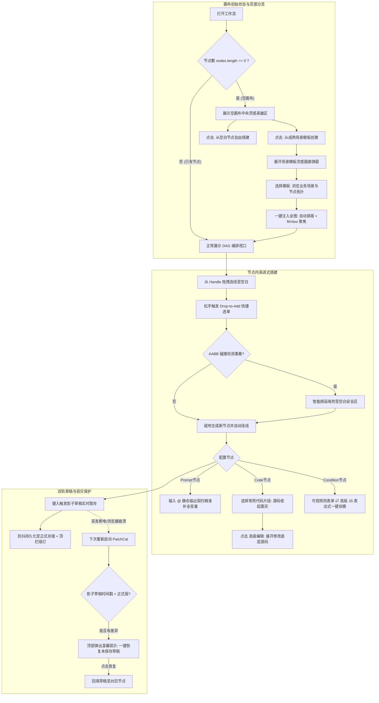

# PRD-013: 空画布灵感引导、场景模板画廊、节点渐进式无代码与草稿安全体系

[English Version](#english-version) | [中文版本](#中文版本)

---

<a name="中文版本"></a>
## 中文版本

### 1. 业务背景与目的 (Context & Purpose)

在完成了 `v0.4.6` 的**画布底层人机工效（25 步有界撤销重做、多节点剪贴板克隆、局部单节点重试与节点级防白屏）**之后，PatchCat 已经具备了极佳的专业级操作手感。

然而，在走向更广泛受众（兼顾轻度业务用户与资深工程师）的演进过程中，产品依然存在以下 **三大体验断层**：

1. **白屏瘫痪症与认知断层（Blank Canvas Anxiety）**：
   - 新用户首次进入产品或清空画布后，面对的是死寂的网格，不知第一步该干什么；
   - 现有的工作流预设深藏在顶栏的小下拉框中，充斥着偏技术的命名，普通用户无法感知“这个工作流到底能帮我解决什么现实业务问题”，也看不懂节点间的依赖逻辑。
2. **节点配置的语法恐惧与机械手抖（Low-Code Ergonomics Gap）**：
   - **Code 节点**：只有一个纯黑输入框写着 `return inputs;`，非程序员面对大模型吐出的 Markdown JSON 字符串不知如何清洗，而工程师每次也必须手动重写样板正则；
   - **Prompt 节点**：强制要求用户手敲记住并拼写正确的上游节点英文 ID（如 `{{node_weather.temperature}}`），手残拼错率极高，导致“参数未就绪”频发；
   - **Condition 节点**：现有的表单规则虽然降低了门槛，但对于需要写复合逻辑（且/或嵌套、正则检测）的技术用户来说过于冗长，缺乏高级表达式出口。
3. **数据安全感与意外丢失焦虑（Draft Safety & Recovery Gap）**：
   - 网页虽然有后台防抖自动保存，但界面**没有任何视觉保存状态反馈**，用户每次关闭前都在疑神疑鬼；
   - 缺乏离开页面的防误触保护，且在浏览器崩溃或断电后，无法智能找回未落盘的编辑草稿。

#### 本次迭代目的 (Purpose)
本 PRD 旨在确立 **“专业确定性底座 + 渐进式披露（Progressive Disclosure）”** 的设计哲学：
- **消灭全屏黑色探照灯弹窗等反人类说教**；
- **以“场景模板灵感”作为空画布的第一触点**，让初次探索者与业务用户在挑选模板的同时自然看懂节点拓扑搭配逻辑；
- **给三大节点铺设无代码化的高速公路，同时 100% 捍卫代码与高级表达式的自由度**；
- **建立坚固的影子草稿双轨容灾机制，死守数据 0 丢失底线**。

---

### 2. 目标人群画像 (Target Audience & Personas)

```
┌────────────────────────────────────────────────────────────────────────────────────────┐
│                               PatchCat 双轨用户画像分层                                │
├──────────────────────────────────────────┬─────────────────────────────────────────────┤
│ 👤 角色 A：AI 探索者 / 业务运营 / 产品经理 │ 👨‍💻 角色 B：AI 工程师 / 全栈开发者 / 架构师  │
├──────────────────────────────────────────┼─────────────────────────────────────────────┤
│ • 核心痛点：不懂复杂代码语法，面对空白   │ • 核心痛点：讨厌死板低效的图形积木，需要    │
│   画布容易发懵，害怕手残敲错变量名。     │   100% 的 JS 沙箱自由与单行复杂逻辑表达。    │
│ • 核心诉求：成熟场景模板一键套用、点击式 │ • 核心诉求：将模板作为快速脚手架、常用的代码│
│   变量补全、现成代码片段，拒绝空洞说教。 │   片段一键偷懒、全功能 Monaco 编辑器与 AST。 │
│ • 体验底线：不被专业黑话和满屏代码吓退。 │ • 体验底线：绝不接受功能被阉割成低幼化玩具。│
└──────────────────────────────────────────┴─────────────────────────────────────────────┘
```

---

### 3. 详细功能规范 (Functional Specifications)

```
┌────────────────────────────────────────────────────────────────────────────────────────┐
│                                   PRD-013 四大功能支柱                                  │
├───────────────────────┬───────────────────────┬────────────────────────┬───────────────┤
│ 1. 空画布英雄区与灵感库 │ 2. Drop-to-Add 连线即增│ 3. 节点渐进式无代码化  │ 4. 影子草稿保护 │
│ • 统一 0 节点空态呈现 │ • 拖线空白处松开就地选│ • Code: 片段折叠+高级编辑│ • 顶栏实时保存灯│
│ • 文件夹分类场景画廊   │ • AABB 碰撞检测防重叠 │ • Prompt: 静态契约@补全 │ • 离开挽留守卫 │
│ • 业务场景+节点拓扑胶囊│ • 预留未来追加导入能力│ • Condition: 表单/表达式│ • 时序时差一键恢复│
└───────────────────────┴───────────────────────┴────────────────────────┴───────────────┘
```

#### 3.1 模块一：空画布灵感英雄区与业务场景模板库 (Empty Canvas & Template Showcase)

##### 3.1.1 触发与展示规则
* **统一触发场景**：
  1. 新用户首次启动产品且画布为空时；
  2. 老用户在左侧侧边栏点击“+ 新建工作流”产生新空白画布时；
  3. 任意工作流内的所有节点被清空（`nodes.length === 0`）时。

##### 3.1.2 针对“纯新用户”与“老用户新建空白”的自适应双轨交互 (New vs. Returning User Differentiation)
* **状态智能判定 (Context Detection)**：
  - **纯新用户（First-time Newcomer）**：系统中工作流总数 $\le 1$ 且历史运行记录为空；
  - **老用户空白画布（Existing User on Blank Canvas）**：系统内已积累有其他工作流资产，主动新建了空白流程或清空了当前画布。
* **差异化视觉与交互呈现 (Adaptive Hero Card UI & Demo)**：

  > [!TIP]
  > 💡 **交互原型实测**：可在本地直接打开 [交互式原型 Demo (demo_empty_canvas_hero.html)](file:///C:/Users/小喵喵/.gemini/antigravity/brain/8d66feb3-2ae3-43d4-bc94-14f6962cd0ce/demo_empty_canvas_hero.html) 实时切换体验双轨模式与起手入图交互。

  #### 状态 A：纯新用户首次启动（启蒙导师模式）
  

  * **核心呈现**：聚焦业务启蒙，主推 `[ ✨ 从成熟场景模板创建 (推荐) ]`，辅以 `[ ➕ 从零开始添加空白起始节点 ]`，引导用户通过现成场景看懂节点拓扑搭配。

  #### 状态 B：老用户新建空白画布（效率发射台模式）
  

  * **核心呈现**：聚焦效率与脚手架，提供 `[ 📚 浏览场景脚手架 ]`、`[ ⚡ 快速起手 (Input➔LLM) ]`、`[ 📂 导入本地 JSON ]` 与 `[ ➕ 放置空白起始节点 ]` 四大快捷入口。

* **老用户核心体验保障 (Ergonomic Guarantees for Experienced Users)**：
  1. **绝不把老手当新手说教**：严禁出现“欢迎来到 PatchCat，这是画布……”等反智新人指引弹窗；
  2. **快速起手（Boilerplate Elimination）**：老手搭建新流时往往需要重复拉取 `Input ➔ Prompt ➔ LLM`，卡片提供一键插入常用起手骨架，省去 3 次拖拽与连线；
  3. **快捷导入通道**：老用户常需基于历史备份构建，直接在英雄区提供 `[ 📂 导入本地工作流 JSON ]` 入口；
  4. **极客零阻断（Zero Friction Geek Bypass）**：老用户若选择直接从左侧拖拽节点入画布，或通过快捷键添加，英雄区在捕获到第一个节点创建的瞬间**毫秒级平滑淡出**，绝不进行拦截确认。

##### 3.1.3 场景模板库弹窗 (Template Showcase Modal)
* **分类导航（类似文件夹目录）**：
  - 📁 全部场景 (All)
  - 📚 知识库与 RAG 质检 (Knowledge & RAG)
  - 🔀 智能客服与动态分流 (Customer Routing)
  - ⚖️ 多模型竞技与评测 (Model Arena Eval)
  - 🌐 REST API 与系统集成 (API & Integrations)
* **单个模板卡片的信息架构（完全杜绝纯技术黑话）**：
  1. **业务场景说明 (Scenario)**：
     - 用清晰人话讲明白该流解决什么实际问题（例如：“针对企业技术诉求，从私有白皮书召回切片起草方案，再由独立审计官逐行反思质检，彻底杜绝大模型胡言乱语”）。
  2. **节点流转拓扑可视化 (Pipeline Capsules)**：
     - 用彩色胶囊直观标出数据流动链路：  
       `[📥 业务入参] ➔ [📚 语义检索] ➔ [🤖 初稿生成] ➔ [🔍 事实质检] ➔ [🏁 交付报告]`
     - **心智价值**：业务用户与初学者在挑选模板的同时，一眼看懂“原来知识库要接提示词、提示词再接大模型”，完成架构启蒙。
  3. **核心特性与难度标签**：
     - 包含标签如：`#稠密向量召回` `#双模型质检` `#Zero-Hallucination`。

##### 3.1.4 一键导入与未来复用演进
* **一键整图导入**：
  - 点击卡片右下角 `[ 🚀 使用此模板并导入画布 ]`；
  - 弹窗丝滑淡出，模板中的完整节点与带流动虚线的连线瞬间布满画布，自动执行平滑居中聚焦（`fitView({ padding: 0.2, duration: 600 })`）；
  - 顶部 Run 按钮就绪，3 秒即可跑通全流程。
* **架构预留能力：可重复/追加导入（Composability Subgraphs）**：
  - 模板导入接口保留 `mode: 'replace' | 'append'` 参数；
  - 后续阶段支持在已有画布上多次追加导入子模块，利用 v0.4.6 的 `nanoid` 映射与坐标平移算法，将其作为可复用的“业务乐高子图”。

---

#### 3.2 模块二：Drop-to-Add 连线即增与智能防重叠 (Drop-to-Add & Collision Avoidance)

##### 3.2.1 交互流程
1. 用户在任意节点的输出端口（Handle）按住鼠标左键拉出一根贝塞尔连线；
2. 拖拽至画布空白区域并**松开鼠标**；
3. 鼠标松开位置**就地浮现微型候选选单**（列出 Prompt、LLM、Code、Condition 等常用节点）；
4. 用户点击目标节点，新节点在松手位置生成，且**前置节点与新节点之间的连线自动连好**。

##### 3.2.2 关键工程规约：AABB 空间碰撞检测与智能避让 (Spatial Collision Avoidance)
* **问题痛点**：若用户松手位置紧挨着某个已有节点，新生成的卡片容易与老卡片发生视觉重叠遮挡。
* **算法规约**：
  - 在生成新节点坐标 $(X_{new}, Y_{new})$ 时，遍历当前画布所有节点的包围盒 $(X_i, Y_i, W_i, H_i)$；
  - 计算最小安全间距 $Gap_{min} = 40px$；
  - 若检测到与已有节点包围盒重叠（`Overlap(Box_{new}, Box_i) === true`），系统自动沿流向向量顺延吸附至空白安全区域（默认向右偏移 $W_i + Gap$ 或向下微调），确保卡片清爽整洁。

---

#### 3.3 模块三：节点的“渐进式无代码化”三件套 (Progressive Low-Code Node Suite)

```
┌────────────────────────────────────────────────────────────────────────────────────────┐
│                               三大节点渐进式分层模型                                   │
├───────────────────┬────────────────────────────────────────────────────────────────────┤
│ 节点类型          │ 渐进式分层方案 (Progressive Layering)                              │
├───────────────────┼────────────────────────────────────────────────────────────────────┤
│ 1. Code 节点      │ 选用代码片段 ➔ 源码自动折叠置灰，呈现人话功能说明 ➔ 点 [高级编辑] 解锁 │
├───────────────────┼────────────────────────────────────────────────────────────────────┤
│ 2. Prompt 节点    │ 设计期依赖静态输出契约推导 @ 补全 ➔ 运行期支持 {{var | '默认值'}} 降级 │
├───────────────────┼────────────────────────────────────────────────────────────────────┤
│ 3. Condition 节点 │ 规则简单时用可视规则表单点选 ⇄ 复杂逻辑一键切到单行高级 JS 表达式  │
└───────────────────┴────────────────────────────────────────────────────────────────────┘
```

##### 3.3.1 Code 节点：预置片段收起置灰 + `[高级编辑]` 解锁
* **双层洋葱模型**：
  1. **外层（轻代码与开箱即用）**：
     - 编辑框上方提供常用高频代码片段胶囊：
       - `[⚡ 提取 Markdown JSON 块]`：自动提取 ```json ... ``` 块并转换为标准对象；
       - `[⚡ 文本按换行切分数组]`：清洗首尾空格并拆分为列表；
       - `[⚡ 文本去空白与标点]`：清洗不可见字符；
       - `[⚡ 多源字典扁平合并]`：合并上游多分支输出。
     - **关键体验突破**：一旦用户选择了某个片段，**下方的代码框自动收起置灰，不直接展示 15 行复杂的正则和 try/catch**，而是显示简洁卡片：`⚡ 当前已启用：【Markdown JSON 提取器】`。
  2. **内层（极客自由）**：
     - 置灰卡片上醒目保留按钮：**`[ 🛠️ 高级编辑 (查看/修改源码) ]`**；
     - 点击后解除置灰并完全展开原生 Monaco/JS 编辑器，工程师可随时手写重构正则或增加个性化逻辑；
     - 提供 `[ ↺ 还原为标准片段 ]` 供随时回退。

##### 3.3.2 Prompt 节点：静态输出契约推导 + `@` 变量精准补全 + 优雅降级
* **设计期静态推导（Design-time Static Schema Contract）**：
  - **核心原理**：**不需要等上游执行完拿到真实返回值！**
  - 系统根据画布中已连线的上游节点**类型（Type）**，静态确定其必定拥有的产出字段：
    - `Input` 节点：用户配置的入参键；
    - `Knowledge` 节点：必定输出 `.result`, `.records`；
    - `LLM` 节点：必定输出 `.response`, `.reasoning`；
    - `HTTP` 节点：必定输出 `.response`, `.status`。
* **`@` 触发与气泡插入**：
  - 用户在输入框打出 `@` 时，光标处浮现轻量候选气泡，展示上游可用字段列表；
  - 鼠标点击后，自动转换为 `{{node_id.field}}` 插入光标位置，输入框下方“已识别插槽”实时响应；
  - **彻底根除因手残拼错节点 ID 导致的“参数未就绪”报错**。
* **运行期优雅降级（Runtime Fallback Guard）**：
  - 若上游节点未连接，Prompt 支持作为静态常量独立运行；
  - 语法支持管道符降级：`{{node_knowledge.result | '暂无参考资料'}}`；若上游分支被跳过或返回空，自动填充默认值，绝不中断整链。

##### 3.3.3 Condition 节点：可视规则表单 ⇄ 高级 JS 表达式一键双模
* **模式 A（可视规则表单）**：
  - 适合 80% 常规场景：下拉选择 `[输入变量] [操作符: >=, ==, contains, is_empty] [目标值] ➔ [流向分支]`，支持 `AND/OR` 多规则；
* **模式 B（高级 JS 表达式）**：
  - 右上角一键切换：`[⚡ 切换到高级表达式]`；
  - 展开单行代码输入框，技术用户直接手写：  
    `inputs.urgency >= 4 && inputs.sentiment === 'negative'`；
  - **底层一致性**：双模统一编译为底层的 AST 规则引擎，零两套逻辑。

---

#### 3.4 模块四：断电安全感、页面离开守卫与影子草稿时序恢复 (Draft Safety & Shadow Recovery)

##### 3.4.1 顶栏视觉安全感指示灯 (Save Status Indicator)
* 顶栏右侧常驻微型状态灯：
  - 状态 1（正常）：`🟢 所有修改已保存至本地 (刚刚)`；
  - 状态 2（同步中）：输入框打字或画布拖拽时变为轻微呼吸：`🟡 正在同步保存...`。

##### 3.4.2 页面离开拦截守卫 (`beforeunload` Guard)
* 当检测到以下任一状态时，激活浏览器原生退出挽留提示：
  1. 画布正在执行工作流（`isExecuting: true`）；
  2. 属性抽屉中有尚未完成防抖落盘的输入草稿；
* 阻止用户误触 `Ctrl+W` 或刷新导致执行中断或内容丢失。

##### 3.4.3 影子草稿时序比对恢复机制（采纳方案 B）
* **双轨存储原理**：
  - **主版本（Committed Workflow）**：通过正式防抖写入 `localStorage[STORAGE_KEY_WORKFLOWS]`；
  - **影子草稿（Shadow Draft）**：当用户在 Prompt/Code 文本框键入时，以超轻量时序（50ms 极短防抖或同步）将当前节点的未提交变动暂存在 `localStorage['patchcat_shadow_draft']`；
* **异常启动差异恢复流程**：
  1. 用户重新启动或刷新 PatchCat 时，系统执行启动自检：
     $$\Delta t = Timestamp(ShadowDraft) - Timestamp(CommittedWorkflow)$$
  2. 若 $\Delta t > 0$ 且两者内容哈希不一致：
     - 判定为：**上次存在未完全落盘的草稿变动**（无论是由断电、浏览器崩溃还是强杀引起）；
  3. 界面顶部滑出温馨的草稿恢复浮条：
     - *“⚠️ 检测到上次未正常同步的编辑草稿（草稿比当前图多出未保存的提示词内容）”*；
     - 按钮选项：**`[ 一键恢复草稿 ]`** | **`[ 放弃并使用当前版本 ]`**；
  4. 用户点击恢复后，草稿内容平滑回填，死守数据 0 丢失。

---

### 4. 架构设计与状态流转 (Architecture & State Flow)



---

### 5. 验收标准与测试契约 (Acceptance Criteria & Test Matrix)

| 编号 | 模块 | 验收项 (Acceptance Criteria) | 验证手段 |
| :---: | :--- | :--- | :--- |
| **AC-01** | 空画布灵感区 | 当 `nodes.length === 0` 时，画布中央居中展示磨砂质感引导卡片；添加节点后自动无感隐藏。 | 单元测试 + UI 交互测试 |
| **AC-02** | 模板画廊弹窗 | 模板画廊包含 4 大工业级场景；每张卡片具备场景人话描述、彩色节点拓扑小胶囊、特性标签；点击导入后全图节点与连线完整上屏并触发 `fitView`。 | 组件集成测试 |
| **AC-03** | 连线即增防重叠 | 从输出端点拖线至空白画布松手，弹出候选微选单；创建节点时进行 AABB 碰撞检测，与已有节点重叠时自动执行安全间距顺延（$Gap \ge 40px$）。 | 几何拓扑算法单元测试 |
| **AC-04** | Prompt @补全 | 在 Prompt 输入框键入 `@`，即便上游节点尚未执行，也能基于静态输出契约准确弹出变量气泡；点选后正确转化为 `{{node_id.field}}` 插入。 | 表单交互测试 |
| **AC-05** | Code 片段折叠 | 选用代码片段后，代码框默认置灰收起，展示人话卡片；点击 `[高级编辑]` 能完全解锁原生 JS 编辑并支持正常运行与修改。 | 组件状态测试 |
| **AC-06** | Condition 双模 | 在“可视规则表单”与“高级 JS 表达式”之间切换时，表达式与规则数据能够正确映射和解析，执行引擎判定结果 100% 一致。 | 引擎契约测试 |
| **AC-07** | 离开挽留守卫 | 当 `isExecuting === true` 或有未落盘输入时，触发浏览器刷新或关闭会弹出原生的 `beforeunload` 拦截确认框。 | 浏览器事件测试 |
| **AC-08** | 影子草稿恢复 | 模拟输入文字后未落盘直接刷新：系统启动时识别出 `ShadowDraft` 差异，顶部弹出恢复浮条，点击后能完整还原最后编辑的文本。 | LocalStorage 状态恢复测试 |

---

<a name="english-version"></a>
## English Version (Executive Summary)

### Overview
PRD-013 establishes the foundational **"Progressive Usability & Zero-Anxiety Ergonomics"** framework for PatchCat, bridging the gap between non-technical users and professional engineers without dumbing down system capabilities.

### Core Pillars
1. **Empty Canvas Hero & Template Showcase Gallery**:
   - Replaces intrusive spotlight tours with an adaptive central call-to-action on 0-node canvases:
     - **For Newcomers**: Acts as an inspirational guide ("Start your first workflow") showcasing scenario templates to understand node topologies.
     - **For Returning Users**: Acts as a rapid scaffolding hub ("Start orchestrating new workflow") with 1-click starter pipelines (`Input ➔ LLM`), JSON import, and zero-friction geek bypass.
   - Categorized modal gallery highlighting real business scenarios, visual pipeline capsules (e.g. `Input ➔ Knowledge ➔ LLM ➔ Auditor ➔ Output`), and one-click full graph population with `fitView`.
   - Lays architectural ground for future appendable subgraphs.
2. **Drop-to-Add Connection with AABB Collision Avoidance**:
   - Releasing an in-flight edge connection on empty canvas brings up an in-place node palette.
   - Implements bounding-box collision detection with a minimum $40px$ offset to prevent card overlapping.
3. **Progressive Low-Code Node Suite**:
   - **Code Node**: Curated production snippets. Code editor is folded/grayed out by default upon snippet selection, showing a friendly descriptor card with an `[Advanced Edit]` button to unlock raw JS.
   - **Prompt Node**: Derives available variables from static output contracts at design time (zero pre-run dependency), autocomplete triggered via `@`, with runtime fallback values (`{{var \| 'fallback'}}`).
   - **Condition Node**: Dual-mode toggle between Visual Rule Builder and Advanced Single-line JS Expressions.
4. **Draft Safety & Shadow Recovery**:
   - Visual save status indicator (`🟢 Saved to local / 🟡 Syncing...`).
   - `beforeunload` guard during active workflow execution.
   - Scheme B Shadow Draft Diffing: Compares shadow timestamps with formal workflows on reboot to offer 1-click recovery of unsaved edits.
