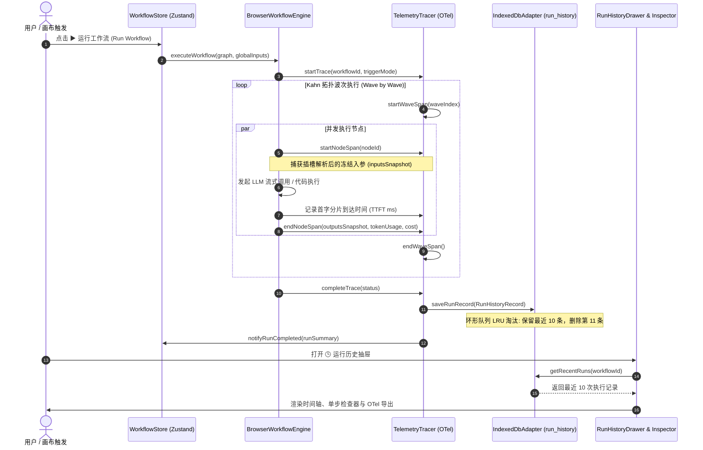
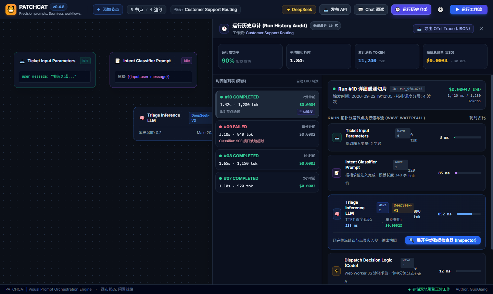
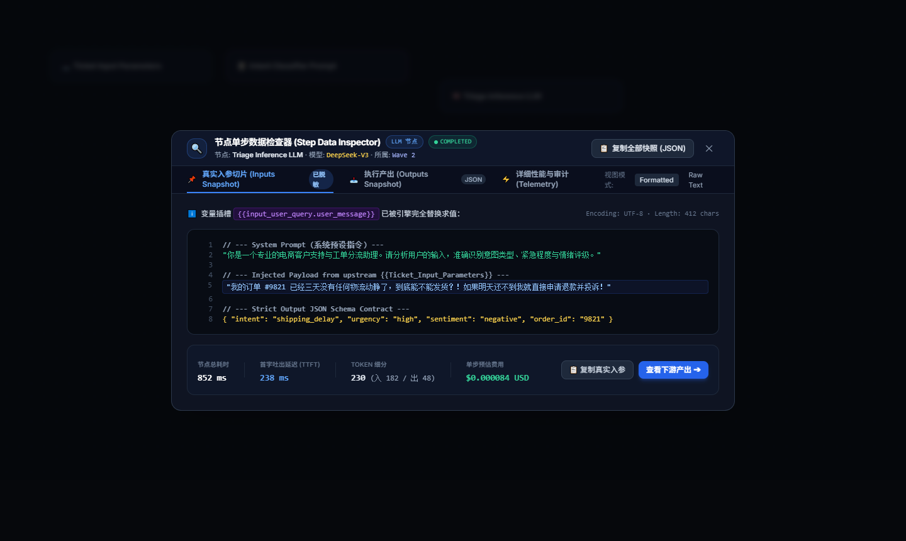
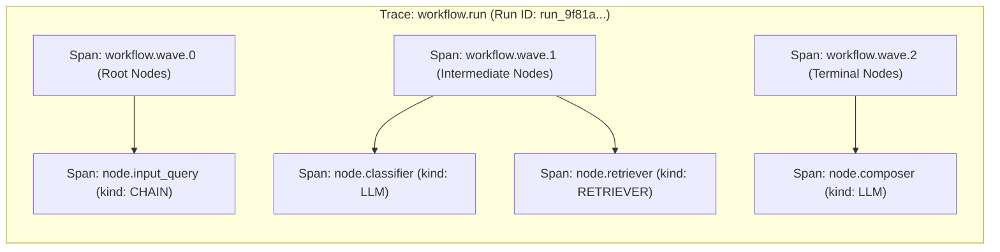

# PRD-015: 运行可观测性、节点单步数据快照与 OpenTelemetry 标准对齐

[English Version](#english-version) | [中文版本](#中文版本)

---

<a name="中文版本"></a>
## 中文版本

### 1. 业务背景与设计动机 (Context & Motivation)

在完成了 `v0.4.6` 的画布工效学（撤销重做、防碰撞、局部单节点重试）以及 `v0.4.7` 的轻量网关与路由集成后，PatchCat 已经具备了出色的拓扑搭建与执行能力。

然而，当用户构建由 **多个 LLM、Agent 自主循环、知识库检索与复杂代码路由交织构成的生产级智能体工作流** 时，系统在“**运行可观测性与排错审计（Observability & Auditability）**”层面面临着核心痛点：

```
                    ┌─────────────────────────────────────────────────────────┐
                    │               工作流执行中的“黑盒之痛”                  │
                    └────────────────────────────┬────────────────────────────┘
                                                 │
            ┌────────────────────────────────────┼────────────────────────────────────┐
            ▼                                    ▼                                    ▼
┌─────────────────────────┐          ┌─────────────────────────┐          ┌─────────────────────────┐
│     1. 状态一次性易失   │          │     2. 排错无案发现场   │          │     3. 成本暗度陈仓     │
│ 画布执行完成或刷新后，  │          │ 复杂流报错或输出不符    │          │ 调用耗费了多少 Token？  │
│ 历史数据被覆盖，无法查  │          │ 预期时，用户无法查看中  │          │ 各节点耗时瓶颈在哪？    │
│ 看上一次甚至前几次的真  │          │ 间节点究竟接收到了什么  │          │ 账单费用究竟花了多少？  │
│ 实执行耗时与结果对比。  │          │ 最终 Prompt 全文。      │          │ 缺乏透明的数据度量。    │
└─────────────────────────┘          └─────────────────────────┘          └─────────────────────────┘
```

#### 本次迭代目标 (Core Purpose)
本 PRD 旨在打造全闭环的 **白盒化运行可观测体系**：
1. **时间轴回溯（Run History Timeline）**：基于浏览器 IndexedDB 异步环形队列，持久化保留当前工作流**最近 10 次**执行快照，支持状态、耗时与 Token 账单全览。
2. **冻结案发现场（Step-by-Step Data Inspector）**：随时就地展开任意历史 Run 中每个节点的**真实入参切片（插槽替换后）、执行产出全文、首字延迟（TTFT）与单步费用**。
3. **工业标准对齐（OpenTelemetry / OpenInference）**：将 Kahn 拓扑分层调度波次映射为标准 Span 树，提供**一键导出 OTel JSON**，无缝对接 Langfuse、Arize Phoenix、Datadog 等专业 APM 观测平台。

---

### 2. 总体数据流与可观测架构 (System Architecture & Data Flow)



---

### 3. 核心功能规范与界面示意 (Functional Specifications)

#### 3.1 最近运行历史时间轴抽屉 (`RunHistoryDrawer.tsx`)

- **触发入口**：
  - 底部状态栏右侧新增操作胶囊：`[ 🕒 运行历史 (10) ]`；
  - 支持全局快捷键呼出：`Ctrl+Shift+H`（Mac: `Cmd+Shift+H`）；
  - 运行结束时若发生错误，顶部错误通知栏附带 `[ 查看看板 ]` 直达抽屉。
- **界面原型与交互布局**：

<p align="center">
  
</p>

#### 3.2 节点单步数据检查器 (`StepDataInspector.tsx`)

点击任意历史波次中的节点卡片，就地滑出深色专业级**“单步案发现场检查器”**，分三大 Tab 彻底拆解节点运行内幕：

<p align="center">
  
</p>


- **Tab 1: 真实入参 (Inputs)**：
  - 展示插槽变量（如 `{{input_node.query}}`）被引擎完全替换求值后的**最终送入大模型的完整字符串/对象**；
  - 彻底解决用户在配置 Prompt 模板时因拼错变量名导致的“隐性空参数”困惑；
  - 自动运行数据脱敏清洗器（`sanitizeData`），遮罩所有敏感 Key 与 Token。
- **Tab 2: 实际产出 (Outputs)**：
  - 支持多视图切换：`[Raw 原始文本]`、`[JSON 结构体高亮]` 与 `[Markdown 渲染]`；
  - 如果节点发生错误，高亮展示错误堆栈与 HTTP 状态码诊断；
  - 若为 **Agent 节点**，额外渲染工具调用追踪卡片（展示所调工具名、传入参数与 Observation 观察结果）。
- **Tab 3: 性能度量 (Telemetry)**：
  - 详细耗时拆解（排队时间、TTFT 首字延迟、生成时间、后处理格式化时间）；
  - Token 输入/输出占比柱状图。

---

### 4. 工业标准对齐：OpenTelemetry / OpenInference 规范映射

为保证企业级用户可将 PatchCat 运行痕迹直接对接到现有的 APM 系统，系统将 DAG 拓扑执行严格对齐至 **OpenInference 语义契约（Semantic Conventions）**：



#### 4.1 Span 属性映射标准

| OpenTelemetry / OpenInference 属性 | 对应 PatchCat 内部字段 | 说明与示例 |
| :--- | :--- | :--- |
| `trace_id` | `record.id` | 32 位 Hex 格式，全局唯一运行标识 |
| `span_id` | `generateSpanId()` | 16 位 Hex 格式，单节点/单步唯一标识 |
| `parent_span_id` | 波次或根 Trace ID | 表达调用父子从属关系 |
| `openinference.span.kind` | `node.type` 映射 | `llm` ➔ `LLM`, `agent` ➔ `AGENT`, `knowledge` ➔ `RETRIEVER`, 其他 ➔ `CHAIN` |
| `llm.model_name` | `node.config.model` | 调用的模型名称（如 `gemini-2.5-flash`） |
| `llm.token_count.prompt` | `tokenUsage.promptTokens` | 输入 Prompt Token 消耗 |
| `llm.token_count.completion` | `tokenUsage.completionTokens` | 输出 Completion Token 消耗 |
| `llm.token_count.total` | `tokenUsage.totalTokens` | 总 Token 消耗 |
| `llm.input_messages` | `inputsSnapshot` | 结构化输入的对话或提示词列表 |
| `llm.output_messages` | `outputsSnapshot` | 结构化输出结果 |
| `llm.time_to_first_token_ms`| `ttftMs` | 首字延迟毫秒数（TTFT） |

#### 4.2 一键导出与第三方兼容性
- 点击 `[ 📤 导出 OTel Trace (JSON) ]` 生成遵循 OpenTelemetry Protocol (OTLP/JSON) 格式的 `.json` 文件；
- **免二次加工直接兼容**：可直接拖拽导入开源平台 **Langfuse**、**Arize Phoenix**、**Jaeger** 或上传至企业 APM。

---

### 5. 存储架构与成本核算引擎 (Storage & Cost Engine)

#### 5.1 IndexedDB 存储与环形队列（Ring Buffer）
- **对象仓库名称**：`run_history`；
- **索引**：`workflow_id`（联合查询）、`started_at`（时序排序）；
- **容量与淘汰策略（LRU Eviction）**：
  - 单个工作流严格限制保留 **最近 10 条** 运行记录；
  - 当第 11 条记录准备写入时，先查询当前工作流在库中最老的一条（`min(started_at)`）并执行物理删除；
  - 保障浏览器数据库占用空间始终小于 **2MB**，杜绝客户端无节制膨胀。

#### 5.2 模型成本审计字典 (`src/config/model-pricing.ts`)
建立静态、无网络依赖的费率核算中枢，基准价格按每 1,000,000 (1M) Tokens 核算：

```typescript
export interface ModelPricingRule {
  promptPer1M: number;     // 1M 输入 Token 价格 ($ USD)
  completionPer1M: number; // 1M 输出 Token 价格 ($ USD)
}

export const MODEL_PRICING_TABLE: Record<string, ModelPricingRule> = {
  // Google Gemini
  'gemini-2.5-flash': { promptPer1M: 0.075, completionPer1M: 0.30 },
  'gemini-2.5-pro':   { promptPer1M: 1.25,  completionPer1M: 5.00 },
  'gemini-2.0-flash': { promptPer1M: 0.10,  completionPer1M: 0.40 },
  // DeepSeek
  'deepseek-chat':    { promptPer1M: 0.14,  completionPer1M: 0.28 },
  'deepseek-reasoner':{ promptPer1M: 0.55,  completionPer1M: 2.19 },
  // OpenAI
  'gpt-4o':           { promptPer1M: 2.50,  completionPer1M: 10.00 },
  'gpt-4o-mini':      { promptPer1M: 0.15,  completionPer1M: 0.60 },
  // 本地模型 (零成本)
  'ollama':           { promptPer1M: 0.00,  completionPer1M: 0.00 },
};
```

- 计算公式：  
  $$\text{Cost} = \frac{\text{PromptTokens} \times P_{\text{prompt}}}{10^6} + \frac{\text{CompletionTokens} \times P_{\text{completion}}}{10^6}$$
- 若使用自定义未识别模型，系统根据服务商默认基准费率估算，并在界面标注“估算值（Estimated）”。

---

### 6. 日志控制台联动过滤增强 (`LogConsole.tsx`)

结合既有的三级安全日志控制台，补齐下钻交互链路：
1. **画布与日志高亮联动**：用户在画布上点击选中任意节点（例如 `node_llm_3`），控制台顶栏自动显示胶囊标签 `[ 📌 过滤节点: node_llm_3 (✕)]`，控制台日志仅过滤出该节点产生的信息；
2. **耗时瓶颈预警**：单节点执行耗时超过 $3000ms$ 时，日志条目自动渲染黄色时钟标记 `[⏱️ 3.4s 耗时瓶颈]`，指引开发者优化提示词长度或切换低延迟模型。

---

### 7. 质量工程与验收指标 (Quality & Acceptance Criteria)

| 检验维度 | 验收标准与测试用例 |
| :--- | :--- |
| **存储淘汰可靠性** | 自动化测试连续写入 15 次 Run，验证 IndexedDB 中该工作流的记录数始终严格为 10 条，且最旧的 5 条被正确淘汰。 |
| **入参冻结准确性** | 验证包含变量插槽 `{{input.query}}` 的 Prompt 节点在检查器中显示的 `inputsSnapshot` 100% 为替换求值后的真实结果。 |
| **TTFT 捕获精度** | 验证首包 SSE 接收时准确记录 `ttftMs`（非负数且小于 `durationMs`）。 |
| **OTel 格式兼容性** | 导出的 JSON 经过 JSON Schema 强校验，并通过 Langfuse 标准导入测试。 |
| **主线程性能基准** | 记录保存与抽屉展开渲染期间，React Flow 画布无任何肉眼可见掉帧，帧率稳定在 **55 ~ 60 FPS**。 |
| **回归基准** | 全量 245+ 前端单元测试 100% 绿灯，TypeScript 严格检查 0 错误。 |

---

---

<a name="english-version"></a>
## English Version

### 1. Context & Motivation

Following the completion of Canvas Ergonomics (`v0.4.6`) and Merlin Router Packaging (`v0.4.7`), PatchCat has achieved high topological execution fidelity.

However, when running production-grade workflows comprising multiple LLMs, autonomous Agent loops, knowledge base retrieval, and dynamic code routing, users encounter a critical observability and auditability gap:
1. **Volatile Run History**: Execution runs disappear upon page refresh or subsequent runs, preventing comparative analysis of duration, token usage, and errors.
2. **Missing Crime Scene Inspection**: When an LLM generates unexpected results or fails, developers cannot inspect the exact, rendered prompt payload that was dispatched to the model.
3. **Opaque Operational Costs**: Lack of visibility into cumulative token expenditures, per-node latency bottlenecks, and real-world billing costs.

### 2. Core Feature Highlights
1. **Run History Timeline Drawer (`RunHistoryDrawer.tsx`)**: Retains the most recent 10 workflow runs per graph in browser IndexedDB with FIFO ring-buffer eviction ($<2\text{MB}$ storage cap).
2. **Step-by-Step Data Inspector (`StepDataInspector.tsx`)**: Freeze-frame inspector displaying rendered inputs, raw outputs, error traces, and Time-to-First-Token (TTFT).
3. **OpenTelemetry / OpenInference Alignment (`otel-exporter.ts`)**: Generates industry-standard Trace/Span trees and provides one-click OTel JSON export directly ingestible by Langfuse, Arize Phoenix, or Datadog.
4. **Token Cost Estimator (`model-pricing.ts`)**: Transparent billing calculations based on official provider pricing tables (Ollama is strictly $\$0.00$).
5. **Interactive Console Node Filtering (`LogConsole.tsx`)**: Contextual filtering linking canvas selection to execution logs.
