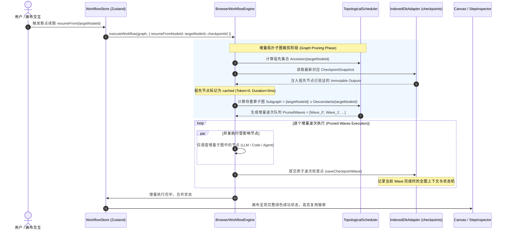
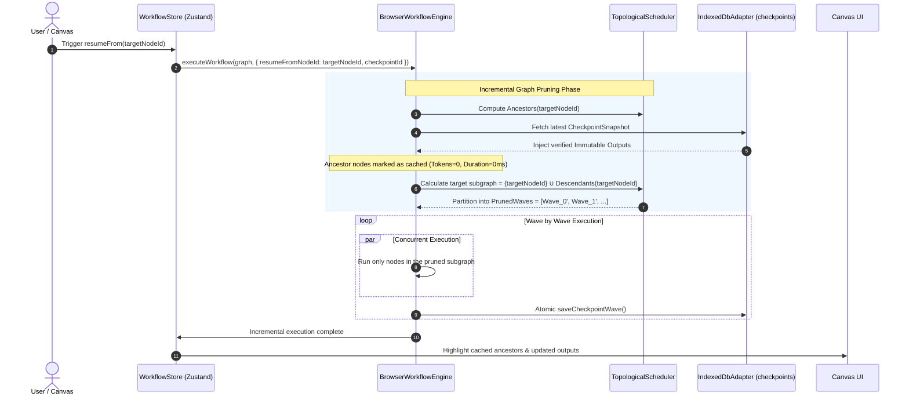

# PRD-016: 端侧不可变 Checkpointing 与容错断点续跑

[English Version](#english-version) | [中文版本](#中文版本)

---

<a name="中文版本"></a>
## 中文版本

### 1. 业务背景与设计动机 (Context & Motivation)

在 PatchCat 完成了 `v0.4.8` 的运行可观测性与 OpenTelemetry 标准对齐之后，系统已具备了对全图拓扑调度与单步节点执行产出的高精度捕获能力。然而，随着工作流复杂度从简单的 3 节点线性链条演进为由**多模型并行竞技、长文档 RAG 语义检索、复杂条件分支以及多轮自主 ReAct Agent 智能体**交织构成的复杂网状拓扑时，一个长期困扰开发者的工程痛点浮出水面：**执行的脆弱性与全图推倒重来的成本灾难**。

```
                              ┌─────────────────────────────────────────────────────────┐
                              │             复杂 AI 工作流编排中的“中途故障痛点”        │
                              └────────────────────────────┬────────────────────────────┘
                                                           │
                      ┌────────────────────────────────────┼────────────────────────────────────┐
                      ▼                                    ▼                                    ▼
          ┌─────────────────────────┐          ┌─────────────────────────┐          ┌─────────────────────────┐
          │     1. 昂贵成本不可逆   │          │     2. 内存状态易失脆弱 │          │     3. 缺乏确定性调度   │
          │ 当拓扑运行至第 8 步，下 │          │ 目前的单节点就地重试仅  │          │ 修改了中游 Prompt 或参数│
          │ 游节点因网络抖动或模型  │          │ 留存于当前 React 内存； │          │ 后，无法精准推导哪些下游│
          │ 超时失败时，用户只能全  │          │ 一旦页面刷新或浏览器关  │          │ 节点失效，只能粗暴全图  │
          │ 图重新运行，重复消耗数  │          │ 闭，前序昂贵输出立即化  │          │ 重跑，缺乏针对增量子图  │
          │ 万 Token 与漫长等待。   │          │ 为乌有，无法断点恢复。  │          │ 的精确裁剪与调度算法。  │
          └─────────────────────────┘          └─────────────────────────┘          └─────────────────────────┘
```

#### 核心金句先行 (Quotable Snippet)

> **“在 AI 工作流编排中，一次偶发的网络抖动或模型幻觉不应推翻整张 DAG 拓扑图。真正的确定性工作流引擎，必须具备端侧不可变 Checkpointing 机制——冻结历史、复用祖先、断点续跑，将昂贵的 Token 开销严格锁死在发生变动的最小增量子图上。”**

#### 本次迭代目标 (Core Purpose)
本 PRD 旨在确立 **PatchCat v0.4.10 端侧不可变 Checkpointing 与容错断点续跑体系**，核心交付包含三大支柱：
1. **端侧不可变快照持久化 (Immutable Checkpointing Storage)**：在拓扑波次推进与节点状态流转时，以不可变深拷贝（`structuredClone`）向浏览器本地 IndexedDB 提交状态机 Checkpoint，确保任何中途奔溃或刷新均可跨会话无损复原；
2. **失败节点就地断点续跑 (`resumeFrom(nodeId)`)**：基于有向无环图逆邻接反查祖先节点集合 $Ancestors(target)$，100% 复用绿色缓存输出，前序昂贵 LLM 调用跳过且 Token/网络开销归零；
3. **脏状态自动感知与增量拓扑裁剪 (Dirty State & Incremental DAG Pruning)**：基于节点配置版本哈希（`dataHash`），在用户微调中游节点后，精准标记级联脏节点（Dirty Cascade），仅针对受影响的后继子图重构 Kahn 拓扑波次并执行。

---

### 2. 技术选型与权衡分析 (Trade-offs & Technical Choices)

针对工作流容错与续跑架构，我们在设计初期严谨权衡了三种实现路径：

| 评估维度 | 方案 A：纯内存临时缓存 (In-Memory Resume) | 方案 B：依赖后端集中式状态机 (FastAPI Redis/DB) | 方案 C：**端侧不可变 IndexedDB Checkpointing (本方案选型)** |
| :--- | :--- | :--- | :--- |
| **Token 节约率** | 中（仅限当前页面未刷新的短暂会话） | 极高（服务端持久化） | **极高（100% 复用祖先已缓存成果）** |
| **跨会话持久性** | ❌ 页面刷新、Tab 关闭或系统崩溃后全丢 | ✅ 强持久化 | ✅ **浏览器 IndexedDB 物理持久化，跨刷新秒级重聚** |
| **部署门槛与依赖** | 零依赖 | ❌ 破坏 Local-First 原则，强依赖后端常驻与持久化数据库 | ✅ **纯端侧零外部依赖，免配置 Key 纯本地即开即用** |
| **存储爆炸防范** | 无需防范（受限于 RAM） | 依赖数据库定期运维定时任务清理 | ✅ **单工作流严格落实 5 个 Checkpoint FIFO 环形淘汰** |
| **数据安全性** | 留在浏览器 | 敏感 Prompt 与输出需上报网络中心 | ✅ **数据 100% 自持，杜绝云端泄露隐患** |

---

### 3. 系统架构与数据流契约 (System Architecture & Contracts)

#### 3.1 总体执行与断点续跑时序图



#### 3.2 核心数据模型契约 (Schema Contracts)

在 `src/engine/types.ts` 与存储适配器中确立不可变 Checkpoint 契约：

```typescript
/**
 * 单节点执行不可变状态切片
 */
export interface NodeCheckpointState {
  nodeId: string;
  nodeType: string;
  status: 'idle' | 'running' | 'success' | 'error' | 'skipped' | 'cached';
  inputsSnapshot?: Record<string, unknown>;
  outputsSnapshot?: Record<string, unknown>;
  errorMessage?: string;
  durationMs: number;
  tokensUsed?: {
    promptTokens: number;
    completionTokens: number;
    totalTokens: number;
  };
  configHash: string; // 节点配置与代码的 SHA-256 / MurmurHash 摘要
  completedAt?: number;
}

/**
 * 完整 DAG 执行检查点实体 (存储于 IndexedDB checkpoints 仓库)
 */
export interface DAGCheckpoint {
  checkpointId: string;        // 唯一检查点 ID (e.g., "chk_1727092800000_abc123")
  runId: string;               // 关联的运行批次 ID
  workflowId: string;          // 所属工作流 ID
  timestamp: number;           // 快照创建时间戳
  graphTopologyHash: string;   // 全图拓扑结构哈希 (节点ID集 + 有向边关系摘要)
  currentWaveIndex: number;    // 当前波次游标
  totalWaves: number;          // 规划总波次数
  isCompleted: boolean;        // 是否已全图终态完成
  failedNodeIds: string[];     // 当前处于失败态的节点 ID 列表
  contextBag: Record<string, Record<string, unknown>>; // 截至当前时刻的全局变量上下文深拷贝
  nodeStates: Record<string, NodeCheckpointState>;     // 各节点的瞬态快照字典
}
```

---

### 4. 核心算法规范：Kahn 增量拓扑裁剪与脏状态级联 (Algorithmic Specification)

#### 4.1 逆邻接祖先反查算法 ($Ancestors$)
为了确保 `resumeFrom(targetNodeId)` 具备确定性，引擎必须以逆邻接表向上广度优先（BFS）追溯目标节点的**全量祖先闭包**：

$$\mathcal{A}(u) = \bigcup_{v \in Parents(u)} \left( \{v\} \cup \mathcal{A}(v) \right)$$

1. 验证 $\mathcal{A}(u)$ 中的所有节点在最近 Checkpoint 中是否全部处于 `success` 状态；
2. 若存在上游节点此前亦未成功（如菱形分支中另一个依赖也处于 `error`），断点续跑调度器必须**前置扩充目标集合**，将上游未成功的最近断点一并纳入续跑集合，彻底杜绝输入参数缺失（Unresolved Input Variable）。

#### 4.2 脏状态级联扩散与增量调度算法 ($DirtyCascade$)
当用户在画布属性面板修改了某个节点的配置参数（如重写了 Prompt 模板或调整了模型 Temperature），该节点的 `configHash` 发生变化：

```
[Node A: Pristine] ──► [Node B: Modified (Dirty)] ──► [Node C: Stale] ──► [Node D: Stale]
        │                                                     ▲
        └─────────────────────────────────────────────────────┘
```

1. **变动感知**：`hash(node.data) !== cachedHash` $\implies Node_B \in \mathcal{D}_{initial}$；
2. **正向有向图广度扩散**：对所有 $v \in Descendants(\mathcal{D}_{initial})$ 标记为 `stale`；
3. **保留未受污染分支**：例如未受修改影响的兄弟分支或独立前序节点，其输出状态保持 `cached`，重跑时直接透传输出，绝不重复调度。

---

### 5. 画布工效与界面交互规范 (Ergonomics & UI Experience)

#### 5.1 失败节点就地续跑操作卡 (In-Place Resume Capsule)
- **触发入口**：
  1. **失败节点卡片右上角**：当节点卡片处于红色 `error` 状态时，除了原有的「单节点重试」，新增显性主操作按钮：`[ ⏯️ 从此处断点续跑 ]`；
  2. **顶部状态提示浮条**：执行失败时，顶部浮条除「重试所有失败节点」外，提供 `[ ⚡ 增量断点续跑 ]`，自动重跑失败节点及其受阻的下游管道；
  3. **节点右键菜单 (Context Menu)**：在任意中游节点右键选择「以此节点为起点重算下游」。

#### 5.2 画布视觉确定性呈现 (Visual State Distinction)
- **复用节点（Cached / Frozen）**：
  - 节点卡片左上角呈现冰蓝色锁定徽章：`🔒 缓存已复用 (0 Token)`；
  - 卡片边框呈现柔和蓝青色（`border-sky-500/40`），不触发跳动；
- **增量重跑子图（Active Resumption Pipeline）**：
  - 激活重跑的节点与连线采用琥珀色/紫色流光脉冲特效（`react-flow-dash-amber`），清晰告知开发者本次运行的边界与实际影响范围。

#### 5.3 运行历史抽屉快照恢复 (Checkpoint Rollback in Drawer)
- 在 `RunHistoryDrawer.tsx` 详情中，对每一个历史 Run 提供 `[ ⤺ 从此处恢复断点 ]` 按钮；
- 支持将历史 Run 的上下文成果灌入当前画布，无需重新经历耗时的全链路生成。

---

### 6. 非功能性约束与端侧配额保障 (Non-Functional Requirements)

1. **Local-First 存储边界与自动清理**：
   - IndexedDB 数据库升级至 `DB_VERSION = 3`，设立独立 `checkpoints` 仓库；
   - 实行严格的 **单工作流 5 个 Checkpoint FIFO 环形淘汰策略**，当工作流快照数超标时，自动删除时间戳最久远的记录，严守浏览器存储空间上限（<20MB）；
2. **状态深度克隆与并发安全**：
   - 所有的上下文读写必须通过原生 `structuredClone` 完成，严格隔离运行时内存引用与 Checkpoint 快照，避免后续就地重试导致快照被静默污染；
3. **性能基准线**：
   - 增量拓扑裁剪与祖先反查计算耗时必须在 $\le 5\text{ms}$（针对 100 节点以内的图拓扑）内完成，保证交互无任何卡顿感。

---

### 7. 质量验收与自动化测试矩阵 (Acceptance & Test Matrix)

| 测试套件与场景 | 验证重点与边界条件 | 预期验收指标 |
| :--- | :--- | :--- |
| **拓扑反查算法测试** (`tests/checkpoint-resumption.node.test.ts`) | 覆盖线性链路、菱形多源汇聚、分支条件及孤立节点 | $Ancestors$ 与 $Descendants$ 集合计算 100% 精确，无死锁漏判 |
| **100% 缓存命中与网络拦截测试** | 断点续跑时 Mock 前序 LLM 客户端与 HTTP 节点 | 确保前序已成功的节点 **未发起任何真实 fetch 调用**，Token 统计为 0 |
| **跨会话持久化与恢复测试** | 模拟页面卸载与 IndexedDB 重建加载 | 正确从持久化 Checkpoint 恢复未决波次并完成剩余节点的调度 |
| **脏状态扩散准确性测试** | 修改中游节点参数，验证兄弟节点保持 cached，下游节点重新执行 | 增量子图精确包含且仅包含目标节点及所有后代 |
| **存储 FIFO 淘汰测试** | 连续执行 8 次中断与断点操作 | IndexedDB 中该工作流的 Checkpoint 数量严格稳定在 5 条上限 |

---

---

<a name="english-version"></a>
## English Version

### 1. Context & Motivation

Following the completion of `v0.4.8` (Run Observability & OpenTelemetry Trace Alignment), PatchCat acquired precise observability over topological scheduling waves and immutable step snapshots. However, as prompt orchestration advances from simple 3-node linear pipelines into intricate DAG topologies—encompassing multi-model arena evaluations, vector RAG retrieval, conditional routers, and multi-turn ReAct autonomous agents—an acute developer pain point emerges: **execution fragility and the catastrophic cost of full graph restarts**.

```
                        ┌─────────────────────────────────────────────────────────┐
                        │             Pain Points in Mid-Run Failures             │
                        └────────────────────────────┬────────────────────────────┘
                                                     │
                ┌────────────────────────────────────┼────────────────────────────────────┐
                ▼                                    ▼                                    ▼
    ┌─────────────────────────┐          ┌─────────────────────────┐          ┌─────────────────────────┐
    │  1. Irreversible Cost   │          │  2. Volatile RAM State  │          │ 3. Lack of Pruning Alg  │
    │ When node 8 fails due   │          │ In-memory local retry   │          │ Tweaking mid-stream     │
    │ to API rate-limits or   │          │ vanishes upon browser   │          │ prompts forces a blind  │
    │ network blips, users    │          │ refresh or tab crash;   │          │ full re-run; no pruning │
    │ must re-run everything, │          │ expensive upstream LLM  │          │ scheduler exists for    │
    │ burning thousands of    │          │ outputs are permanently │          │ executing only the      │
    │ redundant tokens.       │          │ lost without checkpoints│          │ affected subgraphs.     │
    └─────────────────────────┘          └─────────────────────────┘          └─────────────────────────┘
```

#### Quotable Snippet

> **"In AI workflow orchestration, an occasional network glitch or model hallucination should never wipe out an entire DAG execution. A truly deterministic workflow engine demands local-first immutable checkpointing—freezing history, reusing ancestors, and resuming from breakpoints, locking token expenditures strictly to the minimal modified subgraph."**

#### Core Purpose
This PRD establishes the **PatchCat v0.4.10 Immutable Checkpointing & Resumable DAG Execution System**, driven by three foundational pillars:
1. **Local-First Immutable Checkpointing**: Persists state machine snapshots into client-side IndexedDB at topological wave transitions via `structuredClone`, enabling resilient cross-session recovery.
2. **In-Place Resumption (`resumeFrom(nodeId)`)**: Traverses reverse DAG adjacencies to identify ancestor nodes $Ancestors(target)$, reusing 100% of cached outputs with zero redundant token or network spend.
3. **Automated Dirty State Detection & Incremental Graph Pruning**: Uses node configuration hashes (`dataHash`) to automatically cascade dirty flags down the affected DAG branches, rescheduling only invalid subgraphs.

---

### 2. Architectural Trade-offs

| Criterion | Option A: Pure In-Memory Cache | Option B: Central Backend State Engine (Redis/DB) | Option C: **Client-Side IndexedDB Checkpointing (Selected)** |
| :--- | :--- | :--- | :--- |
| **Token Savings** | Moderate (same page session only) | High (persistent server-side) | **Optimal (100% upstream reuse across sessions)** |
| **Persistence** | ❌ Lost on reload, crash, or tab close | ✅ Strong persistence | ✅ **IndexedDB persistence; survives reloads instantly** |
| **Setup & Dependencies** | Zero external dependencies | ❌ Violates Local-First ethos, requires daemon services | ✅ **Zero server setup; run 100% locally with BYOK** |
| **Storage Explosion Safeguard** | Bound to JavaScript heap | Requires background cron sweepers | ✅ **Strict 5-record FIFO ring-buffer eviction per workflow** |
| **Data Privacy** | Local in memory | Transmits prompts/outputs across network | ✅ **100% local self-sovereign data privacy** |

---

### 3. System Architecture & Schema Contracts

#### 3.1 Resumption Sequence Diagram



#### 3.2 Schema Definition

```typescript
export interface NodeCheckpointState {
  nodeId: string;
  nodeType: string;
  status: 'idle' | 'running' | 'success' | 'error' | 'skipped' | 'cached';
  inputsSnapshot?: Record<string, unknown>;
  outputsSnapshot?: Record<string, unknown>;
  errorMessage?: string;
  durationMs: number;
  tokensUsed?: {
    promptTokens: number;
    completionTokens: number;
    totalTokens: number;
  };
  configHash: string;
  completedAt?: number;
}

export interface DAGCheckpoint {
  checkpointId: string;
  runId: string;
  workflowId: string;
  timestamp: number;
  graphTopologyHash: string;
  currentWaveIndex: number;
  totalWaves: number;
  isCompleted: boolean;
  failedNodeIds: string[];
  contextBag: Record<string, Record<string, unknown>>;
  nodeStates: Record<string, NodeCheckpointState>;
}
```

---

### 4. Algorithmic Specifications

#### 4.1 Ancestor Closure Traversal ($Ancestors$)
To guarantee deterministic execution on `resumeFrom(targetNodeId)`, the scheduler walks the reverse adjacency graph:

$$\mathcal{A}(u) = \bigcup_{v \in Parents(u)} \left( \{v\} \cup \mathcal{A}(v) \right)$$

1. Validate that all nodes in $\mathcal{A}(u)$ have successful cached outputs in the checkpoint.
2. If any upstream dependency in $\mathcal{A}(u)$ is incomplete or failed, the resume boundary automatically expands upward to include the earliest uncompleted node, preventing missing variable inputs.

#### 4.2 Dirty State Cascading ($DirtyCascade$)
When a user updates prompt templates or settings in an intermediate node:
1. `hash(node.data) !== cachedHash` places the node into the initial dirty set $\mathcal{D}$.
2. Forward BFS cascades dirty marks to all $v \in Descendants(\mathcal{D})$.
3. Independent sibling branches remain pristine (`cached`), completely shielded from redundant re-execution.

---

### 5. UI Ergonomics & Visual Experience

1. **In-Place Resumption Triggers**:
   - `[ ⏯️ Resume from here ]` button in failed node cards.
   - Global status banner `[ ⚡ Resume Failed Subgraphs ]`.
   - Node context menu: `Resume Downstream from this Node`.
2. **Visual Differentiation in React Flow**:
   - Cached nodes show a cyan lock badge: `🔒 Cached Output (0 Tokens)`.
   - Rescheduled active subgraphs show amber streaming pulses.
3. **Run History Drawer Integration**:
   - One-click rollback and resume from any past checkpoint in `RunHistoryDrawer.tsx`.

---

### 6. Non-Functional Requirements & Safeguards

- **Storage Safety**: IndexedDB upgraded to `DB_VERSION = 3` with dedicated `checkpoints` store. Enforces a strict **5-record FIFO ring-buffer per workflow** to protect browser quotas (<20MB footprint).
- **Immutability Invariant**: Context states must be serialized with `structuredClone` to prevent memory mutation leaks.
- **Latency Benchmark**: Subgraph pruning and ancestor traversal calculations must complete in $\le 5\text{ms}$ for topologies up to 100 nodes.

---

### 7. Verification & Acceptance Matrix

- **Ancestor & Pruning Graph Tests**: Comprehensive tests on linear, diamond, multi-path conditional, and loop nodes.
- **Zero Token & Zero Network Invariant**: Assert that cached upstream nodes trigger 0 network requests and register 0 token spend.
- **Cross-Session Durability**: Verify resume recovery after simulated browser restart and store hydration.
- **FIFO Eviction Compliance**: Verify that checkpoint records never exceed 5 per workflow under continuous failure/resumption cycles.
