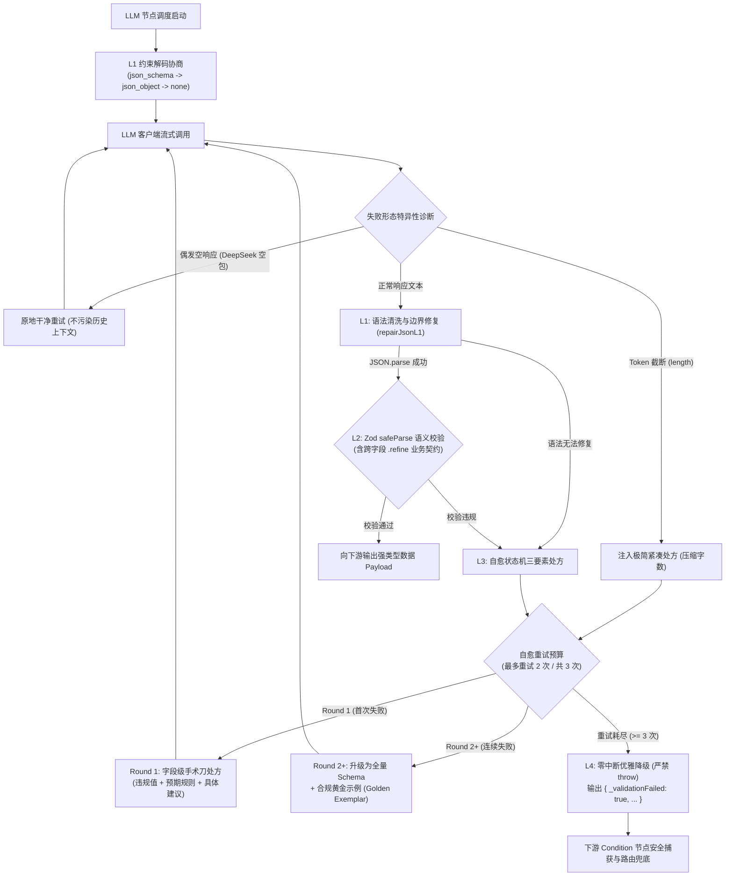

# PRD-018: 确定性结构化输出与自愈状态机引擎 (Deterministic Structured Output & Self-Healing Engine)

> **文档编号**：PRD-018  
> **核心领域**：确定性 AI 工作流编排（Deterministic AI Workflow Orchestration）· DAG 状态机 · 结构化输出契约  
> **负责人**：Guo Qiang (GuoBug) & AI Pair Programming  
> **状态**：Released & Audited ✅  
> **对应版本**：`v0.4.12` / `v0.4.11-patch`  
> **前序依赖**：[PRD-002](PRD-002-DAG-Execution-Engine.md), [PRD-016](PRD-016-Immutable-Checkpointing-and-Resumable-DAG-Execution.md), [PRD-017](PRD-017-Local-Data-Sovereignty-and-Storage-Hardening.md)

---

> [!TIP]
> ### 💡 核心架构原则与设计底线 (Core Architectural Axioms)
> 1. **分层防御哲学**：*“L1 守物理语法，L2 守业务契约，L3 守系统鲁棒，L4 守调度可用性。确定性工作流编排不是剥夺大模型的创造力，而是给概率性的输出套上确定性的工程安全气囊。”*
> 2. **校验与真实的界限**：*“Zod 只能证明‘没查出违规’，不能证明‘数据正确’。已满足 $\neq$ 正确。未被点名不等于正确：朴素字段冻结只会把幻觉锁死在局部优化陷阱中。”*
> 3. **架构边界红线**：*“把这段引擎代码拿去做法律合同审查工作流，需要改吗？需要 $\to$ 就是业务下沉了。引擎必须对业务领域彻底盲视，领域规则永远归仓 Presets。”*
> 4. **重试与自愈的本质**：*“缺少结构化反馈的重试，只是让模型在同一个局部极小值反复打转（同构重试陷阱）；真正的自愈不是‘重跑一次’，而是‘带病历复诊’。”*
> 5. **科学归因底线**：*“端到端通过率的跃升，不是来自模型首轮犯错变少，而是来自自愈状态机在工程调度层强悍的兜底与挽回转化能力。”*

---

## 1. 业务背景与问题定义 (Context & Problem)

在现代 AI 工作流编排中，LLM 节点往往被直接当作下游数据消费者（如 Condition 分支路由、Code 转换节点、HTTP 外部请求）的输入源。当下游依赖确定性的强类型字段时，大语言模型本身的**概率性与发散性**与工作流下游系统的**确定性契约**构成了不可调和的底层冲突：

1. **语法结构漂移 (L1 物理语法崩溃)**：
   * **痛点现象**：模型输出带有 Markdown 标记包裹（````json ... ````）、寒暄客套话、尾部缺失大括号或中英文引号混淆。
   * **工程后果**：下游节点调用 `JSON.parse()` 抛出未捕获的 `SyntaxError`，整条 DAG 拓扑执行猝死断流。
2. **“语法合法”掩盖“业务语义崩溃” (L2 业务契约穿透)**：
   * **痛点现象**：传统约束解码（如 OpenAI JSON Mode）仅能强制输出合法 JSON 语法，无法理解领域语义不变量。模型可能输出合法的 JSON，但字段完全越界（例如工单 `urgency` 限定为 `1..5`，模型吐出 `9`；或者 `summary` 字段吐出空字符串）。
   * **工程后果**：格式没报错，但逻辑全跑偏。下游 Condition 节点读到非法值引发异常静默分支，故障隐蔽且极难排查。
3. **同构重试死锁与暴力抛错 (L3 鲁棒性断崖)**：
   * **痛点现象**：多数 AI Agent 框架在校验失败时直接粗暴 `throw Error`，导致工作流直接夭折；或者进行盲目的无状态重试（仅发送“格式错误请重新输入”）。
   * **工程后果**：缺乏针对性字段级诊断记忆，模型在重试时有超过 80% 的概率掉入**同构重试陷阱（Isomorphic Retry Trap）**，在同一个局部错误反复打转，徒耗 Token 与延迟。

---

## 2. 总体架构设计 (Architecture & Layering)

PatchCat 提出了 **“L1 约束解码 + L2 业务语义防御 + L3 自愈状态机 + L4 零中断优雅降级”** 四位一体的纵深防御体系：



---

## 3. L1 / L2 / L3 深度功能解析与应用场景 (In-Depth Technical Details)

### 3.1 L1: 约束解码与物理语法防线 (Constrained Decoding & Syntax Repair)

#### 1. 功能定义与核心机制
L1 处于与大模型网络调用的最前沿，核心职责是**在物理层保证输出满足 JSON 格式规范，彻底杜绝下游解析崩溃**。
- **三级能力梯队协商 (Multi-Provider Capability Negotiation)**：
  不同模型服务商对结构化输出的支持度参差不齐。L1 实现了运行时显式自适应协商：
  * **Tier 1 (`json_schema`)**：严格结构化输出（Strict Structured Outputs）。利用端点底层的 Logits 语法掩码强制 100% 遵循 JSON Schema（适用于 OpenAI gpt-4o 等高端模型）。
  * **Tier 2 (`json_object`)**：标准 JSON Mode。强制保证输出文本能够被 `JSON.parse`，但不保证字段是否存在（适用于 DeepSeek、SiliconFlow、多数开源模型端点）。
  * **Tier 3 (`none`)**：Prompt 软引导模式。对于完全不支持结构化参数的弱模型或本地端侧模型，自动平滑退化为 System Prompt 格式注入，**绝不因为 Provider 不支持参数而抛出 400 Bad Request**。
- **客户端语法清洗与边界修复引擎 (`repairJsonL1`)**：
  模型生成的文本到达后，首先进入客户端轻量清洗器：
  * 剥离 Markdown 代码块围栏（` ```json ... ``` `）与首尾寒暄解释文本；
  * 自动补全末尾因截断遗漏的引号、括号与大括号；
  * 修复中英文标点混用（如中文逗号、中文双引号）和未转义特殊控制符。

#### 2. 典型实战场景
- **场景 A（多模型平滑切换）**：工作流在开发阶段使用云端 OpenAI（支持 strict 模式），上线至私有化环境后一键切换为纯本地 Ollama 或私有小模型。L1 引擎自动协商降级，用户无需重写一套工作流。
- **场景 B（高并发截断或格式污染）**：模型在复杂 Prompt 诱导下偶发输出了“好的，为您整理如下：{...}”。L1 自动无损剥离首尾冗余，下游节点感知不到任何脏数据。

#### 3. 在 AI 工作流编排中的核心作用
- **消除物理语法断流**：实现下游消费端 `JSON.parse()` 的 100% 安全，确保流入内存的数据必然是一个可遍历操作的 JavaScript Object。
- **异构大模型生态的“解耦垫片”**：将不同厂商五花八门的 API 规范在最外层抹平。

---

### 3.2 L2: 运行时领域语义防御防线 (Runtime Semantic & Invariant Defense)

#### 1. 功能定义与核心机制
L1 只能证明输出是“合法 JSON”，但无法证明内容是“正确合规的业务数据”。L2 建立在 L1 之后，以 **Zod 为单一数据源（Single Source of Truth）**，构建真正的业务防守长城：
- **上游导出与下游校验统一**：
  单次定义 Zod Schema，上游一键导出为 OpenAI 兼容的 JSON Schema，下游自动执行零 Throw 的 `.safeParse()` 校验，杜绝“文档与代码不一致”。
- **标量级语义边界防守**：
  * 数值区间断言（如 `urgency: z.number().int().min(1).max(5)`）；
  * 字符串长度与正则表达式（如 `orderId: z.string().regex(/^ORD-\d{6}$/)`，`summary: z.string().min(5).max(30)`）；
  * 领域严格枚举（如 `category: z.enum(['logistics', 'refund', 'quality', 'other'])`）。
- **跨字段业务不变量契约 (Cross-Field Invariants via `.refine()`)**：
  大模型在多步推理中极易产生“字段孤岛式矛盾”。L2 支持复杂的跨字段联合校验：
  * **资金安全契约**：`refund`（退款）类工单涉及资金变动，其 `urgency` 必须 $\ge 4$；
  * **详情合规契约**：高优先级工单 (`urgency >= 4`) 的 `summary` 必须至少 15 字阐述详情理由；
  * **信息隔离契约**：`orderId` 必须从上下文独立提取并符合格式，`summary` 中严禁重复粘贴订单号。

#### 2. 典型实战场景
- **场景 A（幻觉伪造枚举）**：模型未按规定的 4 种工单类别分类，自行脑补了 `'aftersale'` 类别。L2 精确截获并在毫秒级产生校验报错，阻止非法类别流向下游工单系统。
- **场景 B（跨字段逻辑打架）**：模型在分类字段判定为退款，但在紧急度字段给了 1。L2 通过 `.refine()` 规则精准阻断，指出两个字段间的业务逻辑冲突。

#### 3. 在 AI 工作流编排中的核心作用
- **守死业务逻辑确定性**：彻底解决大模型在弱结构下的“一本正经胡说八道”，将不可控的自然语言收敛至严谨的强类型系统。
- **自愈状态机的数据源泉**：校验失败时，Zod 产出机器可读的精确路径（`issue.path`）、违规值（`issue.received`）与规则描述（`issue.message`），为 L3 提供高信噪比的诊断燃料。

---

### 3.3 L3: 闭环错误记忆自愈状态机 (Closed-Loop Self-Healing State Machine)

#### 1. 功能定义与核心机制
当 L1 语法解析失败或 L2 语义校验被拦截时，系统不抛出错误，而是自动驱动 LLM 进行**带诊断记忆的闭环自我修复**：
- **Round 1: 字段级三要素手术刀处方 (Triad Surgical Feedback)**：
  绝大多数模型在收到笼统的“请修改”时会产生同构重试。L3 首轮构造高信息密度的精准错误反馈：
  1. **违规当前值 (Violating Value)**：明确告知上一轮具体哪一个字段输出了什么非法值（例如 `实际输出值: 9`）；
  2. **违反规则 (Constraint Rule)**：明确列出该字段的约束（例如 `数值必须 <= 5`）；
  3. **具体纠偏建议 (Actionable Recommendation)**：给出合规示范（例如 `修复处方: 请将数值纠偏至合法区间内`）。
  上下文组装机制：原样保留上一轮 Assistant 消息以留存现场，紧随追加诊断 User 处方。
- **Round 2+: 顶格升级为全量 Schema + 合规黄金示例 (Golden Exemplar Escalation)**：
  如果模型在 Round 1 纠正后依然违规（或陷入多字段震荡），说明该任务对当前模型的注意力机制构成挑战。L3 自动升级处方能级：
  * **合成纯净黄金示例 (`generateGoldenExemplar`)**：基于当前 Zod Schema 动态生成结构完全对齐的合成范例；
  * **反抄袭安全护栏**：在示例中明确标注假数据标记，并附带强指令：*“【重要护栏】：以上示例仅供结构与字段名对齐参考，严禁照抄为真实数据！”* 杜绝小模型直接照抄示例造成虚假业务幻觉。
- **特异性失败形态分流诊断 (Failure Mode Triage)**：
  * **Token 长度截断 (`finish_reason === 'length'`)**：特异性注入紧凑压缩处方，严禁无意义的语法质问，要求模型砍掉引言并将文字压缩在 30 字内；
  * **偶发空响应 (如 DeepSeek 空包坑)**：原地无污染重发原始请求（保持上下文纯净），绝不追加虚假的校验报错记忆。

#### 2. 典型实战场景
- **场景 A（7B 小模型跨字段推理挽回）**：开源 7B 模型在处理复杂工单时，初次生成往往遗漏了“退款类工单 urgency 必须 $\ge 4$”的隐性规则。L3 首轮精准点名两个字段的冲突，模型在 Round 2 准确纠偏，无需人工介入。
- **场景 B（同构死锁阻断）**：面对连续 2 次微调失败，状态机自动触发黄金示例灌顶，通过 Few-shot 上下文注意力锚定，将原本必死的 Case 成功拉回。

#### 3. 在 AI 工作流编排中的核心作用
- **用架构确定性弥补模型概率性**：无需更换更大、更昂贵的模型，直接在工程调度层将 7B 小模型的端到端任务完成率提升至商业可用水平（实测 69.0% $\to$ 92.9%）。
- **终结同构重试**：将有限的重试预算（2 次）精准聚焦在逻辑差异上，杜绝算力浪费。

---

### 3.4 L4: 零抛错优雅降级契约 (Graceful Degradation Contract)

#### 1. 功能定义与核心机制
无论自愈机制多完备，在极端恶劣输入下模型仍有预算耗尽的可能。L4 确立了系统调度的终极安全底线：
- **熔断预算控制**：严格限制重试预算（默认最多重试 2 次，共计 3 次 LLM 请求），防止因模型不可纠正的认知死锁引发死循环或费用失控。
- **严禁使用 `throw Error`**：当 3 次调用全部失败后，节点**绝对禁止抛出未捕获异常**中断整图调度。
- **标准化降级契约输出**：
  节点返回携带完整审计追踪的降级对象：
  ```json
  {
    "_validationFailed": true,
    "errors": [
      {
        "path": "urgency",
        "message": "业务红线：退款类工单涉及资金流转，urgency 必须 >= 4",
        "receivedValue": 2,
        "suggestion": "请将数值纠偏至合法区间内"
      }
    ],
    "raw": "{\"category\":\"refund\",\"urgency\":2,\"summary\":\"申请退款\"}",
    "fallbackReason": "max_retries_exceeded"
  }
  ```

#### 2. 在 AI 工作流编排中的核心作用
- **保障 DAG 状态机的调度活性**：整个图调度引擎保持平稳运转。
- **下游透明路由解耦**：下游的 `condition`（分支判断）节点可以极其优雅地配置表达式：
  * `inputs._validationFailed === true` $\to$ 安全流转至“人工审核”、“告警推送”或“备用兜底模型”分支；
  * `inputs._validationFailed !== true` $\to$ 正常流转至主业务流水线。

---

## 4. 铁律边界规约：业务下沉红线与 Presets 彻底解耦 (Architecture Purity)

### 4.1 判定铁律
> **“把这段引擎核心代码拿去做法律合同审查工作流，需要改动引擎代码吗？需要 $\to$ 就是业务逻辑下沉，属于架构违规。”**

### 4.2 治理实施与架构收益

1. **引擎核心去领域化 (`src/engine/structured-output.ts`)**：
   - 彻底移除 `TicketSemanticSchema` 及任何工单、退款、物流领域的硬编码业务字段；
   - 移除 `obj['name'] === 'TicketSemanticSchema'` 静态按名查表，改用通用的动态注册表 `schemaRegistry`：
     ```typescript
     export const schemaRegistry = new Map<string, z.ZodTypeAny>();
     export function registerSchema(name: string, schema: z.ZodTypeAny): void;
     export function getRegisteredSchema(name: string): z.ZodTypeAny | undefined;
     export function clearRegisteredSchemas(): void;
     ```
   - 移除 130 行业务测试场景 `TEST_SCENARIOS` 与 `TestScenarioDefinition`。
2. **业务资产归仓 (`src/presets/`)**：
   - 建立专用资产模块 [`src/presets/self-healing-scenarios.ts`](file:///f:/git/ai-prompt-orchestrator/src/presets/self-healing-scenarios.ts)，将工单场景、测试用例、仿真序列与语义 Schema 统一定义，并在运行时动态注入至引擎注册表；
   - 引擎类型 `src/engine/types.ts` 中的 `testScenario` 收敛为通用场景标识 `testScenario?: string`，与具体业务枚举完全解耦。

---

## 5. 统计口径与实测评测标准 (Statistical Rigor)

在基于真实商业模型（硅基流动 `Qwen/Qwen2.5-7B-Instruct` 免费档，14 组典型工单用例 × 3 轮完整独立重复测试，共 42 对样本）的实测评测中，坚持严谨求真的科学口径：

### 5.1 双口径配对检验 (McNemar Test)

| 统计口径 | 样本量 | 检验统计量 | p-value | 显著性结论 | 科学解释 |
|:---|:---|:---|:---|:---|:---|
| **按样本配对 (By-Sample)** | $n = 42$ 对 | 不一致对：$b = 10, c = 0$ | **$p = 0.00195$ ($p < 0.01$)** | **极显著 (Statistically Significant)** | 自愈状态机在整体样本层面对成功率具有决定性提升作用。 |
| **按独立用例 (By-Case)** | $N = 14$ 个独立 Case | 不一致 Case：$b = 3, c = 0$ | **$p = 0.125$ ($p > 0.05$)** | **不显著 (Non-significant)** | 由于独立用例基数较小 ($N=14$)，增益主要由若干代表性困难用例（如跨字段冲突用例 #11）驱动。 |

### 5.2 收益归因与缺陷透明度 (Intellectual Honesty)

1. **结构类错误（L1 收益）**：对照组 A 发生 3 次语法破碎，实验组 B 为 0 次（L1 约束解码彻底消除 JSON.parse 崩溃）。
2. **跨字段契约违规（L2 真实表现）**：首轮违规数对照组 A 为 8 次，实验组 B 为 13 次。**模型首轮并未因为开启结构化模式而“变聪明”或“犯错变少”**，反而在格式严格化后暴露出更多跨字段冲突。
3. **端到端提升归因**：端到端合规率从 **69.0% 跃升至 92.9% (+23.9pt)**，其增益**几乎 100% 来自 L2/L3 自愈状态机在 R1/R2 轮次中的有效纠偏与转化**。
4. **对外陈述红线**：严禁宣传“各项指标全面改善”；对外必须严格限定口径为：**“端到端合规率从 69.0% 提升至 92.9% (按样本配对 McNemar $p < 0.01$)，主要得益于闭环自愈状态机的高效挽回”**。

---

## 6. 核心工程认知与设计底线 (Core Axioms & Architectural Principles)

本特性在经历了由粗放重试到自愈状态机、由业务下沉到纯粹引擎解耦的演化过程中，凝练了以下工程认知：

### 6.1 分层防御契约
> *“L1 守物理语法，L2 守业务契约，L3 守系统鲁棒，L4 守调度可用性。确定性工作流编排不是剥夺大模型的创造力，而是给概率性的输出套上确定性的工程安全气囊。”*

### 6.2 校验不等于正确：警惕局部优化陷阱
> *“Zod 只能证明‘没查出违规’，不能证明‘数据正确’。已满足 $\neq$ 正确。未被点名不等于正确：朴素字段冻结只会把幻觉锁死在局部优化陷阱中。”*

### 6.3 引擎纯粹性铁律
> *“把这段引擎代码拿去做法律合同审查工作流，需要改吗？需要 $\to$ 就是业务下沉了。引擎必须对业务领域彻底盲视，领域规则永远归仓 Presets。”*

### 6.4 自愈状态机的本质
> *“缺少结构化反馈的重试，只是让模型在同一个局部极小值反复打转（同构重试陷阱）；真正的自愈不是‘重跑一次’，而是‘带病历复诊’。”*

### 6.5 真实科学的归因底线
> *“端到端通过率的跃升，不是来自模型首轮犯错变少，而是来自自愈状态机在工程调度层强悍的兜底与挽回转化能力。”*

---

## 7. 验收标准与测试规范 (Verification Matrix)

- **单元测试覆盖**：329 项契约测试持续 100% 全绿（涵盖 L1 协商、L2 safeParse、L3 三要素处方、L4 优雅降级、动态 schemaRegistry）。
- **运行环境规约**：`package.json` 中的 `test` 脚本内联 `--experimental-strip-types`，保障 Node.js v22+ 本地免配环境变量直接运行。

---

> **关于作者**  
> **郭强 (GuoBug)**，兼具平台工程底蕴与业务增长能力的资深 Product Engineer。  
> 专注于 **AI 工作流编排（AI Workflow Orchestration）**、DAG 状态机与确定性系统架构落地。  
> 开源项目与主页：[https://github.com/GuoBug](https://github.com/GuoBug) · [https://guobug.github.io](https://guobug.github.io)  
> 秉持“边写边学、双向共创”理念，欢迎围绕工作流引擎架构、拓扑调度及低门槛开发体验交流指教。
