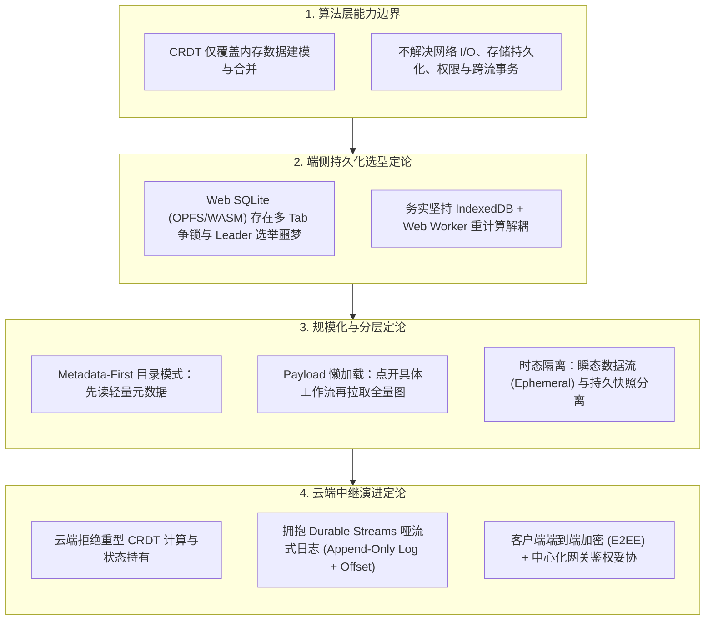
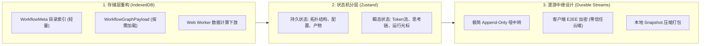
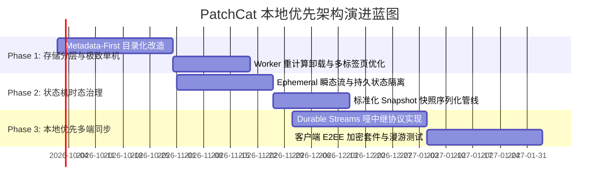

# 本地优先（Local-First）架构核心结论与 PatchCat 演进启示录

## 概述

随着大语言模型（LLM）与多智能体（Multi-Agent）系统的爆发，工作流编排器正经历从传统“中心化云端 SaaS”向“本地优先（Local-First）端侧系统”的代际演进。

本文档综合了工业级分布式系统与本地优先同步引擎的实战复盘与踩坑教训，**彻底摒除未经验证的技术假象**，提炼出可落地的核心工程结论，并确立 PatchCat 在存储层、执行调度层、同步中继与数据主权上的架构演进路线。

---

## 一、 核心概念与场景边界定论

### 1.1 Local-Only vs. Local-First 的本质区别

很多纯前端或桌面工具常将自身标榜为“本地优先”，但两者存在本质上的代际鸿沟：

| 维度 | Local-Only（纯本地工具） | Local-First（真正的本地优先系统） |
| :--- | :--- | :--- |
| **数据所有权** | 数据在本地（IndexedDB/本地文件），用户拥有所有权。 | 数据以本地为**唯一权威源（Source of Truth）**，用户持有全量副本。 |
| **离线与响应** | 零网络依赖，秒开秒用。 | 具备相同甚至更优的离线秒开体验，读写均发生在本地。 |
| **多设备漫游** | 依赖用户手动导出/导入 JSON，协作链路彻底割裂。 | **具备云端协作便利性**：全自动多设备增量同步与协同。 |
| **云端角色定位** | 无云端，或仅提供静态托管。 | **云端仅为“备份与辅助副本（Replica）”**，云端关停、拔网线绝不影响本地全功能运行。 |
| **数据加密与隐私**| 本地单机相对安全，但无跨端安全传输机制。 | 原生支持**客户端端到端加密（E2EE）**，云端中继无法窥探业务数据。 |

### 1.2 场景适用性定论：最终一致性 vs. 强一致性

本地优先架构从底层物理与信息学原理上无法解决**强一致性场景**（如高并发抢票、库存扣减、瞬时金融支付）。

但对于**以创作为核心的领域**（如代码、文档编辑、AI 提示词拓扑、多智能体协同控制面），天然具备异步、分支、合并的特征，是**最终一致性（Eventual Consistency）**的天选载体。本地优先架构能够在这类场景中实现极致的低延迟与高韧性。

---

## 二、 工业级工程踩坑与技术定论

### 2.1 CRDT 不是万能钥匙，必须构建“同步引擎”
- **结论**：开源 CRDT 库（如 Loro、Yjs、Automerge）仅解决了 JSON 结构冲突合并与逻辑时钟（Lamport / Hybrid Logical Clock），这只占端到端系统的 30% 复杂度。
- **痛点**：真实系统需要处理持久化 I/O、断网重试策略、多标签页并发、跨文档事务、去中心化鉴权与用户界面同步状态反馈。因此，工程重心必须从“裸调 CRDT 算法”转移到**“整体同步引擎架构”**。

### 2.2 端侧持久化选型定论：Web SQLite 陷阱 vs. 务实 IndexedDB
- **踩坑事实**：在 Web 端使用 WebAssembly + OPFS 运行 SQLite，虽然看似功能强大，但在现代浏览器多标签页（Multi-tab）环境下会遭遇严重困境：
  1. SQLite 原生机制仅支持单写入者（Single Writer）；
  2. 多个浏览器标签页同时开启时，必须实现一套极其复杂的跨标签页 Leader 选举协议来持有写入句柄；
  3. 崩溃恢复、锁争用与死锁处理在生产环境下故障率极高。
- **技术定论**：
  - **在 Web/浏览器环境中，IndexedDB 依然是成熟度最高、原生支持并发读写的最佳持久化底座**；
  - 针对大图计算、历史回溯、差异比对等 CPU 密集型任务，**一律下放至独立 Web Worker** 执行，主线程仅负责 60 FPS 渲染。

### 2.3 规模化瓶颈：Metadata-First 目录与懒加载机制
- **踩坑事实**：在含有数百个工作流、数千轮对话记忆或大量知识库切片的场景中，启动时全量反序列化所有文档，将导致内存与 CPU 瞬间打满。
- **技术定论**：必须实施 **元数据优先（Metadata-First）** 分层设计：
  - **目录层（Catalog Metadata）**：以极轻量的数据结构存储所有实体清单（ID、标题、标签、节点摘要、修改时间）。应用启动时仅加载此层，保证秒开；
  - **实体层（Payload Data）**：具体的节点完整图结构、提示词模板、Prompt 历史记录仅在用户实际切换/打开时触发异步懒加载。

### 2.4 时态数据解耦：瞬态流（Ephemeral）vs. 持久流（Persistent）
- **踩坑事实**：如果将执行过程中的 Token 吐字、思维链推导、节点运行状态高亮、光标移动等高频更新直接写入持久化层，会引发巨大的写放大（Write Amplification）和多端冲突风暴。
- **技术定论**：
  - **瞬态流（Ephemeral Stream）**：仅驻留内存，通过本地广播或临时中继通道传输，不落盘、不纳入版本历史；
  - **持久流（Persistent Snapshot）**：仅在拓扑结构修改、执行成功生成完整产物或用户主动保存时，生成原子快照（Snapshot）落盘。

### 2.5 云端中继设计定论：从“重型智能服务”到“哑流式日志（Durable Streams）”
- **踩坑事实**：试图让云端服务器加载图结构并计算版本差异（如在 Serverless/Edge 状态机中维护 CRDT），会导致内存账单激增、冷启动唤醒昂贵、维护困难。
- **技术定论**：
  - 云端应保持为**“哑管道（Dumb Relay）”**：采用 Append-Only 日志流协议（如 Durable Streams），服务端仅根据 URL 维护一条只增流与递增 `offset`，只负责搬运加密字节，不做任何内容解析；
  - 客户端通过记录 `remote_offset` 实现增量追尾（Catch-up）；
  - 辅以客户端定期生成的**快照（Snapshot）**，大幅压缩历史变更体积，使新设备能够秒级完成初始化。

### 2.6 安全与鉴权：端到端加密（E2EE）与去中心化的务实平衡
- **踩坑事实**：纯去中心化的去中心化身份（DID）或无中心密钥协商协议目前仍处于极早期，工程成熟度低。
- **技术定论**：
  - 采用**“中心化网关做基础身份路由 + 客户端强加密（AES-GCM E2EE）”**的平衡方案；
  - 数据离开用户浏览器前均由本地主密码派生密钥加密。云端中继无法窥探提示词、API Key 及执行数据。即使云端被攻破或拔网线，用户资产依然绝对安全。

---

## 三、 对 PatchCat 项目的架构启示与落地指引

结合 PatchCat 的核心能力（Kahn 拓扑调度器、React Flow 画布、多模型 BYOK 客户端、知识库与多轮会话记忆），制定以下落地原则：

### 3.1 坚持巩固 IndexedDB 底座，杜绝盲目引入 Web SQLite
- **行动项**：
  1. 维持 [`src/services/storage/indexeddb-adapter.ts`](file:///f:/git/ai-prompt-orchestrator/src/services/storage/indexeddb-adapter.ts) 的底层技术选型，不引入带有单写锁限制的 WebAssembly SQLite；
  2. 严格杜绝在多标签页环境下可能引发死锁的方案，利用 IndexedDB 原生事务并发保障画布在多个窗口打开时的稳定性；
  3. 将耗时较长的 DAG 拓扑验证、环路检测、复杂 Markdown JSON 脱壳及向量距离计算全面转移到 Web Worker。

### 3.2 存储层推行“Metadata-First 目录化”与懒加载
- **现状分析**：目前 PatchCat 保存工作流时，整个包含节点坐标、属性配置的大对象直接作为单一记录。当工作流数量达到数十个以上时，列表侧边栏加载存在潜在压力。
- **重构方案**：
  - 拆分 IndexedDB Object Store 结构：
    - `workflows_meta`：存储 `{ id, name, description, tags, nodeCount, updatedAt, version }`，专供侧边栏和管理抽屉高频无感拉取；
    - `workflows_payload`：存储 `{ id, nodes, edges, viewport, nodeConfigs }`，仅在选定特定工作流时才按 ID 触发读取。

### 3.3 执行态治理：瞬态流（Ephemeral）与持久状态彻底物理隔离
- **现状分析**：实时 Token 吐字、DeepSeek 思维链增量推送、节点状态由 `PENDING` 到 `RUNNING` 往往频繁触发 Zustand 变更。若未来对接外部同步，极易引发同步洪峰。
- **重构方案**：
  - 确立**瞬态信道（Ephemeral Channel）**机制：
    - Token 流、思维链流、耗时秒表属于瞬态事件，只在渲染层通过轻量广播更新，不触发持久层写入；
    - 仅在整图执行完毕或单节点转入 `COMPLETED`/`ERROR` 时，生成一份不可变的 `NodeExecutionResult` 写入执行历史。

### 3.4 探索极轻量同步方案：Durable Streams 哑中继 + 客户端 E2EE
- **定位**：PatchCat 无需走传统 Dify/Flowise 的重型后端数据库老路（避免庞大的 Docker、Postgres、Redis 依赖）。
- **设计规范**：
  - **哑中继（Relay）**：一个仅需数百行代码的极简中转服务（单二进制 Go 或 Edge Worker），提供基于 URL 的 Append-only 线性日志中转与 SSE 订阅；
  - **增量追尾**：客户端保存本地已同步的最新游标 `offset`，重连后仅拉取 `offset` 之后的增量数据；
  - **零信任安全**：所有数据块在客户端通过 AES-256-GCM 加密后再发往中继，保障商业机密和 Prompt 资产完全由用户掌控。

### 3.5 商业定位与增长护城河：打透“本地 AI 时代的数据主权”
- **认知升级**：本地优先不只是技术细节，更是产品在 AI 时代的**核心商业增长武器**：
  1. **直击企业信任痛点**：云端大模型厂商频繁改动规则、调整计费、乃至存在商业提示词泄露风险；
  2. **降低运维门槛**：为中小型团队与独立开发者提供“零服务器运维、零数据库配置、开箱即用”的高级多智能体编排方案；
  3. **数据主权护城河**：坚持“本地权威 + BYOK 直连 + 零知识加密备份”，树立坚固的隐私与稳定性心智。

---

## 四、 实施路线图（Evolution Roadmap）

| 阶段 | 核心任务 | 关键验证指标 |
| :--- | :--- | :--- |
| **Phase 1: 存储分层与单机极速** | 1. 拆分 `WorkflowMeta` 与 `WorkflowGraphPayload`。 2. 拓扑校验与重型数据计算下放 Web Worker。 3. 强化多标签页下的并发读写稳定性。 | 工作流列表冷启动耗时 < 5ms；支持管理 500+ 工作流不卡顿；画布维持 60 FPS。 |
| **Phase 2: 状态机时态治理** | 1. 隔离 Token 流式、思维链与执行状态的瞬态更新。 2. 规范化快照（Snapshot）打包与版本导出机制。 3. 引入脏标记（Dirty Check），杜绝无效落盘。 | 运行高峰期主线程 CPU 占用下降 35%；完全杜绝流式输出期间的界面偶发掉帧。 |
| **Phase 3: 本地优先多端中继** | 1. 定义基于 Durable Streams 的极轻量同步协议规范。 2. 研发支持自部署的轻量中转 Relay（边缘端/单二进制）。 3. 集成客户端 AES-GCM 端到端加密机制。 | 零后端数据库依赖；实现跨设备无感增量漫游；云端中继对业务明文零接触。 |

---

## 五、 结语与架构定力

工业级实践复盘给我们的最大警示是：**在复杂的分布式与本地优先领域，做减法远比做加法重要。**

不盲从看似前沿但满是并发陷阱的浏览器端 SQLite，不把云端做成庞大而脆弱的状态机计算中心，而是坚持**“扎实 IndexedDB + Metadata-First 目录化 + 瞬态/持久流隔离 + 哑中继 E2EE”**。这种兼具架构确定性与极简工程美的路径，正是 PatchCat 在多智能体编排赛道上确立长期技术与产品优势的关键基石。
