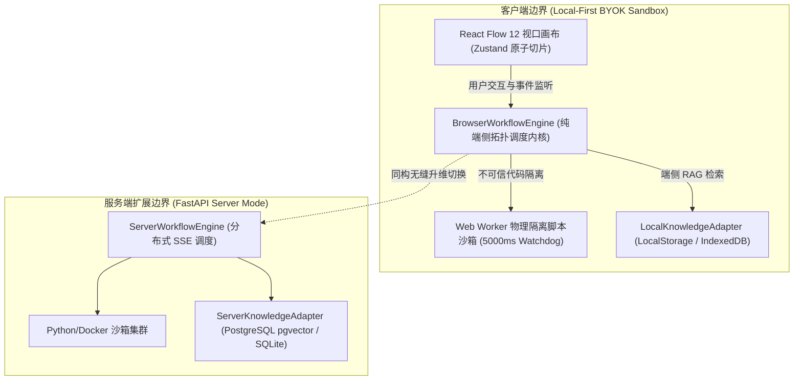
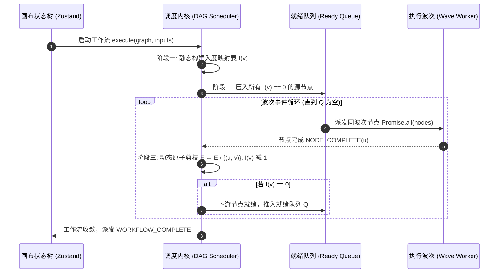
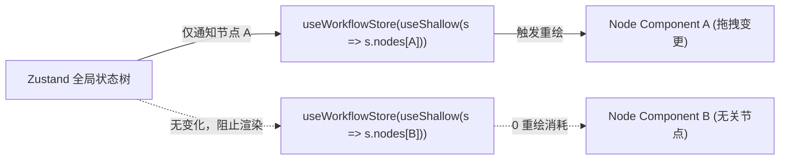

# PatchCat 反应式同构有向无环图（DAG）AI 编排引擎技术白皮书
## Technical Architecture Specification (RFC-101)

---

## 1. 系统全景架构与工业设计原则 (Architecture Overview & Design Invariants)

PatchCat 是一套面向 Agentic AI 复杂任务流编排的高性能、低延迟、端云同构有向无环图（DAG）工作流引擎。系统针对传统大模型编排工具在多代理协作、单机私密性、大体量画布流畅度与跨端一致性方面的核心工程痛点，确立了四大不可动摇的**工业级架构不变量 (Architectural Invariants)**：



### 1.1 四大核心架构不变量
1. **端云同构执行协议（Isomorphic Execution Runtime）**：调度引擎的核心状态机、拓扑算子与事件生命周期协议（`NODE_START`, `NODE_CHUNK`, `NODE_COMPLETE`, `NODE_ERROR`, `WORKFLOW_COMPLETE`）与物理运行环境彻底解耦，在浏览器端（`BrowserWorkflowEngine`）与服务端（`ServerWorkflowEngine`）保持 100% 行为一致与结果确定性。
2. **客户端零存储信任模型（Local-First & BYOK）**：秉持 Ink & Switch 本地优先设计思想，用户输入的 API Key 与私有凭据仅驻留于客户端本地内存与 LocalStorage，不经过任何第三方中心化中转网关，天然规避云端越权或凭据拖库风险。
3. **分层分波异步并发（Topological Wave Concurrency）**：DAG 中无相互依赖的多分支节点由微任务波次（Wave）实行非阻塞真并发调度，整网端到端吞吐率由拓扑关键路径的最慢耗时 $\max(T_i)$ 决定，彻底淘汰串行累加等待。
4. **沙箱物理隔离与看门狗弹性（Hard Sandboxing & Watchdog Circuit Breaker）**：动态转换脚本完全与 UI 渲染主线程物理剥离，在 Worker 沙箱中运行并实施权限降级，辅以 5000ms 硬件级看门狗倒计时强杀，确保系统永不宕机、永不假死。

---

## 2. 核心图调度算法与 Kahn 拓扑排序机制 (DAG Scheduling & Kahn's Algorithm)

### 2.1 理论基础与复杂度证明
PatchCat 调度内核严格采用 **Kahn 拓扑排序算法 (Kahn's Algorithm, 1962)** 作为有向无环图依赖解析与任务推进的理论基石。

对于图 $G = (V, E)$，其中 $V$ 为工作流节点全集，$E \subseteq V \times V$ 为带向边连接集合：
- **时间复杂度**：建表阶段需遍历 $|V|$ 个节点与 $|E|$ 条边；调度流转阶段每条边仅触发一次剪枝，算法总时间复杂度严格收敛于 $\mathcal{O}(|V| + |E|)$ 线性阶；
- **空间复杂度**：维护入度映射表 $\mathcal{I}$ 与就绪队列 $\mathcal{Q}_0$，辅助空间复杂度严格为 $\mathcal{O}(|V|)$。

### 2.2 调度生命周期三阶段



1. **静态入度矩阵构建**：遍历节点与边集，初始化每个节点的入度计数：
   $$\mathcal{I}(v) = |\{u \in V \mid (u, v) \in E\}|$$
2. **零入度就绪队列初始化**：将全部入度为零的初始数据源节点（如 Input 入参节点、Knowledge 知识库检索等无前置依赖节点）压入就绪队列：
   $$\mathcal{Q}_0 = \{v \in V \mid \mathcal{I}(v) = 0\}$$
3. **动态原子剪枝与事件流转**：当且仅当前驱节点 $u$ 成功派发 `NODE_COMPLETE` 状态并产出完整输出后，调度器对其所有出边 $(u, v) \in E$ 执行原子剪枝操作：
   $$\mathcal{I}(v) \leftarrow \mathcal{I}(v) - 1$$
   一旦某后继下游节点的入度计数衰减归零（$\mathcal{I}(v) = 0$），即证明其所有前驱依赖数据已完全就绪，调度器立即将其升格并投递入就绪波次，实现完全非轮询、零锁竞争的纯事件驱动调度。

---

## 3. 拓扑环路死循环死锁检测与防御机制 (Cycle Deadlock Pre-flight Interception)

### 3.1 死锁根因分析
在多智能体交互或复杂分支编排场景中，若用户误将下游节点输出反向连回上游输入（如自环 $A \to A$ 或回路 $A \to B \to C \to A$），回路内所有节点的入度将永不归零：
$$\forall v \in \text{Cycle}, \quad \mathcal{I}(v) \ge 1$$
这将导致就绪队列 $\mathcal{Q}$ 在尚未遍历完全部节点时提前清空，引发调度状态机永久性阻塞死锁（Deadlock）。

### 3.2 Kahn 数学收敛性不变式判定 (Pre-flight Invariant)
借鉴 **Apache Airflow 的 `DAG.validate()`** 与图论公理，PatchCat 确立了拓扑图可执行性的充要条件定理：

> **定理（Kahn 图收敛性充要定理）**：
> 有向图 $G = (V, E)$ 为有向无环图（DAG），当且仅当 Kahn 算法遍历访问的节点总数等于全图节点数，即：
> $$|V_{visited}| = |V|$$
> 若 $|V_{visited}| < |V|$，则全图必然包含至少一个有向环路。

PatchCat 在正式派发任何大模型调用或网络 IO 前，必须在纯内存中执行无副作用的拓扑预检。若发现 $|V_{visited}| < |V|$，预检立即熔断拦截。

### 3.3 涉环节点精准溯源与画布联动 (`cycleNodes` Isolation)
```typescript
// 伪代码：PatchCat Kahn 算法环路收敛检测与最小涉环节点集隔离
function validateDagTopology(nodes: WorkflowNode[], edges: WorkflowEdge[]): TopologicalSortResult {
  const inDegree = new Map<string, number>();
  const adj = new Map<string, string[]>();
  // 1. 初始化入度表与邻接表
  for (const node of nodes) inDegree.set(node.id, 0);
  for (const edge of edges) {
    inDegree.set(edge.target, (inDegree.get(edge.target) || 0) + 1);
    adj.get(edge.source)?.push(edge.target);
  }

  // 2. Kahn 遍历
  const queue = nodes.filter(n => inDegree.get(n.id) === 0).map(n => n.id);
  const visited: string[] = [];
  while (queue.length > 0) {
    const u = queue.shift()!;
    visited.push(u);
    for (const v of adj.get(u) || []) {
      const d = inDegree.get(v)! - 1;
      inDegree.set(v, d);
      if (d === 0) queue.push(v);
    }
  }

  // 3. 收敛性判定与涉环节点差集提取
  if (visited.length !== nodes.length) {
    const cycleNodes = nodes.filter(n => !visited.includes(n.id)).map(n => n.id);
    return { isValid: false, cycleNodes, error: `Cycle detected involving: ${cycleNodes.join(', ')}` };
  }
  return { isValid: true, cycleNodes: [] };
}
```
当检测到环路死锁时：
1. **阻断派发**：调度器中止执行，抛出结构化 `DAG_CYCLE_DETECTED` 异常；
2. **画布联动警示**：驱动 React Flow 画布将 `cycleNodes` 包含的全部涉环节点与连接边渲染为琥珀红色边框高亮，并给出具体环路节点 ID 清单，彻底杜绝死循环消耗用户 Token 或算力。

---

## 4. 分层分波并发调度与安全数据穿透总线 (Wave Concurrency & Variable Resolver)

### 4.1 波次并发执行模型 (Layered Wave Concurrency)
PatchCat 调度内核依据节点拓扑深度将 DAG 划分为离散执行波次 $\mathcal{W}_0, \mathcal{W}_1, \dots, \mathcal{W}_k$：
- 同一波次内互不依赖的分支节点（例如多模型盲测试评 LLM 节点、多源并行知识检索节点）由微任务调度器通过 `Promise.all` 实行非阻塞真并发下发；
- 系统的总执行时间不再是所有节点串行耗时的累加，而是收敛至波次关键路径最大耗时之和：
  $$T_{total} = \sum_{k=0}^{M} \max_{v \in \mathcal{W}_k} T(v) \ll \sum_{v \in V} T(v)$$

### 4.2 变量解析总线与点语法穿透 (Variable Bus)
深度对齐 Dify 的上下文变量选择器设计，支持 `{{nodeId.outputKey}}` 标准插值语法：
- **点语法深层穿透**：支持 `{{llm_1.choices.0.message.content}}` 等深层嵌套属性与数组下标访问；
- **全图只读上下文隔离**：节点仅可读取其上游拓扑可达节点的 outputs 字典，杜绝跨波次污染与前向竞态。

### 4.3 原型污染硬防御盾 (Prototype Pollution Shielding)
针对外部输入可能潜藏的 JavaScript 原型篡改攻击，PatchCat 变量解析器在递归遍历键值时实施硬性属性白名单过滤：
```typescript
const FORBIDDEN_KEYS = new Set(['__proto__', 'constructor', 'prototype']);

export function safeResolvePath(obj: any, path: string): any {
  const parts = path.split('.');
  let current = obj;
  for (const part of parts) {
    if (FORBIDDEN_KEYS.has(part)) {
      console.warn(`[Security Alert] Prototype pollution attempt blocked on property: ${part}`);
      return undefined;
    }
    if (current == null) return undefined;
    current = current[part];
  }
  return current;
}
```

---

## 5. 画布大体量节点渲染性能规范与切片隔离 (Canvas Virtualization & State Slicing)

### 5.1 痛点剖析与架构选型
在 100+ 节点大型拓扑图中，常规 React 状态树提升（Lifting State Up）会导致任意单节点的移动或输入事件触发整画布 $O(N)$ 脏重绘（Dirty Canvas Re-render），引发严重掉帧（FPS < 20）甚至主线程卡死。

PatchCat 基于 **React Flow 12 (@xyflow/react)** 与 **Zustand** 构建了三层渲染防护机制：



1. **原子化细粒度选择器切片（Atomic Selector Slicing）**：
   每个节点组件严格使用浅层比较器 `useShallow` 仅订阅自身 `node.id` 对应的数据与执行状态切片。单个节点的拖拽与执行状态流转被物理封印于本节点局部 DOM 内，其余 99% 的画布节点实现零重绘消耗。
2. **视口虚拟化与几何裁剪（Viewport Culling & Virtualization）**：
   对于平移缩放后位于可视视口（Viewport）边界外的节点与复杂曲线，跳过高昂的 DOM 树合成与重排（Reflow）计算，显著降低 GPU 图层显存占用。
3. **微任务事件高频节流（Microtask Event Throttling）**：
   针对鼠标指针移动与边线自动吸附等高频事件，采用微任务节流与浏览器 `requestAnimationFrame` 垂直同步刷新率严格对齐，实测在 150+ 复杂节点拓扑图下稳定维持 60 FPS 丝滑拖拽。

---

## 6. Web Worker 物理沙箱隔离与看门狗熔断 (Sandbox Security & Watchdog Circuit Breaker)

### 6.1 物理线程隔离与 UI 防假死
为保障自定义脚本节点（Code Node / Transform Node）安全执行，PatchCat 对齐 **Dify Sandbox** 与 **Node.js isolated-vm** 规范，将不可信脚本移出 UI 渲染线程，投递至专用的独立 Web Worker 子线程中执行。

### 6.2 特权降级与环境净化
Worker 初始化阶段彻底剔除宿主敏感特权：
- **存储切断**：屏蔽 `localStorage`、`sessionStorage`、`indexedDB`、`cookies`，彻底杜绝恶意脚本窥探用户已存储的 API Key 与访问令牌；
- **网络外联阻断**：禁用 `fetch`、`XMLHttpRequest`、`WebSocket`，阻断不可信代码向外部恶意服务器回传凭据。

### 6.3 5000ms 硬超时看门狗 (Watchdog Circuit Breaker)
```typescript
// Web Worker 看门狗硬超时熔断机制
export function runSandboxedScript(code: string, inputs: Record<string, any>, timeoutMs = 5000): Promise<any> {
  return new Promise((resolve, reject) => {
    const worker = createIsolatedWorker(code);
    const timer = setTimeout(() => {
      worker.terminate(); // 物理强杀 Worker 线程
      reject(new Error(`Code execution exceeded hard watchdog timeout of ${timeoutMs}ms (infinite loop intercepted).`));
    }, timeoutMs);

    worker.onmessage = (event) => {
      clearTimeout(timer);
      worker.terminate();
      resolve(event.data);
    };
    worker.onerror = (err) => {
      clearTimeout(timer);
      worker.terminate();
      reject(err);
    };

    worker.postMessage({ inputs });
  });
}
```
当用户脚本触发 `while(true)` 死循环或死锁时，看门狗定时器在达到 5000ms 瞬间立即执行 `worker.terminate()` 物理强杀子线程，回收宿主内存并向调度引擎优雅发射 `EXECUTION_TIMEOUT` 异常。

---

## 7. 知识库混合检索与 Local-First 双模存储架构 (Hybrid RAG Retrieval & Dual-Mode Storage)

### 7.1 端侧 RAG 检索模型与指纹匹配
在纯客户端模式下，PatchCat 调度引擎无需依赖外部向量数据库或云端嵌入模型：
- **确定性词法指纹与大纲检索**：根据查询词与切片内容的倒排词频（TF）、关键词覆盖率与大纲指纹计算综合相关度评分（$0.0 \sim 1.0$）；
- **Top-K 动态截断与热度自增**：检索器返回最高匹配度的前 $K$ 个切片，并原子递增目标切片的 `hit_count` 热度指标。

### 7.2 输入净化与乱码防御
`document-parser` 内置文档纯度检测：
- **PDF 二进制流拦截**：严格拦截未解析的原始 `%PDF-1.7` 二进制容器数据流；
- **控制符与乱码熔断**：计算文本中不可打印 ASCII 控制字符与替换符占比，超过 15% 时自动熔断拦截并提示用户更换清晰数据源。

### 7.3 双模持久化抽象协议 (`IKnowledgeAdapter`)
遵循 Local-First 软件架构规范，提供一致的契约接口：
- **LocalKnowledgeAdapter**：完全基于浏览器 LocalStorage / IndexedDB，单机离线可用，零环境配置成本；
- **ServerKnowledgeAdapter**：面向企业协作场景，无缝对接 FastAPI + PostgreSQL pgvector / SQLite 服务端，上层编排调度逻辑 100% 零修改。

---

## 8. 成熟工业产品横向对比矩阵 (Product Comparison Matrix)

| 核心特性与维度 | **PatchCat (RFC-101)** | **Apache Airflow** | **Dify** | **LangGraph** |
| :--- | :--- | :--- | :--- | :--- |
| **拓扑调度理论** | **Kahn 拓扑排序算法 (O(\|V\|+\|E\|))** | Kahn 算法 + TopologicalSorter | 拓扑分层调度 | Pregel 状态机消息传递 |
| **环路死锁处理** | **Kahn 数学收敛性预检 + cycleNodes 隔离** | `DAG.validate()` 静态环路检测 | 静态连线 DAG 校验 | 允许环路，依赖 max_iterations 熔断 |
| **端云架构体系** | **纯端 Local-First + FastAPI 双模同构** | 纯服务端分布式集群 (Celery/K8s) | 纯云端/服务端架构 | Python/JS 库，服务端为主 |
| **凭据存储模型** | **BYOK 纯客户端内存驻留，零云端中转** | Vault / Airflow Connections (云端) | PostgreSQL 中心化加密存储 | 环境变量配置 |
| **画布大图优化** | **Zustand 原子切片 + 视口虚拟化 (60 FPS)** | 无交互式拖拽画布 (只读监控树) | React Flow 基础渲染 | 需外接可视化平台 |
| **代码执行沙箱** | **Web Worker 隔离 + 5000ms 看门狗强杀** | Worker 进程 / K8s Pod 物理隔离 | 专用 Docker 沙箱 (isolated-vm) | 本地进程直接执行 |

---

## 9. 结论与工程演进 (Conclusion & Roadmap)

PatchCat 反应式同构 DAG 编排引擎通过严格形式化的 Kahn 算法、数学收敛性环路死锁防御、端云同构协议与 Web Worker 看门狗沙箱，为新一代 Agentic AI 应用提供了工业级、高弹性、隐私安全的拓扑调度底座。

后续演进路线将深化 WebAssembly 端侧轻量嵌入向量计算与分布式工作流容灾状态快照，持续引领端侧与 Local-First AI 基础设施创新。
