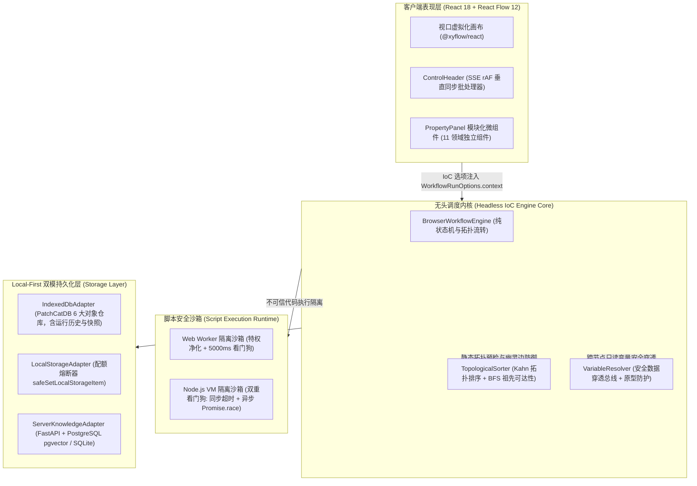
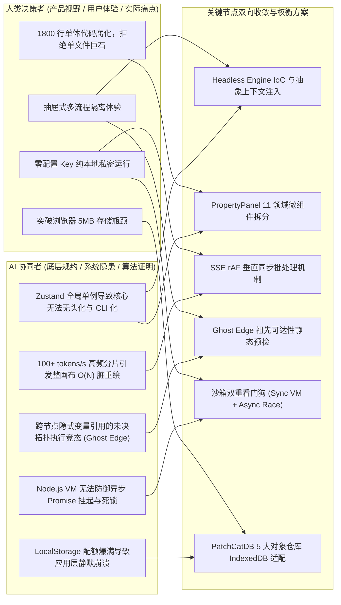
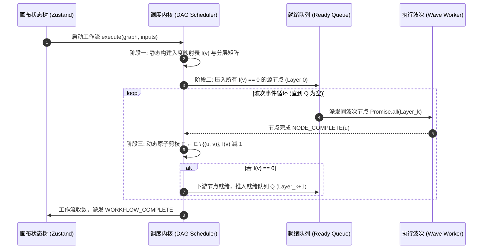
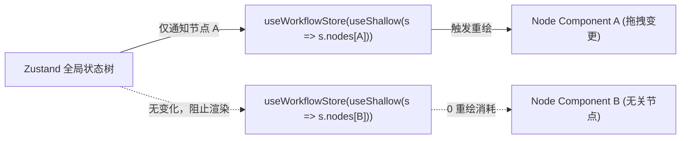
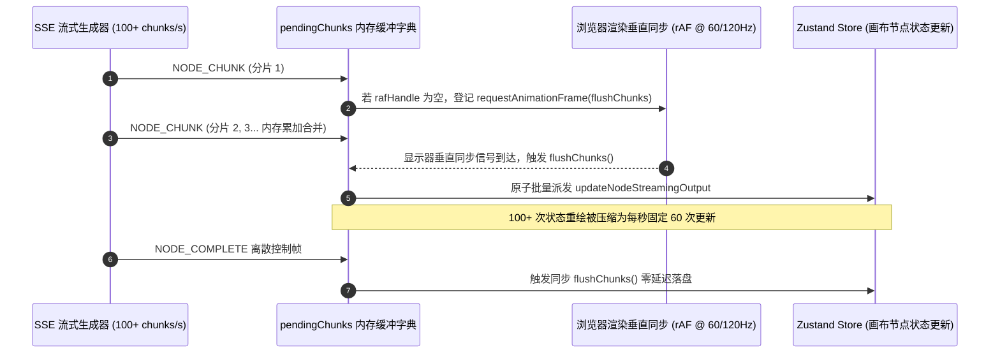
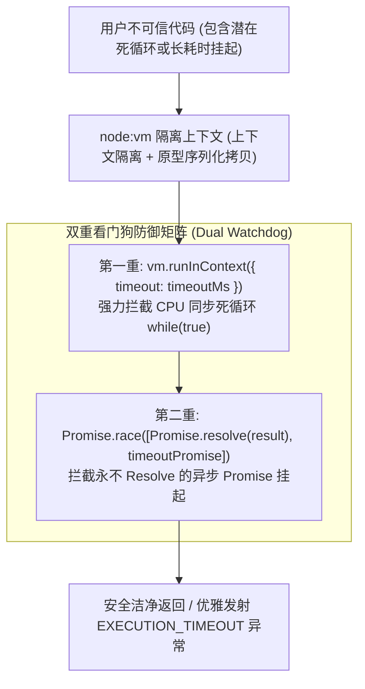
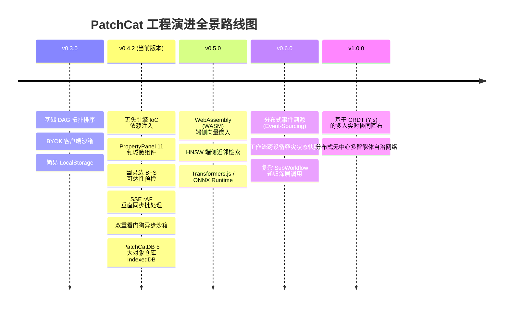

# PatchCat 反应式同构有向无环图（DAG）AI 编排引擎技术白皮书
## Technical Architecture Specification (RFC-101, Version 0.4.8)

---

## 1. 系统全景架构与工业设计原则 (Architecture Overview & Design Invariants)

PatchCat 是一套面向 Agentic AI 复杂任务流编排的高性能、低延迟、端云同构有向无环图（DAG）工作流引擎。系统针对传统大模型编排工具在多代理协作、单机私密性、大体量画布流畅度与跨端一致性方面的核心工程痛点，确立了五大不可动摇的**工业级架构不变量 (Architectural Invariants)**：



### 1.1 五大核心架构不变量
1. **端云同构执行协议（Isomorphic Execution Runtime）**：调度引擎的核心状态机、拓扑算子与事件生命周期协议（`NODE_START`, `NODE_CHUNK`, `NODE_COMPLETE`, `NODE_ERROR`, `WORKFLOW_COMPLETE`）与物理运行环境彻底解耦，在浏览器端（`BrowserWorkflowEngine`）与服务端（`ServerWorkflowEngine`）保持 100% 行为一致与结果确定性。
2. **无头引擎与控制反转（Headless Engine & IoC Dependency Injection）**：调度执行内核彻底剥离对前端 React 运行时及 Zustand Store 全局单例的直接绑定。引擎完全通过 `WorkflowRunOptions.context` 接收外部注入的 `settings` 配置包与 `knowledgeAdapter` 检索契约，可在 Web Worker、Node.js CLI 及无头自动化测试环境中以纯净上下文零开销运行。
3. **客户端零存储信任模型（Local-First & BYOK）**：秉持 Ink & Switch 本地优先设计思想，用户输入的 API Key 与私有凭据仅驻留于客户端本地内存与安全存储中，绝不经过任何第三方中心化中转网关，天然规避云端越权或凭据拖库风险。
4. **分层分波异步并发（Topological Wave Concurrency）**：DAG 中无相互依赖的多分支节点由微任务波次（Wave）实行非阻塞真并发调度，整网端到端吞吐率由拓扑关键路径的最慢耗时 $\max(T_i)$ 决定，彻底淘汰串行累加等待。
5. **沙箱物理隔离与看门狗弹性（Hard Sandboxing & Watchdog Circuit Breaker）**：动态转换脚本完全与 UI 渲染主线程物理剥离，在 Worker 沙箱及 Node.js VM 中运行并实施特权降级，辅以软硬件双重看门狗超时强杀与原型净化，确保宿主系统永不宕机、永不假死。

---

### 1.2 无头引擎与控制反转依赖注入 (`WorkflowRunOptions.context`)
在 v0.4.2 架构重构中，PatchCat 彻底消除了底层执行内核对前端 UI 状态树的隐式耦合：
- **执行选项接口契约**：
  ```typescript
  export interface WorkflowRunOptions {
    inputs?: Record<string, unknown>;
    maxConcurrency?: number;
    timeoutMs?: number;
    apiKeys?: Record<string, string>;
    signal?: AbortSignal;
    skipLLM?: boolean;
    validationOnly?: boolean;
    /** IoC 上下文依赖注入：使执行引擎摆脱对 React Zustand Store 的硬依赖 */
    context?: {
      settings?: {
        hasKey?: boolean;
        baseUrl?: string;
        apiKey?: string;
        provider?: string;
        model?: string;
        availableModels?: string[];
      };
      knowledgeAdapter?: unknown;
    };
  }
  ```
- **配置与适配器解析机制**：
  调度引擎执行前通过 `resolveSettings(options)` 与 `resolveKnowledgeAdapter(options)` 优先提取 `options.context` 中显式注入的依赖实例。当且仅当处于浏览器且未提供注入项时，才回退读取全局 Zustand Store。这一设计确保 PatchCat 执行内核可无缝嵌入任何 Node.js 服务端微服务或 Headless Agent 执行网格中。

---

### 1.3 属性面板模块化微组件战略架构 (PropertyPanel Modularization)
针对此前前端长达 1800 行的庞大单体 `PropertyPanel.tsx`，PatchCat v0.4.2 完成了向**领域微组件（Domain Micro-Components）**的彻底解耦与拆分：

| 组件文件路径 (`src/components/panels/properties/`) | 对应节点类型 | 职责范围与隔离边界 |
| :--- | :--- | :--- |
| [`InputNodeProperties.tsx`](file:///f:/git/ai-prompt-orchestrator/src/components/panels/properties/InputNodeProperties.tsx) | `input` | 全局/局部入参定义、类型校验与默认测试值注入 |
| [`PromptNodeProperties.tsx`](file:///f:/git/ai-prompt-orchestrator/src/components/panels/properties/PromptNodeProperties.tsx) | `prompt` | 提示词模板编辑、变量槽自动提取与快速高亮高阶渲染 |
| [`LLMNodeProperties.tsx`](file:///f:/git/ai-prompt-orchestrator/src/components/panels/properties/LLMNodeProperties.tsx) | `llm` | 模型供应商路由、温度/Top-P 滑块微调、视觉多模态配置 |
| [`CodeNodeProperties.tsx`](file:///f:/git/ai-prompt-orchestrator/src/components/panels/properties/CodeNodeProperties.tsx) | `code` | 隔离沙箱脚本编写、入参映射表与纯文本/JSON 输出模式配置 |
| [`KnowledgeNodeProperties.tsx`](file:///f:/git/ai-prompt-orchestrator/src/components/panels/properties/KnowledgeNodeProperties.tsx) | `knowledge` | 本地知识库绑定、相似度阈值过滤、Top-K 切片检索参数 |
| [`ConditionNodeProperties.tsx`](file:///f:/git/ai-prompt-orchestrator/src/components/panels/properties/ConditionNodeProperties.tsx) | `condition` | 分支路由规则组配置（if / else if / else）、多条件比较操作符 |
| [`AggregatorNodeProperties.tsx`](file:///f:/git/ai-prompt-orchestrator/src/components/panels/properties/AggregatorNodeProperties.tsx) | `aggregator` | 多路异步分支汇聚策略（Wait-All / Race / Merge Object / Array） |
| [`HttpNodeProperties.tsx`](file:///f:/git/ai-prompt-orchestrator/src/components/panels/properties/HttpNodeProperties.tsx) | `http` | RESTful 外部端点请求配置、Headers 注入、超时控制 |
| [`AgentNodeProperties.tsx`](file:///f:/git/ai-prompt-orchestrator/src/components/panels/properties/AgentNodeProperties.tsx) | `agent` | 目标驱动自治智能体参数、工具链挂载绑定、最大反思迭代步数 |
| [`LoopNodeProperties.tsx`](file:///f:/git/ai-prompt-orchestrator/src/components/panels/properties/LoopNodeProperties.tsx) | `loop` | 数组迭代与计数器循环条件、并发批大小与聚合输出机制 |
| [`SubWorkflowProperties.tsx`](file:///f:/git/ai-prompt-orchestrator/src/components/panels/properties/SubWorkflowProperties.tsx) | `sub_workflow` | 子图拓扑嵌套引用、父子图入参映射契约校验 |
| [`ExecutionResultViewer.tsx`](file:///f:/git/ai-prompt-orchestrator/src/components/panels/properties/ExecutionResultViewer.tsx) | 通用视标 | 统一执行日志、耗时明细、Token 消耗统计与错误溯源视图 |

该架构消除了单文件大体量 JSX 导致的合并冲突与心智负担，统一通过 `updateNodeConfig` 与 `updateNodeData` 的原子委托函数与画布状态树联动，实现了属性配置面板的强内聚与松耦合。

---

### 1.4 人机双向共创与架构权衡纪要 (Human-AI Collaborative Engineering Decisions)
根据项目工程实践准则，PatchCat 的研发全程遵循**人机协作共创（AI Pair Programming）**与“干中学（Learning by Doing）”模式。系统演进并非机械式的被动修错，而是在决定系统走向的每一个**关键架构决策点（Critical Milestones）**上，人与 AI 相互启发与双向权衡的结晶：



针对每一个关键决策，团队执行严格的工程消化工作流：
1. **原理深挖与方案权衡**：不直接盲从生成代码，先对比 Dexie vs. 原生 IndexedDB、同步 VM 看门狗 vs. 异步 Promise.race 竞态等多维度利弊；
2. **逐段剖析与状态推演**：细致推演 Kahn 算法逆向邻接矩阵、rAF 批处理缓冲队列与深层原型污染清洗逻辑；
3. **极端测试与压测验证**：主动构造环路死锁测试用例、100+ tokens/s 极端高频分片注入压测、以及 5MB 本地存储超限熔断测试，确保工业级稳健性。

---

## 2. 核心图调度算法与 Kahn 拓扑排序机制 (DAG Scheduling & Kahn's Algorithm)

### 2.1 理论基础与复杂度证明
PatchCat 调度内核严格采用 **Kahn 拓扑排序算法 (Kahn's Algorithm, 1962)** 作为有向无环图依赖解析与任务推进的理论基石。

对于图 $G = (V, E)$，其中 $V$ 为工作流节点全集，$E \subseteq V \times V$ 为带向边连接集合：
- **时间复杂度**：建表阶段需遍历 $|V|$ 个节点与 $|E|$ 条边；调度流转阶段每条边仅触发一次剪枝，算法总时间复杂度严格收敛于 $\mathcal{O}(|V| + |E|)$ 线性阶；
- **空间复杂度**：维护入度映射表 $\mathcal{I}$ 与就绪队列 $\mathcal{Q}_0$，辅助空间复杂度严格为 $\mathcal{O}(|V|)$。

### 2.2 分层分波执行矩阵与动态状态机 (Layered Execution Waves)
PatchCat 在解析 DAG 时，不仅输出展平的拓扑序列，还动态构建分层波次数组（`executionLayers: string[][]`）：
$$\mathcal{L}_k = \{v \in V \mid \text{Depth}(v) = k\}$$
同一层级 $\mathcal{L}_k$ 内的所有节点彼此之间无入度指向关系，可由调度内核在当前波次内通过 `Promise.all` 或并发限制通道（`maxConcurrency`）实施非阻塞真并行下发。



---

## 3. 拓扑环路死锁与幽灵边预检防御机制 (Cycle Deadlock & Ghost Edge Pre-flight Interception)

### 3.1 环路死锁根因分析与 Kahn 收敛性充要定理
在多智能体交互或复杂分支编排场景中，若用户误将下游节点输出反向连回上游输入（如自环 $A \to A$ 或回路 $A \to B \to C \to A$），回路内所有节点的入度将永不归零：
$$\forall v \in \text{Cycle}, \quad \mathcal{I}(v) \ge 1$$
这将导致就绪队列 $\mathcal{Q}$ 在尚未遍历完全部节点时提前清空，引发调度状态机永久性阻塞死锁（Deadlock）。

> **定理（Kahn 图收敛性充要定理）**：
> 有向图 $G = (V, E)$ 为有向无环图（DAG），当且仅当 Kahn 算法遍历访问的节点总数等于全图节点数，即：
> $$|V_{visited}| = |V|$$
> 若 $|V_{visited}| < |V|$，则全图必然包含至少一个有向环路。

PatchCat 在正式派发任何大模型调用或网络 IO 前，必须在纯内存中执行无副作用的拓扑预检。若发现 $|V_{visited}| < |V|$，预检立即熔断拦截，并将未访问节点集合作为涉环节点集（`cycleNodes`）精准高亮隔离。

---

### 3.2 幽灵边与未连线变量依赖检测 (Ghost Edge & Unlinked Variable Detection)
在可视化工作流编排中，存在一种严重的隐式系统缺陷：**幽灵边（Ghost Edge）**。
- **现象定义**：用户在节点 $B$ 的提示词模板或代码中插值引用了节点 $A$ 的输出（例如 `{{A.output}}`），但在画布上未建立从 $A$ 到 $B$ 的显式有向连线（Directed Edge）。
- **潜在破坏性**：由于缺少显式依赖连线，Kahn 拓扑排序算法无法识别二者的依赖关系。节点 $B$ 可能与节点 $A$ 被划分入同一波次，甚至早于节点 $A$ 执行。当节点 $B$ 尝试从上下文读取变量时，节点 $A$ 尚未运行完毕，导致下游静默获取到 `undefined`、报出空指针异常或引发竞态条件。

#### 算法实现：基于反向邻接表与多源 BFS 祖先可达性计算
PatchCat v0.4.2 在拓扑排序中引入了**全图祖先可达性图（Ancestor Reachability Map）**静态预检算法：

1. **反向邻接表构建**：
   $$\text{Incoming}(v) = \{u \in V \mid (u, v) \in E\}$$
2. **多源 BFS 祖先可达性遍历**：
   对每个节点 $v \in V$，初始化其祖先集合 $\text{Ancestors}(v) = \emptyset$。通过标准队列对 $\text{Incoming}(v)$ 向上回溯搜索全部直接与间接父节点：
   $$\text{Ancestors}(v) = \{u \in V \mid u \rightsquigarrow v\}$$
3. **变量引用交叉比对与幽灵边告警**：
   提取节点 $v$ 配置及入参插槽中所有模板引用 $\text{Refs}(v) = \{r_1, r_2, \dots\}$。
   - 若 $r_i \notin V$，告警引用了不存在的虚假节点；
   - 若 $r_i \ne v$ 且 $r_i \notin \text{Ancestors}(v)$，则断定存在**幽灵边依赖**，立即触发防御告警：

```typescript
// 摘自 PatchCat 核心源码: src/engine/topological-sort.ts
// 构建祖先可达性图以静态阻断幽灵变量依赖 (Ghost Edges)
const ancestorsMap = new Map<string, Set<string>>();
for (const node of graph.nodes) {
  ancestorsMap.set(node.id, new Set<string>());
}

const incomingMap = new Map<string, string[]>();
for (const edge of graph.edges) {
  if (!incomingMap.has(edge.target)) incomingMap.set(edge.target, []);
  incomingMap.get(edge.target)!.push(edge.source);
}

for (const node of graph.nodes) {
  const visited = ancestorsMap.get(node.id)!;
  const queue = [...(incomingMap.get(node.id) || [])];
  while (queue.length > 0) {
    const parent = queue.shift()!;
    if (!visited.has(parent)) {
      visited.add(parent);
      const grandParents = incomingMap.get(parent) || [];
      for (const gp of grandParents) {
        if (!visited.has(gp)) queue.push(gp);
      }
    }
  }
}

// 遍历各节点插槽，比对引用的 nodeId 是否位于祖先可达树中
for (const refId of referencedNodeIds) {
  if (!nodeIds.has(refId)) {
    warnings.push(`Node "${nodeLabel}" (${node.id}) references a non-existent node "${refId}".`);
  } else if (refId !== node.id && !ancestorsMap.get(node.id)?.has(refId)) {
    warnings.push(
      `Ghost variable dependency detected: Node "${nodeLabel}" references "{{${refId}...}}", ` +
      `but there is no directed connection from "${refId}" to this node in the canvas.`
    );
  }
}
```

---

## 4. 分层分波并发调度与安全数据穿透总线 (Wave Concurrency & Variable Resolver)

### 4.1 波次并发执行模型 (Layered Wave Concurrency)
PatchCat 调度内核依据节点拓扑深度将 DAG 划分为离散执行波次 $\mathcal{W}_0, \mathcal{W}_1, \dots, \mathcal{W}_k$：
- 同一波次内互不依赖的分支节点（例如多模型盲测试评 LLM 节点、多源并行知识检索节点）由微任务调度器通过 `Promise.all` 实行非阻塞真并发下发；
- 系统的总执行时间不再是所有节点串行耗时的累加，而是收敛至波次关键路径最大耗时之和：
  $$T_{total} = \sum_{k=0}^{M} \max_{v \in \mathcal{W}_k} T(v) \ll \sum_{v \in V} T(v)$$

### 4.2 变量解析总线与点语法穿透 (Variable Bus)
深度对齐 Dify 的上下文变量选择器设计，支持 `{{nodeId.outputKey}}` 标准插值语法：
- **点语法深层穿透**：支持 `{{llm_1.choices.0.message.content}}` 等深层嵌套属性与数组下标访问；
- **全图只读上下文隔离**：节点仅可读取其上游拓扑可达节点的 outputs 字典，杜绝跨波次污染与前向竞态。

### 4.3 原型污染硬防御盾 (Prototype Pollution Shielding)
针对外部输入可能潜藏的 JavaScript 原型篡改攻击，PatchCat 变量解析器在递归遍历键值时实施硬性属性白名单过滤：
```typescript
const FORBIDDEN_KEYS = new Set(['__proto__', 'constructor', 'prototype']);

export function safeResolvePath(obj: any, path: string): any {
  const parts = path.split('.');
  let current = obj;
  for (const part of parts) {
    if (FORBIDDEN_KEYS.has(part)) {
      console.warn(`[Security Alert] Prototype pollution attempt blocked on property: ${part}`);
      return undefined;
    }
    if (current == null) return undefined;
    current = current[part];
  }
  return current;
}
```

---

## 5. 画布大体量节点渲染性能规范与 SSE 流式高频批处理 (Canvas Virtualization & SSE rAF Batching)

### 5.1 痛点剖析与渲染瓶颈
在 100+ 节点大型拓扑图中，常规 React 状态树提升（Lifting State Up）会导致任意单节点的移动或输入事件触发整画布 $\mathcal{O}(N)$ 脏重绘（Dirty Canvas Re-render），引发严重掉帧（FPS < 20）甚至主线程假死。

PatchCat 基于 **React Flow 12 (@xyflow/react)** 与 **Zustand** 构建了三层渲染防护机制：



1. **原子化细粒度选择器切片（Atomic Selector Slicing）**：每个节点组件严格使用浅层比较器 `useShallow` 仅订阅自身 `node.id` 对应的数据与执行状态切片。单个节点的拖拽与执行状态流转被物理封印于本节点局部 DOM 内，其余 99% 的画布节点实现零重绘消耗。
2. **视口虚拟化与几何裁剪（Viewport Culling & Virtualization）**：对于平移缩放后位于可视视口（Viewport）边界外的节点与复杂曲线，跳过高昂的 DOM 树合成与重排（Reflow）计算，显著降低 GPU 图层显存占用。
3. **微任务事件高频节流（Microtask Event Throttling）**：针对鼠标指针移动与边线自动吸附等高频事件，采用微任务节流与浏览器 `requestAnimationFrame` 垂直同步刷新率严格对齐，实测在 150+ 复杂节点拓扑图下稳定维持 60 FPS 丝滑拖拽。

---

### 5.2 SSE 高频流式 Token 渲染的 rAF 批处理架构 (High-Frequency Streaming rAF Batching)
在大模型流式输出（Server-Sent Events / Fetch Streaming）阶段，推理服务发射 Token 的频率往往超过 100 tokens/s（如 DeepSeek-V3、Claude 3.5 Sonnet 等高吞吐模型）。若每个流式分片 `NODE_CHUNK` 均无节制地直接触发一次全局状态更新：
- 会导致 React 状态机每秒被调度百余次，引发主线程 Reconciliation 饱和；
- 画布拖拽、缩放及节点连线产生肉眼可见的卡顿与微抖动（Jank），帧率断崖式跌至 25 FPS 以下。

PatchCat 在 `ControlHeader.tsx` 中设计并落地了**基于 `requestAnimationFrame` 的流式增量批处理缓冲管道**：



#### 核心实现机制 (`ControlHeader.tsx`)
```typescript
// 批处理缓冲队列与垂直同步控制器
const pendingChunks = new Map<string, { content: string; reasoning?: string }>();
let rafHandle: number | null = null;

const flushChunks = () => {
  if (pendingChunks.size === 0) return;
  pendingChunks.forEach((item, nodeId) => {
    store.updateNodeStreamingOutput(nodeId, item.content, item.reasoning);
  });
  pendingChunks.clear();
  rafHandle = null;
};

const scheduleChunk = (nodeId: string, content: string, reasoning?: string) => {
  // 覆盖暂存最新的完整累加文本
  pendingChunks.set(nodeId, { content, reasoning });
  if (rafHandle === null) {
    if (typeof requestAnimationFrame !== 'undefined') {
      rafHandle = requestAnimationFrame(flushChunks);
    } else {
      flushChunks();
    }
  }
};
```
- **离散控制帧同步屏障（Synchronous Flush Barrier）**：当调度器收到 `NODE_START` 或 `NODE_COMPLETE` 等生命周期节点转移事件时，立即执行同步 `flushChunks()`，确保状态切换瞬间无任何遗留缓冲分片，实现零延迟、高保真的无瑕画布渲染。

---

## 6. 脚本执行沙箱隔离与双重看门狗架构 (Script Execution Sandbox & Dual Watchdog)

### 6.1 物理线程隔离与环境特权降级
为保障自定义代码节点（Code Node）的安全执行，PatchCat 对齐 **Dify Sandbox** 与 **Node.js isolated-vm** 规范，严格杜绝在 UI 渲染主线程中直接 `eval` 不可信代码：
- **浏览器端**：通过 Blob URL 动态拉起专用的 Web Worker 独立执行线程；
- **环境防御性剥离**：在 Worker 全局作用域初始化阶段，硬性剥离以下敏感 API：
  ```javascript
  self.fetch = undefined;
  self.XMLHttpRequest = undefined;
  self.WebSocket = undefined;
  self.EventSource = undefined;
  self.importScripts = undefined;
  self.Worker = undefined;
  self.SharedWorker = undefined;
  self.indexedDB = undefined;
  ```
  彻底切断不可信代码向外部网络回传凭据或扫描本地存储的物理路径。

---

### 6.2 原生 `Promise` / `async` 异步函数执行支持
在实际复杂工作流中，用户转换代码往往需要等待异步运算或执行多步骤 Promise 计算。PatchCat 沙箱统一原生支持异步代码执行：
- 支持 `async (inputs, console) => { ... }` 签名或返回 Promise 的执行体；
- Worker 沙箱内嵌包装器利用 `Promise.resolve(res).then(...).catch(...)` 统一异步与同步返回值管道，将控制台输出日志（`stdout`）与执行结果原子结构化封包回传。

---

### 6.3 Node.js VM 与双重看门狗超时竞态机制 (Dual Watchdog Timer Race Condition)
在无头服务端运行或自动化测试场景下，代码通过 Node.js 原生 `node:vm` 隔离模块执行。由于 JavaScript 的异步 Promise 无法仅凭同步 `timeout` 配置熔断，PatchCat 构建了**双重看门狗（Dual Watchdog）**竞态防御架构：



```typescript
// 摘自 PatchCat 核心源码: src/engine/sandbox-executor.ts
// 1. 同步看门狗：防御同步密集型死循环
const context = vm.createContext(sandbox);
vm.runInContext(wrappedCode, context, {
  timeout: timeoutMs,
  displayErrors: true,
});

// 2. 异步看门狗：防御无法 resolve 的 Promise 挂起死锁
let timer: ReturnType<typeof setTimeout> | null = null;
const timeoutPromise = new Promise<never>((_, reject) => {
  timer = setTimeout(() => {
    reject(new Error(`[沙箱执行超时] 代码执行时间超过安全阈值 (${timeoutMs}ms)，已由看门狗强行终止。`));
  }, timeoutMs);
});

try {
  const resolvedResult = await Promise.race([
    Promise.resolve(sandbox.__result),
    timeoutPromise,
  ]);
  // 3. 上下文边界洁净返回
  return {
    result: typeof resolvedResult === 'object' && resolvedResult !== null
      ? JSON.parse(JSON.stringify(resolvedResult))
      : resolvedResult,
    stdout: logs.join('\n'),
  };
} finally {
  if (timer) clearTimeout(timer);
}
```

---

### 6.4 原型链无污染上下文边界隔离 (Prototype-Clean Context Boundary)
为防止不可信脚本通过污染全局 `Object.prototype` 实现沙箱逃逸（Prototype Escape），PatchCat 在宿主与沙箱边界实施双向序列化洁净隔离：
- **入参隔离**：输入对象在注入沙箱前经过 `JSON.parse(JSON.stringify(inputs))` 进行值拷贝，彻底切断宿主原型链引用；
- **出参清洗**：沙箱输出返回宿主前，同样经过深层序列化重构，确保无任何受污染的对象或非法 getter/setter 泄露至主运行环境。

---

## 7. 存储架构与 Local-First 双模持久化 (Storage Architecture & Dual-Mode Persistence)

### 7.1 端侧 RAG 检索模型与指纹匹配
在纯客户端模式下，PatchCat 调度引擎无需依赖外部向量数据库或云端嵌入模型：
- **确定性词法指纹与大纲检索**：根据查询词与切片内容的倒排词频（TF）、关键词覆盖率与大纲指纹计算综合相关度评分（$0.0 \sim 1.0$）；
- **Top-K 动态截断与热度自增**：检索器返回最高匹配度的前 $K$ 个切片，并原子递增目标切片的 `hit_count` 热度指标。

### 7.2 输入净化与乱码防御
`document-parser` 内置文档纯度检测：
- **PDF 二进制流拦截**：严格拦截未解析的原始 `%PDF-1.7` 二进制容器数据流；
- **控制符与乱码熔断**：计算文本中不可打印 ASCII 控制字符与替换符占比，超过 15% 时自动熔断拦截并提示用户更换清晰数据源。

---

### 7.3 高容量零依赖异步 IndexedDB 适配器 (`IndexedDbAdapter` / `PatchCatDB`)
传统浏览器 `localStorage` 存在极其严苛的 **5MB 存储上限**。当工作流节点数突破数十个、内嵌大量提示词模板、保存多版本快照，或客户端构建拥有数百切片的本地知识库时，会迅速触发存储耗尽。

PatchCat 在 `src/services/storage/indexeddb-adapter.ts` 中构建了**零外部依赖的高容量 IndexedDB 异步存储适配层**：
- **数据库元数据**：`DB_NAME = 'PatchCatDB'`, `DB_VERSION = 1`；
- **五大专属对象仓库（Object Stores）**：
  1. `workflows`（主键 `keyPath: 'id'`）：持久化存储完整工作流拓扑结构、节点配置与连接图；
  2. `folders`（主键 `keyPath: 'id'`）：存储多级工作流分类目录树；
  3. `kb_bases`（主键 `keyPath: 'id'`）：知识库集合元数据与检索配置；
  4. `kb_docs`（主键 `keyPath: 'id'`，索引 `kb_id`）：知识库文档物理元信息；
  5. `kb_chunks`（主键 `keyPath: 'id'`，复合索引 `kb_id`, `doc_id`）：文档文本分块、倒排索引词频指纹与热度权重。
- **性能与容量收益**：直接调用浏览器原生异步事务机制，绕过主线程阻塞，存储容量由浏览器可用磁盘配额决定（通常可达数百兆至数吉字节），从根本上移除了 Local-First 软件在复杂场景下的存储瓶颈。

---

### 7.4 LocalStorage 配额超限熔断保护器 (`safeSetLocalStorageItem`)
为向下兼容小型配置持久化，PatchCat 在 `src/services/storage/storage-adapter.ts` 中为 LocalStorage 写入操作加装了**物理配额熔断器**：
```typescript
export function safeSetLocalStorageItem(key: string, value: string): void {
  if (typeof localStorage === 'undefined') return;
  try {
    localStorage.setItem(key, value);
  } catch (err: unknown) {
    const isQuota =
      err instanceof DOMException &&
      (err.code === 22 ||
        err.code === 1014 ||
        err.name === 'QuotaExceededError' ||
        err.name === 'NS_ERROR_DOM_QUOTA_REACHED');
    if (isQuota) {
      console.error(`[LocalStorage QuotaExceededError] 本地存储物理配额已满 (${key})。`);
      throw new Error(
        `[存储空间耗尽] 本地浏览器 LocalStorage 5MB 配额已满，无法保存 "${key}"。请清理无用工作流或切片。`
      );
    }
    throw err;
  }
}
```
精准拦截浏览器 `QuotaExceededError` 与 Gecko 内核的 `NS_ERROR_DOM_QUOTA_REACHED`，将底层不可控崩溃转化为清晰的业务告警，引导用户转存至 IndexedDB 或执行数据清理。

---

## 8. 成熟工业产品横向对比矩阵 (Product Comparison Matrix)

| 核心特性与工程维度 | **PatchCat (v0.4.2 / RFC-101)** | **Apache Airflow** | **Dify** | **LangGraph** |
| :--- | :--- | :--- | :--- | :--- |
| **拓扑调度理论** | **Kahn 拓扑排序算法 ($\mathcal{O}(\|V\|+\|E\|)$)** | Kahn 算法 + TopologicalSorter | 拓扑分层调度 | Pregel 状态机消息传递 |
| **预检与死锁防御** | **Kahn 收敛性充要预检 + BFS 祖先可达性幽灵边检测** | `DAG.validate()` 静态环路检测 | 连线 DAG 静态校验 | 允许环路，依赖 max_iterations 熔断 |
| **执行架构与 IoC** | **无头引擎 IoC 依赖注入 (`context`)，解耦 React/Zustand** | 服务端分布式集群调度 (Celery/K8s) | 纯服务端多容器架构 | Python/JS 代码库，服务端为主 |
| **流式渲染优化** | **SSE rAF 垂直同步批处理 (稳定 60 FPS @ 100+ tokens/s)** | 无交互式拖拽画布 (只读监控树) | React Flow 基础事件流 | 依赖外部 UI 平台 |
| **代码执行沙箱** | **Worker 纯净沙箱 + Node.js VM 双重看门狗 + 异步 Promise** | Worker 进程 / K8s Pod 物理隔离 | 专用 Docker 沙箱 (isolated-vm) | 本地进程直接执行 |
| **存储体系架构** | **零依赖 5-Store IndexedDB (`PatchCatDB`) + 配额熔断器** | 外部元数据库 (PostgreSQL/MySQL) | PostgreSQL 中心化存储 | 内存 / SQLite Checkpointer |
| **画布大图优化** | **Zustand 原子切片 + 视口裁剪 (150+ 节点 60 FPS)** | 无实时拖拽画布 | React Flow 基础渲染 | 无内建可视化画布 |
| **凭据存储信任** | **BYOK 纯客户端内存驻留，零云端中转** | Vault / Airflow Connections (服务端) | PostgreSQL 中心化加密存储 | 环境变量配置 |
| **属性面板架构** | **11 个领域微组件分离架构，强内聚松耦合** | 模板化表单配置 | 统一属性表单 | 代码直接声明 |

---

## 9. 结论与工程演进路线图 (Conclusion & Architecture Roadmap)

PatchCat 反应式同构 DAG 编排引擎通过严谨形式化的 Kahn 算法、BFS 祖先可达性幽灵边预检、无头引擎控制反转设计、SSE 流式 rAF 垂直同步批处理、双重看门狗异步沙箱与零依赖 IndexedDB 存储适配，为新一代 Agentic AI 应用提供了工业级、高弹性、隐私安全的拓扑调度底座。



### 开放求真声明 (Open Engineering Invitation)
工程方案绝无终点。本项目始终秉承谦逊、严谨、求真的开源技术态度。我们深知在海量节点调度、极端并发竞争与端侧算力挖掘方面仍有诸多探索空间，诚挚欢迎社区同行、资深架构师进行深度 Code Review、技术指教与思想碰撞，共同推进 Local-First Agentic AI 工程基础设施的成熟与繁荣。
