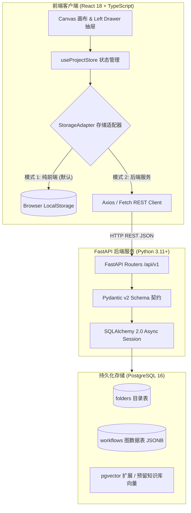

# Phase 1: FastAPI + PostgreSQL (pgvector) 后端架构与双模存储设计规范

> **文档版本**: 1.0.0  
> **状态**: 规划与实施中 (In Progress)  
> **作者**: PatchCat 核心架构组  
> **最后更新**: 2026-09-02  

---

## 1. 背景与架构目标

PatchCat 原生基于纯前端（Client-Side BYOK 模式）构建。为了支持多端同步、企业级团队协作以及后续核心功能——**AI 知识库（Knowledge Base / RAG 向量检索）**，系统需要引入工业级后端底座。

本方案旨在建立 **FastAPI + SQLAlchemy 2.0 (Async) + PostgreSQL (pgvector)** 后端架构，并通过前端 **StorageAdapter（存储适配器模式）** 保证纯前端与服务端双模式的平滑共存。

---

## 2. 总体系统拓扑与双模架构



---

## 3. 数据库表结构设计 (PostgreSQL DDL)

### 3.1 目录表 (`folders`)
```sql
CREATE TABLE folders (
    id VARCHAR(64) PRIMARY KEY,
    name VARCHAR(255) NOT NULL,
    is_expanded BOOLEAN NOT NULL DEFAULT TRUE,
    is_preset BOOLEAN NOT NULL DEFAULT FALSE,
    created_at TIMESTAMPTZ NOT NULL DEFAULT NOW(),
    updated_at TIMESTAMPTZ NOT NULL DEFAULT NOW()
);

CREATE INDEX idx_folders_created_at ON folders (created_at DESC);
```

### 3.2 工作流表 (`workflows`)
```sql
CREATE TABLE workflows (
    id VARCHAR(64) PRIMARY KEY,
    name VARCHAR(255) NOT NULL,
    folder_id VARCHAR(64) REFERENCES folders(id) ON DELETE SET NULL,
    description TEXT,
    nodes JSONB NOT NULL DEFAULT '[]'::jsonb,
    edges JSONB NOT NULL DEFAULT '[]'::jsonb,
    global_inputs JSONB NOT NULL DEFAULT '{}'::jsonb,
    is_preset BOOLEAN NOT NULL DEFAULT FALSE,
    created_at TIMESTAMPTZ NOT NULL DEFAULT NOW(),
    updated_at TIMESTAMPTZ NOT NULL DEFAULT NOW()
);

CREATE INDEX idx_workflows_folder_id ON workflows (folder_id);
CREATE INDEX idx_workflows_updated_at ON workflows (updated_at DESC);
CREATE INDEX idx_workflows_nodes_gin ON workflows USING GIN (nodes);
```

---

## 4. 后端工程目录规范 (`server/`)

```text
ai-prompt-orchestrator/
├── src/                          # 前端 React 源代码
├── server/                       # FastAPI 后端服务
│   ├── app/
│   │   ├── api/
│   │   │   └── v1/
│   │   │       ├── api.py        # 路由聚合器
│   │   │       ├── endpoints/
│   │   │       │   ├── health.py     # 健康检查与 DB 连通性测试
│   │   │       │   ├── folders.py    # 目录 CRUD 接口
│   │   │       │   └── workflows.py  # 工作流 CRUD 接口
│   │   ├── core/
│   │   │   ├── config.py         # Pydantic 环境变量读取
│   │   │   └── database.py       # 异步数据库引擎与 Session 生命周期管理
│   │   ├── models/
│   │   │   ├── base.py           # SQLAlchemy Declarative Base
│   │   │   ├── folder.py         # FolderORM 数据模型
│   │   │   └── workflow.py       # WorkflowORM 数据模型
│   │   ├── schemas/
│   │   │   ├── folder.py         # Pydantic Folder 校验模型 (Create/Update/Response)
│   │   │   └── workflow.py       # Pydantic Workflow 校验模型 (Create/Update/Response)
│   │   ├── services/
│   │   │   ├── folder_service.py # 目录业务逻辑
│   │   │   └── workflow_service.py# 工作流保存/加载逻辑
│   │   └── main.py               # FastAPI App 实例、CORS 配置与启动事件
│   ├── tests/                    # pytest 单元测试
│   ├── docker-compose.yml        # PostgreSQL 16 + pgvector 容器编排
│   ├── requirements.txt          # Python 依赖清单
│   └── .env.example              # 环境变量配置模板
```

---

## 5. API 接口契约清单

### 5.1 基础健康检查
- `GET /api/v1/health`
  - 响应：`{"status": "ok", "db": "connected", "version": "0.1.0"}`

### 5.2 目录管理 (Folders)
- `GET /api/v1/folders`：获取全部目录及下属工作流计数。
- `POST /api/v1/folders`：创建新目录。
- `PUT /api/v1/folders/{folder_id}`：重命名目录或切换折叠状态。
- `DELETE /api/v1/folders/{folder_id}`：删除目录（级联移动工作流至默认目录）。

### 5.3 工作流管理 (Workflows)
- `GET /api/v1/workflows`：分页/条件检索工作流列表（可按 `folder_id` 过滤）。
- `GET /api/v1/workflows/{workflow_id}`：获取指定工作流的完整 DAG 数据。
- `POST /api/v1/workflows`：新建工作流。
- `PUT /api/v1/workflows/{workflow_id}`：全量更新/自动保存节点与连线。
- `POST /api/v1/workflows/{workflow_id}/duplicate`：创建工作流副本。
- `POST /api/v1/workflows/{workflow_id}/move`：移动工作流至目标目录。
- `DELETE /api/v1/workflows/{workflow_id}`：删除工作流。

---

## 6. 前端 StorageAdapter 存储抽象设计

```typescript
export interface IStorageAdapter {
  // Folders
  getFolders(): Promise<Folder[]>;
  createFolder(name: string): Promise<Folder>;
  renameFolder(id: string, name: string): Promise<void>;
  deleteFolder(id: string): Promise<void>;

  // Workflows
  getWorkflows(): Promise<SavedWorkflow[]>;
  getWorkflow(id: string): Promise<SavedWorkflow | null>;
  saveWorkflow(workflow: SavedWorkflow): Promise<void>;
  deleteWorkflow(id: string): Promise<void>;
  duplicateWorkflow(id: string): Promise<SavedWorkflow>;
  moveWorkflow(id: string, targetFolderId: string): Promise<void>;
}
```

- **`LocalStorageAdapter`**：读取与写入浏览器 `localStorage`，适用于无服务器离线模式。
- **`ApiServerAdapter`**：调用 `/api/v1/folders` 和 `/api/v1/workflows`，支持服务端持久化。

---

## 7. 后续演进阶段预告 (Phase 2 ~ Phase 4)

1. **Phase 2（引擎升维）**：
   - Python 版 Kahn 拓扑排序调度器与 `StreamingResponse` SSE 实时流式分发。
2. **Phase 3（知识库核心）**：
   - Document ETL（PDF/Markdown/Word）、语义分块、Embeddings 向量化与 `pgvector` HNSW 混合检索（BM25 + Cosine Similarity）。
3. **Phase 4（画布知识库节点）**：
   - 画布新增 `knowledge` 检索节点，实现端到端 Agent 知识增强工作流。
