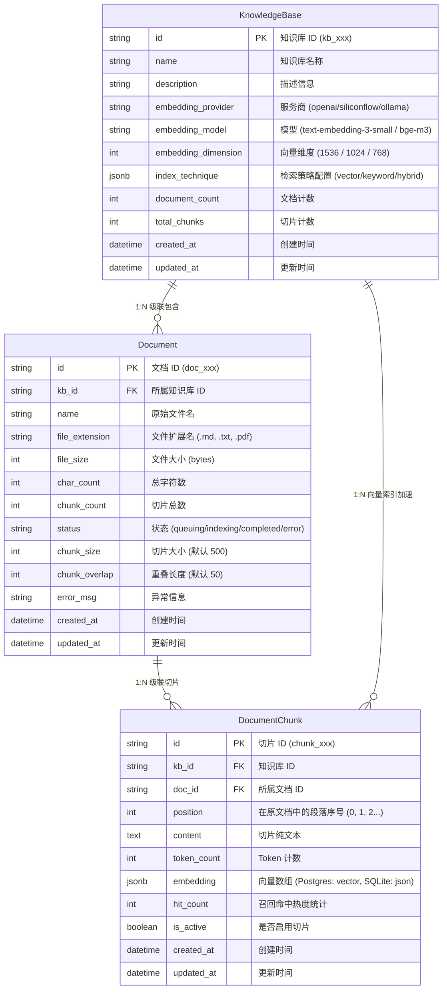

# Phase 2: 知识库（RAG）向量引擎与数据建模技术方案

> **架构版本**: 2.0.0  
> **所属阶段**: 第二阶段（Phase 2）  
> **设计基准**: Dify 知识库架构模型与 PatchCat 画布提示流编排体系  
> **最后更新**: 2026-09-03  

---

## 1. 架构目标与设计原则

本阶段旨在为 PatchCat 引入工业级 **检索增强生成（Retrieval-Augmented Generation, RAG）** 基础设施，使用户能够在画布中引入私有文档、技术手册、行业报告，并通过语义相似度检索为 LLM 提供精准、无幻觉的上下文。

### 核心原则：
1. **Dify 级经典三层数据模型**：采用 `KnowledgeBase` ➔ `Document` ➔ `DocumentChunk` 三层结构，确保文档增量维护与精确引文溯源（Citations）。
2. **环境自适应双模向量引擎（Zero-Docker 支持）**：
   - **生产环境**：基于 PostgreSQL 16 + `pgvector`（HNSW / IVFFlat 索引加速）；
   - **本地开发（默认）**：基于 SQLite + JSON 浮点数组，在 Python 内存中通过 Numpy 向量点积与余弦相似度计算，**无需安装 Docker 即可单机秒级启动全功能 RAG**。
3. **分层解耦与工作流节点集成**：
   - 后端负责 ETL 清洗、分块、向量化与检索；
   - 前端画布通过独立的 **【知识库检索节点 (Knowledge Node)】** 无缝接入 DAG 调度网络。

---

## 2. 数据库 E-R 关系模型设计



---

## 3. RAG 数据处理与检索流转全景

```
[原始文档上传 (Markdown / TXT / PDF)]
                 │
                 ▼
[ETL 文本预清洗引擎] (连续空格压缩、换行规约)
                 │
                 ▼
[语义/定长滑动窗口分块器] (chunk_size: 500, chunk_overlap: 50)
                 │
                 ▼
[Embedding 嵌入向量服务] (OpenAI / 硅基流动 / Ollama 批量批处理)
                 │
                 ▼
[数据库持久化落盘] (PostgreSQL pgvector / SQLite JSON)
                 │
        ═════════╧═════════ (检索阶段)
                 │
[用户提问 Query ➔ Vectorize] 
                 │
                 ▼
[余弦相似度 / HNSW 向量检索] (Top-K 筛选 & Score Threshold 过滤)
                 │
                 ▼
[输出结构化切片与 Context 拼接] ➔ 注入 Prompt 模板与 LLM 节点
```

---

## 4. 第二阶段实施路线（4 个关键步骤）

| 步骤 | 规划内容 | 核心产出与目标 |
| :--- | :--- | :--- |
| **Step 1** | **知识库数据建模与 CRUD 接口** | • `KnowledgeBaseORM`, `DocumentORM`, `DocumentChunkORM`<br>• Pydantic v2 Schemas 校验层<br>• `/api/v1/knowledge-bases` 完整 RESTful API 与自动化测试 |
| **Step 2** | **ETL 清洗、分块器与切片预览** | • 实现连续空白/换行清洗算法<br>• 定长+重叠滑动窗口分块器 (`chunk_size`, `overlap`)<br>• `/api/v1/documents/preview-chunks` 实时切片预览 |
| **Step 3** | **Embedding 向量化与相似度检索** | • 多厂商 Embedding Client（OpenAI, SiliconFlow, Ollama）<br>• 批量向量化入库流水线<br>• `/api/v1/knowledge-bases/{id}/retrieve` Top-K 语义召回接口 |
| **Step 4** | **前端画布知识库检索节点与 RAG 联调** | • Canvas 注册 `knowledge` 节点类型<br>• 属性面板知识库选择与召回阈值配置<br>• 完整真实 RAG 提示流执行与引文溯源展示 |
