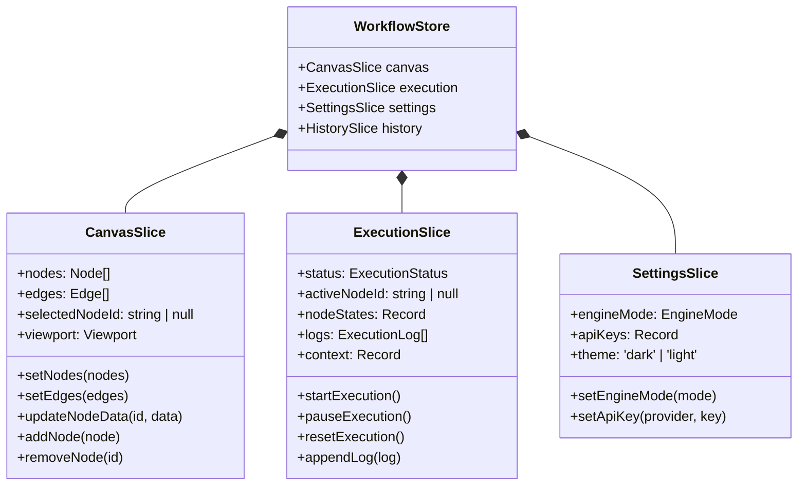

# State Management Specification / Zustand 状态机流转与持久化设计

[English Version](#english-version) | [中文版本](#中文版本)

---

## English Version

### 1. Overview
The orchestrator leverages **Zustand** as the centralized state manager, enhanced with `immer` for immutable updates and `persist` for multi-tier persistence (LocalStorage / Remote Backend).

The state is organized into 4 distinct slices:
1. **Canvas Slice**: Nodes, edges, active selection, viewport coordinates, and visual parameters.
2. **Execution Slice**: Workflow lifecycle state (Idle / Running / Paused / Success / Error), node runtime states, execution logs, and context cache.
3. **Settings Slice**: Engine mode toggle (Browser / Local-Server), BYOK API keys, and theme settings.
4. **History Slice (Undo/Redo)**: Dual-stack history snapshot recorder with a 50-step rollback limit.

### 2. State Slice Architecture

### 3. History Snapshot & Debounce Strategy
- **Coalescing Drag Snapshots**: Node dragging only captures coordinate snapshots upon `onNodeDragStop`.
- **Transient Field Filtering**: Node execution states and streaming tokens are excluded from undo/redo history to prevent bloat.

---

## 中文版本

### 1. 状态架构概述
系统采用 Zustand 作为状态管理中枢，划分为 Canvas Slice（画布切片）、Execution Slice（执行切片）、Settings Slice（配置切片）与 History Slice（撤销重做切片）。

### 2. 快照防抖与持久化
- 拖拽仅在结束时打点快照，流式 Token 不污染撤销历史。
- 纯前端模式下数据持久化至 LocalStorage，本地后端模式下同步至后端 JSON 文件。
