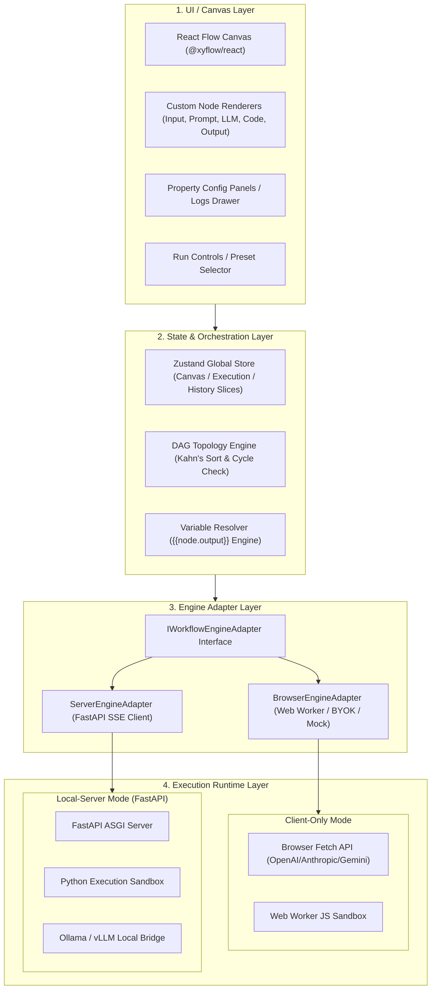
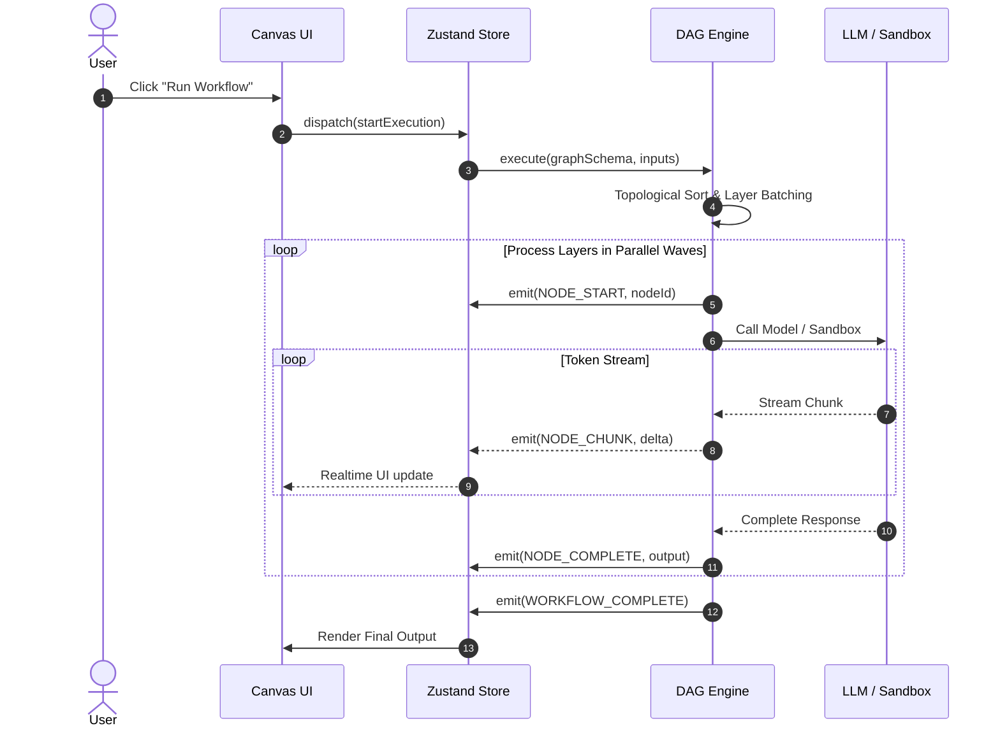

# System Architecture Specification / 系统总体架构与数据流设计

[English Version](#english-version) | [中文版本](#中文版本)

---

## English Version

### 1. Architectural Goals & Core Principles
AI Prompt Flow Orchestrator decouples visual presentation, graph scheduling, and the underlying execution runtime. Key design principles:
1. **Separation of Concerns**: Canvas UI handles rendering & interaction; independent engines handle graph computation.
2. **Isomorphic Execution**: Graph schema and execution events are 100% isomorphic across browser and server runtimes.
3. **Streaming First**: Full-pipeline support for token-level streaming and real-time event distribution.

### 2. Layered Architecture

### 3. Data & Event Flow

---

## 中文版本

### 1. 架构目标与核心原则
系统遵循关注点分离、环境同构（Isomorphic Execution）与流式优先（Streaming First）原则，解耦画布表现层与计算执行层。

### 2. 总体分层架构
分为 4 大层级：可视化表现层 (UI Layer)、状态与编排层 (State Layer)、引擎适配抽象层 (Adapter Layer) 以及底层执行运行时 (Execution Runtime)。

### 3. 核心数据与事件流
用户触发执行后，Zustand 分发图数据至调度引擎，按 Kahn 分层批次并发调用模型并实时回传 Token 流事件。
