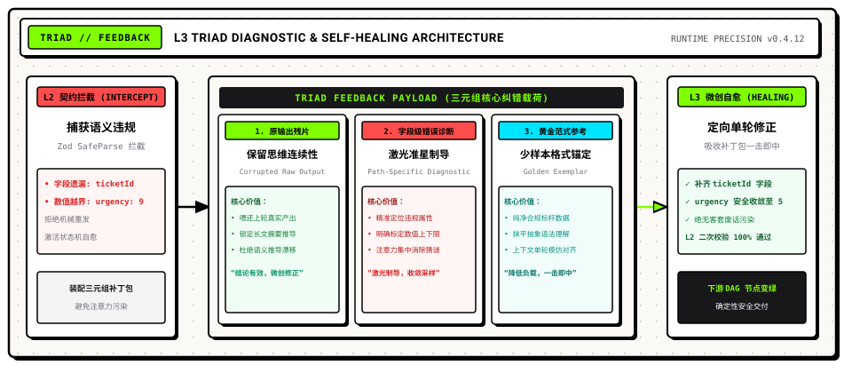
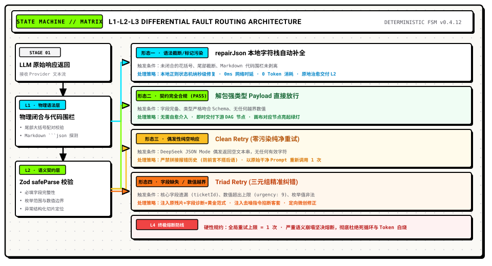
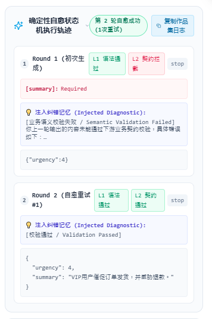
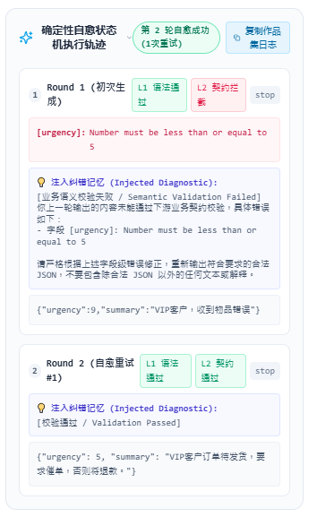
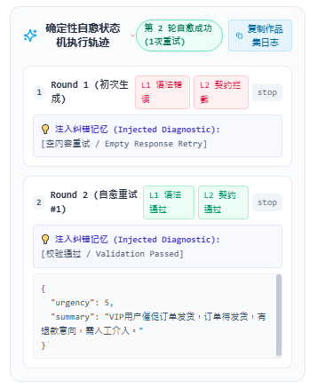

# 边写边学 AI 工作流引擎（二）：告别盲目重试 —— L3 自愈状态机与三元组纠错机制

> **导读**：上一篇我们通过 L1（受限解码与物理修补）和 L2（Zod 运行时校验）为工作流筑起了语法与契约防线。然而，当校验引擎当场拦截到非法输出时，下游系统该如何自愈？很多开发者第一反应是写一个 `for (let i = 0; i < 3; i++)` 重新请求——但在实测中，未改变上下文的同构重试大多只是在原地空转、白耗 Token。  
> 本篇记录我们在 PatchCat 开源项目推进中，如何从自回归概率采样的底层机理出发，设计出兼顾低延迟与高精度的 **L3 自愈状态机** 与 **三元组精准纠错（Triad Feedback）** 机制。

---


---

## 一、为什么盲目重试只是在原地空转？

在 [PatchCat](https://github.com/GuoBug/PatchCat) 的开发中，我们始终坚持“边写边学”（Learning by Doing）的工作流，与 AI 进行结对编程。在我们为引擎补齐了 Zod（L2）的语义校验网之后，很自然地遇到了一个关键的架构分水岭：
- **我从产品交互与体验出发**：L1 和 L2 确实拦截住了物理格式和语义契约异常，但拦截之后，系统的处理策略绝不能是直接报错并中断流程，更不能像进入死循环一样拼命燃烧 Token 发起盲目重试。必须建立一套有策略、有规则、有严格边界的有意义回喂机制，帮助系统自愈并拿到确定性结果。
- **AI 搭档则从底层机理与算法边界进行共创推导**：
  1. 明确盲目重试的死穴：在低 Temperature（0 ~ 0.3）下，自回归模型受限于注意力概率分布，输入未变时具有极强的采样路径依赖（Sampling Inertia），同构重发只会确定性复现同一错误；
  2. 确立有界回喂的规约：模型需要的不是笼统的报错斥责（那会引发注意力污染与客套性幻觉），而是“原残片保留推理上下文 + 字段级路径激光准星 + 最小化黄金范式”的定向约束；
  3. 收敛为有限状态机（FSM）：将重试次数严格锁定为 1 次针对性修正，物理截断在本地栈瞬时修补，空响应纯净重发，语义违规走三元组，彻底锁死死循环发散的风险。

### 1. 传统视角的直觉陷阱：同构重试（Isomorphic Retry）
最开始的直觉很质朴：
> “既然模型第一次吐出的数据少了一个必填字段，或者某个数字超标了，那用一个简单的 while 循环，把刚才的 Prompt 原封不动再发一遍，试 3 次难道还碰不对一次？”

然而，基准回归测试迅速推翻了这个假设。在测试中我们发现：大模型如果第 1 次在某个字段违背契约，在完全相同的 Prompt 下，由于采样条件未变，第 2 次、第 3 次几乎总会在同一位置复现完全一致的错误。数轮重试下来，不仅耗费了数千 Token 和好几秒时延，工作流最终依然中断崩溃。

### 2. 深入机理：为什么大模型会有“犯错路径依赖”？
与 AI 搭档共同推演大模型的底层生成机制后，原因逐渐清晰：
1. 自回归与确定性采样区间（Sampling Inertia）：大模型基于上下文窗口计算下一个 Token 的概率分布。在追求确定性的工作流场景中，Temperature 通常设得很低（0 ~ 0.3）。在输入上下文完全不变的前提下，高概率 Token 的采样路径基本固定，模型会直接重复上一轮的逻辑轨迹。
2. 模糊反馈引发的“注意力污染”：如果退一步，在第二轮追加一句“你的 JSON 格式错了，请重新检查并输出”，这种缺乏坐标的指责不仅无法引导修正，还会将宝贵的注意力窗口浪费在无关信息上；大模型甚至容易诱发礼貌性幻觉，吐出一串“非常抱歉，我刚刚检查了格式，以下是正确内容……”，反而彻底破坏了下游的结构化解析。

基于这一机理，我们确立了设计方向：废弃没有信息增量的同构重试，构建带微创手术级诊断的异构自愈状态机。

---

## 二、概念底座：什么是 Trace？为什么它是 AI 工作流的“飞行黑匣子”？

在深入状态机之前，先澄清一个可观测性核心概念：**Trace**（执行链路追踪）。

### 通俗比喻：从单反快门到全程手术录像
传统的软件调试往往像单反快门，只看最终函数返回了值还是抛出了 Error。但大模型具备概率性、多轮次与延迟波动等特征，只看终态根本无法还原中间几秒内的执行细节。

Trace 就像飞机的飞行黑匣子，或是医院的手术监护记录。在 PatchCat 运行中，一个完整的 Trace 不仅记录了任务终态，而且以毫秒级精度切片还原了完整的生命周期：
- +0ms：上游节点触发，组装系统预设与用户变量，发出第 1 轮 LLM 请求；
- +280ms：模型返回原始文本，但 ticketId 字段发生遗漏；
- +295ms：L2 校验引擎介入，定位根对象缺少必填属性，生成结构化错误路径；
- +305ms：L3 状态机研判该错误属于可自愈形态，自动装配三元组补丁包，发起第 2 轮定向请求；
- +520ms：模型吸收补丁，精准补齐字段，L2 二次校验顺利通过；
- +525ms：下游 DAG 拓扑节点接收到确定性数据，画布节点变绿。

有了 Trace，非确定性的调试就变成了白盒化的现代工程。后文展示的所有实测数据与截图，均来自运行时的真实 Trace。

---

## 三、教学级拆解：三元组精准纠错为什么缺一不可？

> 核心设计原则：无反馈的重试是赌博，带诊断的自愈才是工程。

为了让大模型在第 2 轮能够一击即中，我们在 `src/engine/structured-output.ts` 中落地了三元组精准纠错（Triad Feedback）机制：



### 1. 原输出残片（Corrupted Raw Output）：保留推导上下文
- 它的作用：将大模型上一轮产出的真实内容（哪怕未通过校验），完整喂还给模型。
- 反面推演：大模型生成一段业务工单，往往耗费了数百 Token 推导分类意图与长文本摘要。如果丢弃原输出让它重写，不仅重复消耗推理算力，而且极易发生语义漂移（例如第 1 轮判断为“退款”，第 2 轮被漂移为“咨询”）。保留残片，本质上是告诉模型：“已有推导整体有效，仅需做局部修正。”

### 2. 字段级错误诊断（Path-Specific Diagnostic）：激光准星
- 它的作用：利用 L2 的 Zod 校验引擎，提取精确的报错路径与原因，格式化为带明确指引的诊断信息。例如：
  ```text
  Field "urgency": Number must be less than or equal to 5, received 9
  Field "ticketId": Required field is missing
  ```
- 反面推演：业务 JSON Schema 往往包含深层嵌套与复杂数组。如果只笼统提示“格式不合规”，模型必须把注意力分散在全量字段上去猜谜。通过提供带精确路径的报错明细，自注意力机制得以直接聚焦到违规字段，促使采样概率迅速收敛。

### 3. 黄金范式参考（Golden Exemplar）：少样本格式锚定
- 它的作用：在纠错上下文中，附带一份极简、纯净、绝对合规的标准示例对象（Few-shot Anchor）。
- 反面推演：复杂的 TypeScript 或 JSON Schema 描述（包含联合类型、枚举校验）对语言模型而言属于抽象语法。直接给出一个具象的标杆范式，模型可以通过上下文学习（In-Context Learning）在单轮内完成键值对齐与类型模仿。

### 4. 严苛的工程去噪指令
组装自愈 Prompt 时，必须切断模型的客套反射：
```text
CRITICAL REPAIR INSTRUCTIONS:
1. DO NOT apologize or explain what you did wrong.
2. DO NOT wrap the output in conversational text.
3. Output ONLY the raw, valid JSON object fixing the errors listed above.
```
这三条指令如同一道硬编码防火墙，杜绝了任何解释性文本破坏 JSON 解码器的可能。

### 5. 工程代价与适用边界（Trade-offs）
任何架构设计都不是免费的午餐，三元组纠错同样伴随着清晰的代价与边界：
- 上下文与时延代价：回传原残片与诊断信息，会导致第 2 轮 Prompt 的 Token 消耗增加约 1.5 到 2 倍，并引入额外的网络往返（RTT）时延；
- 适用边界：该机制专为字段缺失、枚举越界、类型错位等结构性轻伤设计；若模型上一轮产生了全篇偏题的严重逻辑幻觉，三元组反而可能诱导模型在错误方向上修修补补，此时应果断熔断而非纠错。

---

## 四、状态机流转：针对不同异常形态的差异化分支

在真实生产中，大模型的错误形态各不相同，一刀切全走三元组不仅低效，甚至可能引发新的死锁。我们在 PatchCat 引擎中设计了清晰的状态转移策略：



### 1. 物理层修补分支（0 延迟、0 Token 消耗）
若错误仅是 Markdown 标记污染（如包含了 ```json 围栏）或由于超长导致的尾部大括号未闭合，引擎优先调用本地 `repairJson` 正则状态机进行字符栈补全。无需发起二次网络请求，在毫秒级内原地修正。

### 2. DeepSeek 专属“空响应”分支（**Clean Retry**）
研读 DeepSeek 官方 API 文档时，官方明确注记：在启用 JSON Mode 时，模型极偶发情况下可能返回纯空文本。针对空响应，若机械拼接三元组询问“你错在哪”，模型会陷入逻辑断层。因此状态机执行 Clean Retry：不拼接任何报错历史，以原始 Prompt 重新发起调用，既规避上下文污染，又化解偶发性传输抖动。

### 3. 业务违规分支（**Triad Retry**）
数值超标、枚举越界、必填键缺失等语义级违规，全面激活三元组纠错机制，让模型在原残片基础上定向修正。

---

## 五、实测验证：PatchCat 运行时的自愈 Trace

所有架构设计都必须经受极限场景的实测检验。在 PatchCat 的自动化测试与可视化画布中，我们设计了针对性的注入用例，以下为运行时的真实 Trace 记录：


### 1. 实战案例一：必填字段缺失秒级补齐
初次响应中，模拟模型遗漏了 `ticketId` 字段。L2 引擎拦截到 `ticketId: Required`。三元组将缺失提示与合法示例打包推回，大模型在第 2 轮精准补上合法 ID，流程顺利放行。



### 2. 实战案例二：数值越界自愈
模拟模型返回了违规的 `urgency: 9`（业务上限为 5）。L2 拦截后，诊断信息明确指出 `Number must be <= 5`。第 2 轮调用中，模型在保留其它推导结论的前提下，将数值安全修正为 `5`。



### 3. 实战案例三：空响应纯净重试
捕获模型返回的空字符串，状态机未向外抛出异常，而是静默执行无污染干净重试，并在第 2 轮成功获取合规数据。



---

## 六、给 Product Engineer 的工程思考

作为 Product Engineer，既要对底层的状态转移与 Token 损耗保持敏锐，更要时刻关注终端用户的真实体验。

在没有自愈状态机前，面对大模型偶发的概率性格式越界，产品往往只能给用户弹出一个红色的报错弹窗，逼迫用户重新点击运行；而在引入自愈状态机后，这数百毫秒的静默自我修正，对画布前的用户完全透明无感。用户只看到节点顺畅亮起绿灯、数据平稳流淌，系统把概率性的不可控风险收敛在底层。

### 留白与引线：自愈是否能无脑万能？


三元组自愈看起来行之有效，但在更复杂的实际业务流中，我们很快遭遇了更隐蔽的问题：
> 在测试更为复杂的 Case #7 时，模型为了修好字段 A，竟然顺手把上一轮推导正确的字段 B 改崩了！我们自作聪明地做了一套“字段级强制冻结”，却反倒让系统陷入了更深的死锁……

我们在这一步踩了怎样的坑？又是如何推演权衡、果断执行代码回滚并设计出 L4 终极兜底防线的？

下一篇揭秘：[《边写边学 AI 工作流引擎（三）：真实踩坑尸检 —— Case #7 的字段冻结陷阱与代码回滚复盘》](./article-03-case-7-field-freezing-trap-and-rollback.md)。

---

> **关于作者**  
> **郭强 (GuoBug)**，Product Engineer，做平台工程也做业务增长。目前主要在折腾 AI 工作流编排、DAG 状态机与确定性系统架构。  
> 开源项目与主页：[https://github.com/GuoBug](https://github.com/GuoBug) · [https://guobug.github.io](https://guobug.github.io)  
> 欢迎就工作流引擎架构、拓扑调度和低门槛开发体验交流指教。
