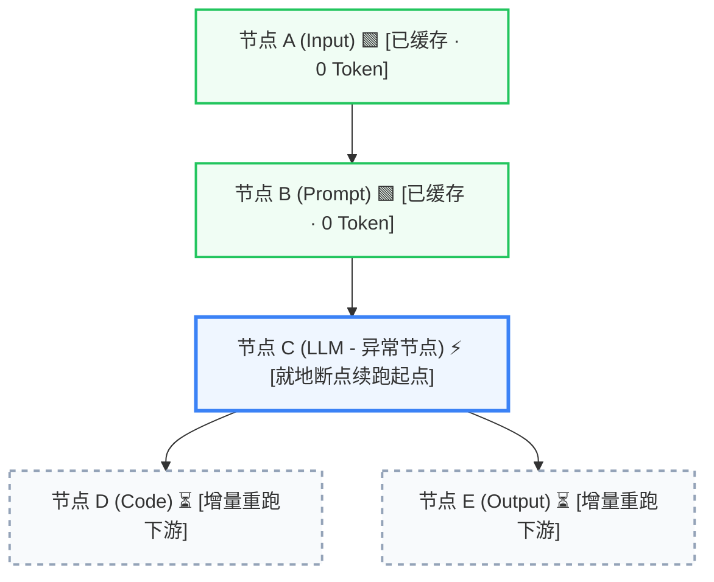

# Dev Log (Phase 4.10): 端侧不可变 Checkpointing 与容错断点续跑 (Resumable DAG Execution)

> **版本归属**: `v0.4.10`  
> **关联阶段**: Phase 4.10 Immutable Checkpointing & Resumable DAG Execution  
> **更新日期**: 2026-09-23  
> **项目作者**: 郭强 (GuoBug) & AI Pair Programming  

---

> **核心定义 (Architecture Snippet)**  
> **AI 工作流编排（AI Workflow Orchestration）** 的确定性核心，在于建立一套高容错的 **DAG 状态机（DAG Engine / State Machine）**。  
> 在网络波动、模型限流或下游节点异常中断时，系统不应粗暴地全量回滚或从头重放，而是基于端侧不可变快照（Immutable Checkpointing），通过 Kahn 拓扑排序实现**零 Token 浪费、下游子图增量裁剪的就地断点续跑**。

---

## 1. 核心演进与人机协同思考 (Milestone Co-Discovery)

在 PatchCat 演进至 `v0.4.8` 具备了全链路可观测性与 OpenTelemetry 追踪之后，开发者面临的一个极具痛点的生产级现实问题浮出水面：**复杂工作流的容错重跑代价过于昂贵**。

当一条包含知识库切片检索（RAG）、复杂多步骤代码清洗（Code）和多次大模型深度调用（LLM / Agent）的长链路，在最后一步由于 API 网络抖动或模型限流（HTTP 429）而失败时：如果只能从头重新执行，此前消耗的所有 Token 与等待时长全部白白浪费；而在没有服务端数据库支撑的 Local-First 纯端侧架构中，如何持久化保存执行状态更是工程重难点。

推进 `v0.4.10` 的过程，是一次标准的人机双向共创与启发实践：

### 人提的关键点（业务痛点、用户体验与经济效益）
1. **就地恢复的极致体验（In-Place Resumption）**：用户在画布上调试时，某个中间或末尾节点失败后，只需点击该节点上的「从此处断点续跑」或顶部错误横幅中的「增量断点续跑」，即可原地恢复，**前置已成功的节点绝对不能被再次重复执行**。
2. **零 Token 浪费底线保障（Zero-Token Recomputation）**：上游已经执行成功的祖先节点，其输出数据必须 100% 被新一轮调度复用，计费与耗时显式标明为 `0 Token`、`0ms`，并在节点卡片上打上明显的「缓存已复用 (0 Token)」天青色徽章，给开发者极致的确定性心理安全感。
3. **历史快照画布一键还原（Canvas Hydration）**：在 Run History 抽屉中查看某一次历史执行记录时，能够一键「恢复快照至画布」，将当时的节点输出与状态瞬间回填至 React Flow 画布，方便基于历史成果继续分叉实验。

### AI 提的关键点（底层工程规约、算法隐患与确定性契约）
1. **菱形依赖拓扑空洞与逆向向上扩充（Upward Dependency Expansion）**：若仅简单地调度目标节点及其下游子图，在经典菱形网络（如 $A \rightarrow B, C$ 且 $B, C \rightarrow D$）中，如果某个平行上游分支由于历史执行未完成而缺少输出，下游汇聚节点运行时必将因“变量未就绪”抛出级联死锁异常。引擎必须在拓扑预检阶段，执行**逆邻接依赖图遍历**，一旦发现前置祖先未处于就绪态，必须自适应向上扩充执行波次，补全缺失的依赖输出。
2. **端侧存储爆炸与 5-Record FIFO 环形淘汰**：每个波次完成后持久化存储快照（Context 字典、节点状态集合、拓扑指纹），若无边界沉淀，多工作流多轮执行将迅速耗尽浏览器存储配额。必须在 IndexedDB（`DB_VERSION = 3`）中以 `workflowId` 为边界，严格实施 **5-Record FIFO 环形队列淘汰**，将单个工作流的快照占用控制在安全红线（<20MB）以内。
3. **结构指纹与配置验签（Topology & Config Fingerprinting）**：用户如果在两次执行间隙修改了节点的 Prompt 模板、连线关系或删除了节点，使用过期的快照会导致不可预知的变量错乱。必须通过确定性哈希算法（`computeGraphTopologyHash` 与 `computeNodeConfigHash`）生成防篡改指纹，确保快照与画布拓扑的一致性。

---

## 2. 边写边学与方案权衡 (Trade-offs & Learning)

围绕断点续跑与快照恢复的设计，团队深入推演并权衡了三种架构路线：

| 选型维度 | 方案 A：纯内存上下文缓存 | 方案 B：依赖后端服务快照持久化 | 方案 C：**端侧 IndexedDB 不可变快照 + 逆向祖先扩充 + Kahn 增量剪枝** |
| :--- | :--- | :--- | :--- |
| **持久化能力** | ❌ 页面刷新/崩溃后全部丢失 | ✅ 存储于服务端关系型数据库 | ✅ **存储于浏览器本地 IndexedDB，支持跨页面生命周期** |
| **架构约束** | 零额外开销 | ❌ 强依赖云端后端，破坏 Local-First 零配置原则 | ✅ **100% 保持 Local-First，纯前端单页应用自闭环** |
| **拓扑剪枝精度** | 仅单节点浅重试，无法处理多级下游 | 依赖服务端重型任务调度器（如 Celery/Temporal） | ✅ **基于 Kahn 算法原地动态重构波次，仅调度 $\{target\} \cup Descendants(target)$** |
| **存储管控** | 内存占用不可控 | 依赖服务端定期清理脚本 | ✅ **严格单工作流 5 条 FIFO 环形淘汰，死守配额安全** |
| **最终决策** | ❌ 无法支撑真实生产调试 | ❌ 违背轻量平权设计初衷 | ✅ **采纳（Phase 4.10 标准落地规范）** |

---

## 3. 核心算法与工程实现剖析 (Deep Dive)

### 3.1 逆向祖先追踪与自适应向上扩充算法
当用户触发 `resumeFromNodeId: "node_C"` 时，系统执行以下三步确定性调度：
1. **前向后代子图闭包计算**：
   $$\text{PrunedSubgraph} = \{\text{targetNode}\} \cup \text{Descendants}(\text{targetNode})$$
2. **逆向祖先依赖完整性校验**：
   引擎沿入边遍历 $\text{Ancestors}(\text{targetNode})$，核对各祖先节点在快照或当前画布中的输出完整性：
   - 若某祖先节点输出未就绪，该祖先节点将被动态纳入重跑候选集，波次调度器自动将其排入先行波次；
   - 若祖先节点均已拥有确定性输出，则判定为安全缓存，执行时直接注入 Context，**状态标记为 `'cached'`，耗时设为 0ms，Token 消耗标记为 `{ prompt: 0, completion: 0, total: 0 }`**。
3. **Kahn 算法并行重排**：
   仅对需要重跑的受限子图执行入度统计与波次切分，维持最佳并发度，同时彻底规避环路死锁。

### 3.2 毫秒级时间戳并发并列规避 (Tie-Breaking Resolution)
在编写高并发或极速测试用例（<5ms 跑完整图）时，作者与 AI 发现了一个极端隐患：各波次快照的生成时间戳可能处于同一个毫秒内。如果仅使用 `b.timestamp - a.timestamp` 排序查询最新快照，会导致波次快照与最终完成快照顺序随机漂移。  
**解法**：在 `IndexedDbAdapter.getCheckpointsForWorkflow` 中增加了确定性次级判决逻辑：若时间戳相同，优先按 `isCompleted`（完成态排前），再按 `currentWaveIndex`（波次索引大者排前）做确定性打破。

---

## 4. 极端测试场景与质量验证 (Testing & Verification)

针对断点续跑与快照机制，专门编写了独立测试套件 `tests/checkpoint-resumption.node.test.ts` 与 `tests/canvas-ergonomics.node.test.ts`，主动构造极端场景进行极限测试验证：

1. **增量跳过已成功祖先**：验证在多层流水线中触发中间节点续跑时，所有前置祖先均立即派发 `NODE_COMPLETE` 事件且 `durationMs === 0`，不发起任何实际网络与模型调用。
2. **菱形图自适应向上扩充**：构造 $A \rightarrow B, C$ 且 $B, C \rightarrow D$ 结构，在人为清空平行分支 $C$ 输出的情况下请求断点续跑 $D$，测试引擎是否成功识别前置空洞并自动向上补充调度 $C$。
3. **5-Record FIFO 严格淘汰与隔离**：向单条工作流连续写入 8 条 Checkpoint，断言最终留存记录严格收敛为 5 条，多余老旧快照被全自动物理级清除；不同 `workflowId` 之间的快照互不干扰。
4. **画布状态还原与断点无缝续接**：测试调用 `restoreCheckpointToCanvas` 与 `restoreRunToCanvas` 后，画布各节点的 `status`、`outputs` 及执行指标完美回填，并能无缝再次触发断点续跑。

### 最终质检成绩单
- **前端单元与契约测试**：272 项测试用例全部 100% 绿灯通过（覆盖 65 个测试套件）；
- **TypeScript 严格类型校验**：`npm run typecheck` 0 报错、0 警告；
- **生产环境打包构建**：`npm run build` Vite 生产打包 8.60s 顺畅构建通过。

---

> **关于作者**  
> **郭强 (GuoBug)**，兼具平台工程底蕴与业务增长能力的资深 Product Engineer。  
> 专注于 **AI 工作流编排（AI Workflow Orchestration）**、DAG 状态机与确定性系统架构落地。  
> 开源项目与主页：[https://github.com/GuoBug](https://github.com/GuoBug) · [https://guobug.github.io](https://guobug.github.io)  
> 秉持“边写边学、双向共创”理念，欢迎围绕工作流引擎架构、拓扑调度及低门槛开发体验交流指教。
