# Engineering Test Coverage & Runtime Benchmarks / 工程测试覆盖度与运行时基准评估

[English Version](#english-version) | [中文版本](#中文版本)

---

<a name="english-version"></a>
## English Version

### 1. Overview & Evaluation Framework

To ensure that the **AI Prompt Flow Orchestrator** meets industrial production standards, the test suite is partitioned into two complementary tiers:

```
┌─────────────────────────────────────────────────────────────────────────┐
│              AI Prompt Flow Orchestrator Verification Matrix            │
├────────────────────────────────────┬────────────────────────────────────┤
│ Tier 1: Pure-Memory Unit Tests     │ Tier 2: Advanced Engineering &     │
│ (Algorithm & Lexical Correctness)  │ Chaos Benchmarks (Runtime Latency) │
├────────────────────────────────────┼────────────────────────────────────┤
│ • Linear topological sorting       │ • Concurrency Timing ~max(T_i)     │
│ • Cycle detection & cycle nodes    │ • In-flight AbortSignal cancelling │
│ • Deep nested property access      │ • Node rejection cascading & halt  │
│ • Prototype pollution defense      │ • Dangling/orphan edge pre-flight  │
│ • Regex slot extraction & fallback │ • Zustand reactive state store     │
└────────────────────────────────────┴────────────────────────────────────┘
```

---

### 2. Detailed Test Specifications

#### 2.1 Tier 1: Pure-Memory Algorithmic & Lexical Correctness
- **Topological Ordering (Linear Chain)**: Verifies that $A \rightarrow B \rightarrow C$ produces exact execution order $[A], [B], [C]$.
- **Layer Wavefront Partitioning**: Verifies that parallel branches $(A \rightarrow B, A \rightarrow C, B+C \rightarrow D)$ are split into optimal concurrency layers: `Layer 0: [A]`, `Layer 1: [B, C]`, `Layer 2: [D]`.
- **Cyclic Deadlock Detection**: Uses Kahn's lemma ($\text{visitedCount} \neq |V|$) to detect directed cycles and identify offending nodes ($in\_degree > 0$).
- **Nested Path Traversal**: Resolves deep object properties (e.g., `result.items[0].name`) without using unsafe `eval()`.
- **Prototype Pollution Defense**: Explicitly blocks attempts to access `__proto__`, `constructor`, or `prototype`.
- **Mustache Variable Extraction & Fallback**: Extracts variable references via regex and substitutes default values when upstream context is undefined.

---

#### 2.2 Tier 2: Advanced Engineering Benchmarks & Chaos Tests

```mermaid
flowchart TD
    subgraph Benchmark1["1. Concurrency Benchmark"]
        direction LR
        A1[Start] --> B1[Node B: 100ms] & C1[Node C: 100ms]
        B1 & C1 --> D1[Assert: Total wall-clock duration ~107ms << 200ms sum]
    end

    subgraph Benchmark2["2. In-Flight Abort"]
        direction LR
        A2[Start Node: 300ms] --> B2[Trigger Abort at 50ms]
        B2 --> C2[Assert: Immediate cancellation at ~63ms << 300ms]
    end

    subgraph Benchmark3["3. Error Cascading"]
        direction LR
        A3[Node A: Success] --> B3[Node B: Reject/Throw]
        B3 --> C3[Node C: Downstream]
        B3 --> D3[Assert: NODE_ERROR emitted, Node C NEVER executed]
    end

    subgraph Benchmark4["4. Dangling Edge"]
        direction LR
        A4[Edge: A -> GHOST_NODE] --> B4[Pre-flight Validation]
        B4 --> C4[Assert: WORKFLOW_ERROR yielded before executing any node]
    end
```



1. **Concurrency Timing Verification ($\max(T_i)$ vs $\sum T_i$)**:
   - **Assertion**: Two parallel 100ms nodes scheduled in the same layer must finish in $\approx 107\text{ms}$ (close to $\max(T_i)$), proving real `Promise.all` concurrency rather than sequential iteration.
2. **In-Flight Cancellation Mechanism**:
   - **Assertion**: When an `AbortSignal` is fired mid-execution (e.g. 50ms into a 300ms task), all pending timers and requests abort immediately ($\approx 63\text{ms}$ total wall-clock time).
3. **Error Bubbling & Downstream Halting**:
   - **Assertion**: When an upstream node throws an unhandled error, the engine emits `NODE_ERROR`, halts subsequent layers (downstream nodes are never scheduled), and terminates the workflow with `WORKFLOW_ERROR`.
4. **Dangling Edge Pre-flight Negative Assertion**:
   - **Assertion**: Edges referencing non-existent nodes are intercepted before execution starts, preventing runtime null-pointer crashes.

---

### 3. Execution Results

```
▶ Topological Sort (Kahn's Algorithm) (3.21ms) - 4 passed
▶ Variable Resolver (1.58ms) - 5 passed
▶ Execution Runtime (Async Scheduling & Propagation) (122.81ms) - 2 passed
▶ Advanced Engineering Benchmarks & Edge-Case Verification (172.20ms) - 4 passed
▶ Workflow Zustand Store (3.61ms) - 3 passed

Total: 18 tests, 5 suites, 18 passed, 0 failed (Total Duration: 574ms)
```

---

<a name="中文版本"></a>
## 中文版本

### 1. 评估体系概述

为确保 **AI 提示流编排器 (AI Prompt Flow Orchestrator)** 具备工业级高可用性，测试体系划分为两大梯队：

1. **第一梯队：纯内存单元测试**（图论算法与词法正确性）
   - 线性链路拓扑排序与分层划分
   - 环路识别与涉环节点统计
   - 嵌套路径提取与原型链防御
   - 模板正则捕获与 Fallback 默认值降级
2. **第二梯队：高阶工程基准与混沌压力测试**（运行时性能与容错）
   - **异步并发度时序验证**：验证同一 Layer 内确实并发执行且耗时符合 $\max(T_i)$ 而非 $\sum T_i$。
   - **任务取消机制**：验证 AbortSignal 触发时能否及时终止等待中的 In-flight 异步操作。
   - **异常冒泡策略**：单节点执行 Reject 时，整条工作流的状态机流转、错误捕获与下游阻断。
   - **悬空边负向断言**：显式注入非法边 ID，断言预检错误收集器能够准确捕获。
   - **Zustand 全局状态机**：节点 CRUD、状态流转与重置。

---

### 2. 核心工程基准断言解析

1. **并发时序断言**：同一 Layer 包含两个 100ms 节点，实测整体耗时仅约 **107ms**（远低于串行累加的 200ms），确凿证明 `Promise.all` 实现了同层最大化并发。
2. **In-Flight 中断断言**：在 300ms 的长任务进行到 50ms 时发出 Abort 信号，引擎在 **63ms** 处立即安全退出，彻底阻断算力浪费与僵尸 Promise。
3. **单节点 Reject 熔断断言**：当上游节点发生异常时，引擎发出 `NODE_ERROR`，**下游依赖节点 100% 拒绝被触发**，整图平稳进入 `WORKFLOW_ERROR` 终态。
4. **悬空边防御断言**：针对指向不存在节点的脏边，引擎在执行前通过静态分析直接熔断，杜绝空指针异常。

---

### 3. 测试运行指令

```bash
# 运行全量 18 项核心与高阶工程测试
npm test

# 运行静态类型安全检查
npm run typecheck
```
