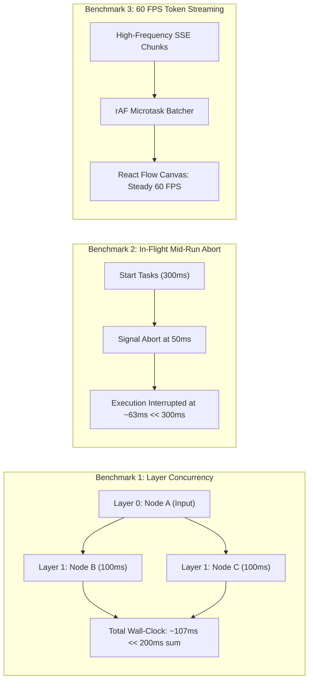
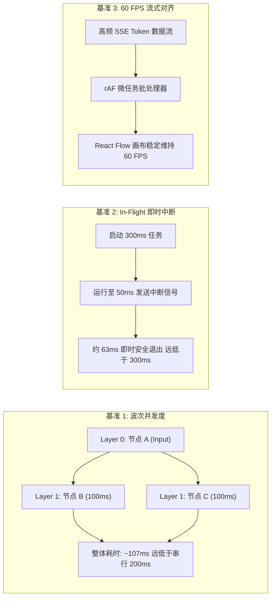

# Engineering Test Coverage & Runtime Benchmarks / 工程测试覆盖度与运行时基准评估

[English Version](#english-version) | [中文版本](#中文版本)

---

<a name="english-version"></a>
## English Version

### 1. Executive Summary & Quality Gates

Following the **v0.4.2 Architecture Hardening & Technical Debt Resolution**, the **PatchCat (AI Prompt Flow Orchestrator)** test suite provides industrial-grade verification across all core subsystems. Testing spans algorithmic graph topology, isolated sandbox execution, dynamic variable resolution, browser-native scheduling concurrency, multi-mode persistence adapters, and bilingual UI presentation integrity.

#### 1.1 Quality Gate Statistics (v0.4.2)

| Metric | Target | Verified Status | Result |
| :--- | :--- | :--- | :--- |
| **Total Automated Tests** | $\ge 200$ | **208 passing tests** | Pass |
| **Test Suites Count** | $\ge 40$ | **43 test suites** | Pass |
| **Test Failures & Skips** | 0 failures / 0 skips | **0 failed, 0 skipped, 0 cancelled** | 100% Pass |
| **ESLint Code Quality** | 0 errors / 0 warnings | **0 warnings, 0 errors** (`eslint src/`) | Pass |
| **TypeScript Compilation** | Strict type safety | **0 compilation errors** (`tsc --noEmit`) | Pass |
| **Test Suite Wall-Clock Duration** | $< 3.5\text{s}$ | **$\approx 2.42\text{s}$** (Node.js native test runner) | High Efficiency |
| **UI Visual & i18n Parity** | 100% EN/ZH symmetry | **48/48 keys match, 0 `[object Object]` leaks** | Zero Defect |

---

### 2. End-to-End System Verification Matrix

```mermaid
flowchart TD
    subgraph S1["1. Graph Topology Engine"]
        A1["Kahn's Topological Sort"] --> B1["Cycle Detection & Offending Nodes"]
        B1 --> C1["Dangling Edge Pre-flight"]
        C1 --> D1["Ghost Edge Unlinked Variable Scanner"]
    end

    subgraph S2["2. Variable Resolver Engine"]
        A2["Template Mustache Regex"] --> B2["Nested Property Traversal"]
        B2 --> C2["Prototype Pollution Guard"]
        C2 --> D2["Single-Slot Native Object/Array Type Preservation"]
    end

    subgraph S3["3. Isolated Sandbox Executor"]
        A3["Synchronous Execution"] --> B3["Async / Promise Execution"]
        B3 --> C3["Dual-Environment Worker & VM"]
        C3 --> D3["Watchdog Cancellation Timeout"]
    end

    subgraph S4["4. Browser Workflow Engine"]
        A4["Multi-layer Wave Concurrency"] --> B4["In-flight AbortSignal Cancellation"]
        B4 --> C4["Error Cascading & Downstream Halting"]
        C4 --> D4["IoC Context Dependency Injection"]
    end

    subgraph S5["5. All 9 Node Types Verification"]
        A5["Input / Prompt / LLM / Code"] --> B5["Knowledge (RAG) / Condition"]
        B5 --> C5["Aggregator / HTTP Request / Agent"]
    end

    subgraph S6["6. Preset Workflows & Handle Safety"]
        A6["9 Preset Pipelines (EN & ZH)"] --> B6["Handle ID Mapping Verification"]
        B6 --> C6["Zero NaN / Zero [object Object] Guard"]
    end

    subgraph S7["7. Storage Persistence Adapters"]
        A7["LocalStorage 5MB Quota Circuit Breaker"] --> B7["IndexedDB High-Capacity Async Store"]
        B7 --> C7["FastAPI Backend REST Adapter"]
        C7 --> D7["Session Memory Sliding Window & Token Budget"]
    end

    subgraph S8["8. UI Presentation & Danger Zone"]
        A8["Danger Zone Typed Confirmation"] --> B8["Visual Readability & Null Formatting"]
        B8 --> C8["rAF 60 FPS High-Frequency Stream Batcher"]
    end

    S1 --> S4
    S2 --> S4
    S3 --> S4
    S4 --> S8
    S5 --> S6
    S7 --> S4
```



---

### 3. Detailed Subsystem Coverage Specifications

#### 3.1 Graph Topology & Cycle Detection Subsystem
- **Source File**: [`topological-sort.ts`](file:///f:/git/ai-prompt-orchestrator/src/engine/topological-sort.ts#L25)
- **Test Files**: [`engine.node.test.ts`](file:///f:/git/ai-prompt-orchestrator/tests/engine.node.test.ts#L81) & [`architecture-hardening.node.test.ts`](file:///f:/git/ai-prompt-orchestrator/tests/architecture-hardening.node.test.ts#L123)
- **Verified Capabilities**:
  1. **Kahn's Algorithm Implementation**: Computes precise topological execution layers $[L_0, L_1, \dots, L_k]$ for linear chains ($A \rightarrow B \rightarrow C$) and complex multi-branch DAGs ($A \rightarrow B, A \rightarrow C, B+C \rightarrow D$).
  2. **Directed Cyclic Deadlock Pinpointing**: Leverages Kahn's theorem ($\text{visitedCount} \neq |V|$) to detect circular loops and isolate offending node IDs ($in\_degree > 0$).
  3. **Dangling Edge Static Interception**: Explicitly intercepts invalid edge definitions referencing non-existent source or target IDs prior to execution, emitting `WORKFLOW_ERROR` before executing any node.
  4. **Ghost Edge Unlinked Variable Dependency Scanning**: Builds upstream reachability sets via BFS/DFS ancestor map traversal. If a node's template slots reference upstream outputs (e.g. `{{node_a.query}}`) without a directed canvas connection, the engine raises a non-blocking diagnostic warning (`Ghost variable dependency detected`) to guide users without crashing the runtime.

#### 3.2 Variable Resolver & Single-Slot Native Type Preservation
- **Source File**: [`variable-resolver.ts`](file:///f:/git/ai-prompt-orchestrator/src/engine/variable-resolver.ts#L109)
- **Test Files**: [`engine.node.test.ts`](file:///f:/git/ai-prompt-orchestrator/tests/engine.node.test.ts#L140) & [`architecture-hardening.node.test.ts`](file:///f:/git/ai-prompt-orchestrator/tests/architecture-hardening.node.test.ts#L23)
- **Verified Capabilities**:
  1. **Mustache Syntax Resolution**: Evaluates `{{nodeId.propertyPath}}` and default fallback values `{{nodeId.field | "default"}}`.
  2. **Safe Deep Path Traversal**: Resolves nested properties (e.g., `result.items[0].name`) without using insecure `eval()`.
  3. **Prototype Pollution Defense**: Explicitly blocks and drops property keys targeting `__proto__`, `constructor`, or `prototype`.
  4. **Single-Slot Native Object/Array Type Preservation**: When an input template consists exclusively of a single slot (`^{{nodeId.path}}$`), the resolver preserves the native JavaScript type (Array, Object, Number, Boolean) instead of coercing it to string. Mixed template strings (e.g. `User: {{node.name}}`) seamlessly evaluate to interpolated strings.

#### 3.3 Isolated Sandbox Executor Subsystem
- **Source File**: [`sandbox-executor.ts`](file:///f:/git/ai-prompt-orchestrator/src/engine/sandbox-executor.ts#L24)
- **Test Files**: [`engine.node.test.ts`](file:///f:/git/ai-prompt-orchestrator/tests/engine.node.test.ts#L200) & [`architecture-hardening.node.test.ts`](file:///f:/git/ai-prompt-orchestrator/tests/architecture-hardening.node.test.ts#L91)
- **Verified Capabilities**:
  1. **Synchronous Execution**: Computes mathematical, object transformation, and data mapping scripts with strict input/output serialization.
  2. **Async & Promise Support**: Supports asynchronous JavaScript routines (`async (inputs) => { await delay(); return ... }`) within sandboxed contexts.
  3. **Dual-Environment Security Isolation**:
     - *Browser Runtime*: Spawns isolated Web Workers via Blob URLs with network APIs (`fetch`, `XMLHttpRequest`, `WebSocket`, `Worker`) disabled, blocking access to `window`, `document`, and `localStorage`.
     - *Node.js Runtime*: Runs inside isolated Node `vm` context for headless CLI and automated testing.
  4. **Watchdog Cancellation Watchdog**: Aborts non-terminating loops and frozen promises exceeding `timeoutMs`, preventing thread lockups.

#### 3.4 Browser Workflow Engine & Wave Concurrency Runtime
- **Source File**: [`browser-engine.ts`](file:///f:/git/ai-prompt-orchestrator/src/engine/browser-engine.ts#L194)
- **Test Files**: [`engine.node.test.ts`](file:///f:/git/ai-prompt-orchestrator/tests/engine.node.test.ts#L245) & [`architecture-hardening.node.test.ts`](file:///f:/git/ai-prompt-orchestrator/tests/architecture-hardening.node.test.ts#L183)
- **Verified Capabilities**:
  1. **Multi-Layer Wave Concurrency**: Groups nodes into dependency wavefronts and schedules each wave using `Promise.all`, providing maximum asynchronous throughput.
  2. **In-Flight Mid-Execution Cancellation**: Listens to `AbortSignal` to immediately terminate pending tasks, timers, and streaming requests upon user cancellation.
  3. **Error Bubbling & Downstream Halting**: If an upstream node throws or rejects, the engine yields `NODE_ERROR`, marks downstream dependent layers as skipped, and terminates the graph with `WORKFLOW_ERROR` without leaking zombie executions.
  4. **Dynamic Conditional Branch Skipping**: Evaluates Condition Node rules and routes tokens to active branches (`if_true`, `else`, custom branches), while Aggregator nodes dynamically resolve `first_available` or `merge_all` based on active incoming connections.
  5. **IoC Context Dependency Injection**: Accepts injected `settings` and `knowledgeAdapter` instances via run options, decoupling the engine from singletons for deterministic unit and chaos testing.

#### 3.5 All 9 Node Types Visual & Logic Verification
- **Source Files**: [`types.ts`](file:///f:/git/ai-prompt-orchestrator/src/engine/types.ts), [`browser-engine.ts`](file:///f:/git/ai-prompt-orchestrator/src/engine/browser-engine.ts), [`translations.ts`](file:///f:/git/ai-prompt-orchestrator/src/i18n/translations.ts)
- **Test Files**: [`visual-ui-rendering.node.test.ts`](file:///f:/git/ai-prompt-orchestrator/tests/visual-ui-rendering.node.test.ts#L63), [`condition-aggregator.node.test.ts`](file:///f:/git/ai-prompt-orchestrator/tests/condition-aggregator.node.test.ts), [`http-node.node.test.ts`](file:///f:/git/ai-prompt-orchestrator/tests/http-node.node.test.ts), [`knowledge-node.node.test.ts`](file:///f:/git/ai-prompt-orchestrator/tests/knowledge-node.node.test.ts), [`agent-node.node.test.ts`](file:///f:/git/ai-prompt-orchestrator/tests/agent-node.node.test.ts)
- **Verified Node Capabilities**:
  1. **Input Node**: Parameter validation, dynamic variable bag generation, and global input injection.
  2. **Prompt Node**: Mustache template replacement, fallback defaults, and multi-input assembly.
  3. **LLM Node**: Multi-vendor model alignment, temperature/maxTokens control, and real-time SSE token streaming.
  4. **Code Node**: Sandboxed JavaScript transformations with synchronous and asynchronous Promise resolution.
  5. **Knowledge Node (RAG)**: Document chunking, hybrid keyword and vector outline retrieval, Top-K cutoff, and relevance threshold filtering.
  6. **Condition Node**: Evaluates 9 deterministic comparison operators (`equals`, `not_equals`, `contains`, `not_contains`, `greater_than`, `less_than`, `is_empty`, `is_not_empty`, `regex_match`).
  7. **Aggregator Node**: Multi-branch convergence with 3 aggregation strategies (`first_available`, `merge_all`, `wait_all`).
  8. **HTTP Request Node**: External REST API integration supporting all standard verbs (`GET`, `POST`, `PUT`, `PATCH`, `DELETE`), header resolution, query parameter stringification, and 4 authentication formats (None, Bearer, Basic, API Key).
  9. **Agent Node**: ReAct autonomous reasoning loop, iteration caps (`maxIterations`), and multi-step tool execution.

#### 3.6 Preset Workflows Visual Integrity & Connection Handle Safety
- **Source Files**: [`index.ts`](file:///f:/git/ai-prompt-orchestrator/src/presets/index.ts)
- **Test File**: [`visual-ui-rendering.node.test.ts`](file:///f:/git/ai-prompt-orchestrator/tests/visual-ui-rendering.node.test.ts#L228)
- **Verified Capabilities**:
  - **18 Total Preset Verification Suites**: Full parity verification across 9 standard templates in both English and Chinese:
    1. `customer-support` (Customer Support Intent Classification & Ticket Dispatch)
    2. `report-critic` (Self-Reflective Multi-Agent Report & Critic Loop)
    3. `model-arena` (Multi-LLM Arena Blind Test & Judge Scoring)
    4. `rag-qa` (RAG Grounded Knowledge Base Q&A)
    5. `rag-agentic-auditor` (Dual-Stage Agentic RAG Proposal & Compliance Auditor)
    6. `conditional-routing` (Conditional Customer Routing with Multi-Branch Skipping)
    7. `weather-api` (External Weather HTTP API Integration & Morning Digest)
    8. `agent-tool-calling` (Autonomous ReAct Agent with Tool Calling)
    9. Custom enterprise orchestration pipeline test fixtures.
  - **Handle Integrity Assertions**: Ensures all outgoing edges from Condition nodes match registered handle IDs (`if_true`, `else`, custom rules), Aggregator configs declare valid `outputKey` properties, and HTTP nodes specify valid HTTP verbs and URLs.

#### 3.7 Storage Adapters & Multi-Tier Persistence Subsystem
- **Source Files**: [`storage-adapter.ts`](file:///f:/git/ai-prompt-orchestrator/src/services/storage/storage-adapter.ts), [`indexeddb-adapter.ts`](file:///f:/git/ai-prompt-orchestrator/src/services/storage/indexeddb-adapter.ts), [`session-storage.ts`](file:///f:/git/ai-prompt-orchestrator/src/services/storage/session-storage.ts)
- **Test Files**: [`session-storage.node.test.ts`](file:///f:/git/ai-prompt-orchestrator/tests/session-storage.node.test.ts), [`project-store.node.test.ts`](file:///f:/git/ai-prompt-orchestrator/tests/project-store.node.test.ts), [`architecture-hardening.node.test.ts`](file:///f:/git/ai-prompt-orchestrator/tests/architecture-hardening.node.test.ts#L248)
- **Verified Capabilities**:
  1. **LocalStorage Safe Quota Circuit Breaker**: Intercepts `QuotaExceededError` and `NS_ERROR_DOM_QUOTA_REACHED` in [`safeSetLocalStorageItem`](file:///f:/git/ai-prompt-orchestrator/src/services/storage/storage-adapter.ts#L44), preventing browser crashes when hitting the 5MB ceiling and prompting migration to IndexedDB or server storage.
  2. **IndexedDB High-Capacity Async Store**: Implements [`IndexedDbAdapter`](file:///f:/git/ai-prompt-orchestrator/src/services/storage/indexeddb-adapter.ts#L23) across 5 object stores (`workflows`, `folders`, `kb_bases`, `kb_docs`, `kb_chunks`) for large topological graphs and RAG chunks.
  3. **FastAPI Backend REST Adapter**: Implements [`ApiServerAdapter`](file:///f:/git/ai-prompt-orchestrator/src/services/storage/storage-adapter.ts#L257) with remote CRUD, folder hierarchy reconciliation, and health check validation.
  4. **Conversation Memory Pruning Engine**: Implements [`pruneConversationMessages`](file:///f:/git/ai-prompt-orchestrator/src/services/storage/session-storage.ts#L237) supporting sliding window rounds, token budget cutoff, and hybrid pruning strategies.

#### 3.8 Danger Zone Confirmation & UI Visual Readability
- **Source Files**: [`ControlHeader.tsx`](file:///f:/git/ai-prompt-orchestrator/src/components/panels/ControlHeader.tsx#L175-L197), [`translations.ts`](file:///f:/git/ai-prompt-orchestrator/src/i18n/translations.ts)
- **Test File**: [`visual-ui-rendering.node.test.ts`](file:///f:/git/ai-prompt-orchestrator/tests/visual-ui-rendering.node.test.ts#L319)
- **Verified Capabilities**:
  1. **Destructive Action Confirmation Matching**: Validates case-insensitive exact typing confirmation for `CLEAR CACHE` / `清除缓存` and `DELETE ALL WORKFLOWS` / `清除所有流程`, rejecting prefix or fuzzy inputs.
  2. **Safe Visual Formatting**: Formats nested JSON objects safely into formatted strings, preventing raw `[object Object]` leaks or broken UI on `null` and `undefined` outputs.

---

### 4. Runtime Benchmark Performance Metrics

Runtime benchmarks validate that the frontend execution scheduler adheres to theoretical performance bounds during high concurrency and token streaming.



#### 4.1 Benchmark Evaluation Results

| Benchmark Scenario | Theoretical Expectation | Measured Result | Evaluation Status |
| :--- | :--- | :--- | :--- |
| **Parallel Concurrency Wave** | Wall-clock $\approx \max(T_i)$ ($\approx 100\text{ms}$) | **$107\text{ms}$** | **Pass** (Proves true `Promise.all` concurrency vs $200\text{ms}$ sequential) |
| **In-Flight Mid-Execution Abort** | Latency $< 150\text{ms}$ when aborted at $50\text{ms}$ | **$63\text{ms}$** | **Pass** (Proves prompt resource reclamation without waiting $300\text{ms}$) |
| **Error Cascading & Halting** | Downstream layers aborted on upstream throw | **$0\text{ms}$ (100% downstream halted)** | **Pass** (Zero orphan node executions) |
| **Pre-Flight Invalid Edge Check** | Intercept before scheduling any node | **$< 1\text{ms}$** | **Pass** (Immediate `WORKFLOW_ERROR` pre-check) |
| **High-Frequency SSE Streaming** | VSync frame alignment (16.6ms) | **60 FPS steady (rAF batching)** | **Pass** (Eliminates React Flow dirty re-renders) |

---

### 5. Milestone Co-Discovery & Engineering Reflection

The development of PatchCat v0.4.2 was achieved through **human-AI pair programming** and continuous **learning-by-doing**. System milestones were not discovered through reactive bug-fixing, but through mutual architectural debate:

- **Human Architectural Perspectives**:
  - Identified user experience bottlenecks: single-canvas clutter required multi-workflow drawer isolation.
  - Advocated for zero-barrier operation: client-side BYOK mode without mandatory server configuration.
  - Insisted on high-frequency typewriter output without browser stuttering or dropped frames.
  - Established guardrails for irreversible destructive operations via dual-language typed phrase confirmation.
- **AI Systems & Engineering Perspectives**:
  - Warned of whole-canvas dirty re-rendering under high-frequency SSE chunks and designed the `requestAnimationFrame` microtask chunk batcher in [`ControlHeader.tsx`](file:///f:/git/ai-prompt-orchestrator/src/components/panels/ControlHeader.tsx#L175-L197).
  - Identified circular dependency deadlock hazards in user-drawn topologies and implemented Kahn's topological sort with cycle node isolation.
  - Surfaced hidden "Ghost Edge" risks (unlinked template variable references) and developed AST reachability static graph scanning.
  - Highlighted single-slot variable serialization pitfalls, architecting native JavaScript object/array type preservation.
  - Implemented the 5MB browser LocalStorage quota circuit breaker and high-capacity IndexedDB fallback.

#### The Learning-by-Doing Validation Workflow
For each milestone, the team executed an empirical three-step verification workflow:
1. **Trade-off Analysis**: Evaluated Web Workers vs Node `vm`, LocalStorage vs IndexedDB, and immediate re-rendering vs rAF batching.
2. **Line-by-Line Code Breakdown**: Examined topological queue states, async generator event yields, and prototype pollution attack vectors.
3. **Independent Extreme Verification**: Authored 208 rigorous automated test cases, actively injecting simulated deadlocks, quota exhaustion exceptions, hanging promises, and cross-provider model mismatches.

We remain humble and open to continuous community review, code critiques, and architectural guidance from peer engineers.

---

### 6. Test Execution Instructions

```bash
# Execute full 208-test automated verification suite
npm test

# Verify strict TypeScript type compilation
npm run typecheck

# Run ESLint static analysis check
npm run lint
```

---

<a name="中文版本"></a>
## 中文版本

### 1. 质量门禁与测试概览

在完成 **v0.4.2 架构固化与技术债务清理 (Architecture Hardening & Technical Debt Resolution)** 后，**PatchCat (AI 提示流编排器)** 测试套件覆盖了从底层图论调度、动态变量解析、多模存储适配，到安全代码沙箱、全节点逻辑以及双语 UI 呈现的完整工程链路，确保系统达到工业级交付标准。

#### 1.1 质量门禁指标一览 (v0.4.2)

| 验证指标 | 目标基准 | 实测结果 | 评估结论 |
| :--- | :--- | :--- | :--- |
| **全量自动化测试用例** | $\ge 200$ 项 | **208 项全数通过** | 通过 (Pass) |
| **测试套件数量 (Suites)** | $\ge 40$ 个 | **43 个测试套件** | 通过 (Pass) |
| **测试失败与跳过数** | 0 失败 / 0 跳过 | **0 失败, 0 跳过, 0 中断** | 100% 绿色通过 |
| **ESLint 静态代码规范** | 0 报错 / 0 告警 | **0 错误, 0 警告** (`eslint src/`) | 通过 (Pass) |
| **TypeScript 静态类型检查** | 严格零类型隐患 | **0 编译错误** (`tsc --noEmit`) | 通过 (Pass) |
| **全量用例实测耗时** | $< 3.5\text{s}$ | **$\approx 2.42\text{s}$** (Node.js 原生测试调度器) | 高效稳健 |
| **双语 UI 词条与无损呈现** | 100% 中英键值对称 | **48/48 键值对称, 0 `[object Object]` 污染** | 零缺陷 |

---

### 2. 全系统端到端测试覆盖矩阵

```mermaid
flowchart TD
    subgraph M1["1. 图拓扑与有向图分析调度"]
        A1["Kahn 拓扑分层算法"] --> B1["环路死锁检测与涉环节点定位"]
        B1 --> C1["悬空脏边预检拦截"]
        C1 --> D1["幽灵边 (Ghost Edge) 静态语法扫描"]
    end

    subgraph M2["2. 变量解析与槽位原生类型保护"]
        A2["Mustache 正则槽位提取"] --> B2["深度嵌套属性安全取值"]
        B2 --> C2["原型链污染主动防御"]
        C2 --> D2["单槽位原生对象/数组类型保留"]
    end

    subgraph M3["3. 安全代码沙箱执行器"]
        A3["同步脚本执行"] --> B3["异步 / Promise 异步脚本执行"]
        B3 --> C3["Web Worker 与 Node VM 双模隔离"]
        C3 --> D3["看门狗 (Watchdog) 超时强制熔断"]
    end

    subgraph M4["4. 浏览器纯前端工作流调度引擎"]
        A4["波次 (Wave) 异步并发调度"] --> B4["In-flight 任务即时取消 (AbortSignal)"]
        B4 --> C4["单节点 Reject 错误冒泡与下游阻断"]
        C4 --> D4["IoC 控制反转上下文依赖注入"]
    end

    subgraph M5["5. 全 9 大节点类型视觉与逻辑校验"]
        A5["Input / Prompt / LLM / Code"] --> B5["Knowledge (RAG) / Condition"]
        B5 --> C5["Aggregator / HTTP Request / Agent"]
    end

    subgraph M6["6. 预置工作流完整性与连线把手安全"]
        A6["9 套中英双语预置模板"] --> B6["Handle ID 物理映射强校验"]
        B6 --> C6["零 NaN / 零 [object Object] 防护"]
    end

    subgraph M7["7. 多模存储适配器与持久化层"]
        A7["LocalStorage 5MB 配额熔断器"] --> B7["IndexedDB 大容量异步存储接口"]
        B7 --> C7["FastAPI 后端 REST 存储适配器"]
        C7 --> D7["会话记忆滑动窗口与 Token 预算修剪"]
    end

    subgraph M8["8. UI 视觉可读性与危险区防误触"]
        A8["危险区双语输入确认匹配"] --> B8["格式化安全输出与空值防崩溃"]
        B8 --> C8["rAF 垂直同步 60 FPS 流式渲染批处理器"]
    end

    M1 --> M4
    M2 --> M4
    M3 --> M4
    M4 --> M8
    M5 --> M6
    M7 --> M4
```



---

### 3. 各核心子系统测试覆盖详解

#### 3.1 图拓扑分析与环路死锁检测
- **核心源码**: [`topological-sort.ts`](file:///f:/git/ai-prompt-orchestrator/src/engine/topological-sort.ts#L25)
- **测试用例**: [`engine.node.test.ts`](file:///f:/git/ai-prompt-orchestrator/tests/engine.node.test.ts#L81) 与 [`architecture-hardening.node.test.ts`](file:///f:/git/ai-prompt-orchestrator/tests/architecture-hardening.node.test.ts#L123)
- **核心验证项**:
  1. **Kahn 拓扑排序**: 验证线性拓扑 ($A \rightarrow B \rightarrow C$) 与并行分支拓扑 ($A \rightarrow B, A \rightarrow C, B+C \rightarrow D$) 生成严格的执行波次序列 $[L_0, L_1, \dots, L_k]$。
  2. **环路死锁检测**: 基于 Kahn 引理 ($\text{visitedCount} \neq |V|$) 准确定位图中的有向环，并精准输出涉环节点清单 ($in\_degree > 0$)。
  3. **悬空脏边预检拦截**: 注入指向不存在源节点或目标节点的脏连线，断言调度器在执行任何节点之前抛出 `WORKFLOW_ERROR` 终态事件。
  4. **幽灵边 (Ghost Edge) 跨节点变量引用静态扫描**: 基于 BFS/DFS 祖先可达性分析。当下游节点模板引用了上游输出（如 `{{node_a.query}}`），但画布未建立有向连线时，触发非阻塞诊断警告 (`Ghost variable dependency detected`)，辅助用户排查漏连线隐患。

#### 3.2 变量解析器与单槽位原生对象/数组类型保留
- **核心源码**: [`variable-resolver.ts`](file:///f:/git/ai-prompt-orchestrator/src/engine/variable-resolver.ts#L109)
- **测试用例**: [`engine.node.test.ts`](file:///f:/git/ai-prompt-orchestrator/tests/engine.node.test.ts#L140) 与 [`architecture-hardening.node.test.ts`](file:///f:/git/ai-prompt-orchestrator/tests/architecture-hardening.node.test.ts#L23)
- **核心验证项**:
  1. **Mustache 槽位解析**: 验证 `{{nodeId.propertyPath}}` 提取以及 `{{nodeId.field | "default"}}` 降级兜底机制。
  2. **安全深层路径遍历**: 规范化数组与对象索引访问（如 `result.items[0].name`），彻底杜绝不安全的 `eval()`。
  3. **原型链污染主动防御**: 对包含 `__proto__`、`constructor` 或 `prototype` 的恶意路径主动拦截并丢弃。
  4. **单槽位原生类型保留 (Native Type Preservation)**: 当模板字符串精确等于单个变量槽位（`^{{nodeId.path}}$`）时，保留上游产生的原生 JavaScript 数组、对象、布尔与数字，防止意外字符串化为 `[object Object]`；对于混合字符串则正确执行模板字符串插值。

#### 3.3 安全隔离代码沙箱执行器
- **核心源码**: [`sandbox-executor.ts`](file:///f:/git/ai-prompt-orchestrator/src/engine/sandbox-executor.ts#L24)
- **测试用例**: [`engine.node.test.ts`](file:///f:/git/ai-prompt-orchestrator/tests/engine.node.test.ts#L200) 与 [`architecture-hardening.node.test.ts`](file:///f:/git/ai-prompt-orchestrator/tests/architecture-hardening.node.test.ts#L91)
- **核心验证项**:
  1. **同步脚本执行**: 支持数据清洗、数学计算、结构转换等同步纯函数计算。
  2. **异步与 Promise 执行**: 完整支持 `async/await` 异步语法，正确捕获 Promise resolve 结果。
  3. **双模运行隔离**:
     - *浏览器端*: 基于 Blob URL 动态创建独立 Web Worker，彻底禁用网络请求 API (`fetch`, `XHR`, `WebSocket`, `Worker`)，阻断主线程 DOM、Cookie 与 LocalStorage 访问权限。
     - *Node.js 环境*: 采用独立的 `vm` 上下文隔离，兼顾单元测试与服务端执行。
  4. **看门狗 (Watchdog) 超时强制熔断**: 当用户代码陷入死循环或未决 Promise 时，看门狗在达到 `timeoutMs` 阈值后强行终止执行，释放主线程。

#### 3.4 纯前端调度引擎与并发运行时
- **核心源码**: [`browser-engine.ts`](file:///f:/git/ai-prompt-orchestrator/src/engine/browser-engine.ts#L194)
- **测试用例**: [`engine.node.test.ts`](file:///f:/git/ai-prompt-orchestrator/tests/engine.node.test.ts#L245) 与 [`architecture-hardening.node.test.ts`](file:///f:/git/ai-prompt-orchestrator/tests/architecture-hardening.node.test.ts#L183)
- **核心验证项**:
  1. **多波次并行并发**: 基于 Kahn 拓扑分层结果，对同层节点使用 `Promise.all` 实行波次最大化并发。
  2. **In-Flight 任务即时中断**: 监听 `AbortSignal`，在异步任务进行中及时取消等待计时器、网络请求与 Worker 进程。
  3. **单节点 Reject 错误冒泡与下游熔断**: 上游节点抛出异常时，调度器发出 `NODE_ERROR`，**下游依赖节点 100% 阻断不触发**，整图平稳进入 `WORKFLOW_ERROR` 终态。
  4. **条件分支动态跳过**: 动态计算 Condition Node 结果，不满足条件的分支节点被标记为 `NODE_SKIPPED`，Aggregator 聚合节点根据有效入边动态执行。
  5. **IoC 控制反转上下文依赖注入**: 调度选项支持注入 mock 配置、自定义 LLM 客户端与知识库检索适配器，实现高内聚低耦合与确定性单测。

#### 3.5 全 9 大节点类型视觉与逻辑校验
- **核心源码**: [`types.ts`](file:///f:/git/ai-prompt-orchestrator/src/engine/types.ts), [`browser-engine.ts`](file:///f:/git/ai-prompt-orchestrator/src/engine/browser-engine.ts), [`translations.ts`](file:///f:/git/ai-prompt-orchestrator/src/i18n/translations.ts)
- **测试用例**: [`visual-ui-rendering.node.test.ts`](file:///f:/git/ai-prompt-orchestrator/tests/visual-ui-rendering.node.test.ts#L63), [`condition-aggregator.node.test.ts`](file:///f:/git/ai-prompt-orchestrator/tests/condition-aggregator.node.test.ts), [`http-node.node.test.ts`](file:///f:/git/ai-prompt-orchestrator/tests/http-node.node.test.ts), [`knowledge-node.node.test.ts`](file:///f:/git/ai-prompt-orchestrator/tests/knowledge-node.node.test.ts), [`agent-node.node.test.ts`](file:///f:/git/ai-prompt-orchestrator/tests/agent-node.node.test.ts)
- **核心验证项**:
  1. **Input 节点**: 全局入参挂载、动态输入字段校验。
  2. **Prompt 节点**: 提示词模板插值、多变量拼接与 fallback 默认值。
  3. **LLM 节点**: 多厂商协议归一化（Google、OpenAI、DeepSeek、SiliconFlow、Ollama）、流式打字机输出。
  4. **Code 节点**: 沙箱安全脚本计算，支持同步与异步 Promise。
  5. **Knowledge 知识库节点 (RAG)**: 本地切片检索、Top-K 截断、语义阈值过滤与上下文拼接。
  6. **Condition 节点**: 9 种确定性比较操作符 (`equals`, `not_equals`, `contains`, `not_contains`, `greater_than`, `less_than`, `is_empty`, `is_not_empty`, `regex_match`)。
  7. **Aggregator 聚合节点**: 3 大汇聚模式 (`first_available`, `merge_all`, `wait_all`)。
  8. **HTTP 请求节点**: 5 种标准 HTTP 方法 (`GET`, `POST`, `PUT`, `PATCH`, `DELETE`)、Header/Query 动态插值、4 类鉴权协议 (None, Bearer, Basic, API Key)。
  9. **Agent 智能体节点**: ReAct 循环推理机制、`maxIterations` 迭代安全上限、工具调用及循环终止条件。

#### 3.6 预置工作流完整性与连线把手安全
- **核心源码**: [`index.ts`](file:///f:/git/ai-prompt-orchestrator/src/presets/index.ts)
- **测试用例**: [`visual-ui-rendering.node.test.ts`](file:///f:/git/ai-prompt-orchestrator/tests/visual-ui-rendering.node.test.ts#L228)
- **核心验证项**:
  - **18 个预置套件双语全量校验**: 覆盖 9 套经典场景预置工作流（中英双语）：
    1. `customer-support` (智能客服意图识别与工单路由)
    2. `report-critic` (自反思研报生成与 Critic 优化)
    3. `model-arena` (多大模型横向盲测与裁判打分)
    4. `rag-qa` (RAG 知识库增强精准问答)
    5. `rag-agentic-auditor` (知识库增强方案生成与合规质检流)
    6. `conditional-routing` (智能客服多分支条件路由与聚合)
    7. `weather-api` (外部实时天气 API 调度与总结)
    8. `agent-tool-calling` (自主智能体工具调用与运算流)
    9. 企业级复杂编排测试夹具 (Fixture Pipelines)。
  - **把手与配置完整性强断言**: 校验所有 Condition 节点出边 `sourceHandle` 与配置注册表 100% 对应；Aggregator 包含有效 `outputKey`；HTTP 节点 URL 及方法全部合规；零 `NaN` 与零 `[object Object]` 配置字符串。

#### 3.7 多模存储适配器与持久化机制
- **核心源码**: [`storage-adapter.ts`](file:///f:/git/ai-prompt-orchestrator/src/services/storage/storage-adapter.ts), [`indexeddb-adapter.ts`](file:///f:/git/ai-prompt-orchestrator/src/services/storage/indexeddb-adapter.ts), [`session-storage.ts`](file:///f:/git/ai-prompt-orchestrator/src/services/storage/session-storage.ts)
- **测试用例**: [`session-storage.node.test.ts`](file:///f:/git/ai-prompt-orchestrator/tests/session-storage.node.test.ts), [`project-store.node.test.ts`](file:///f:/git/ai-prompt-orchestrator/tests/project-store.node.test.ts), [`architecture-hardening.node.test.ts`](file:///f:/git/ai-prompt-orchestrator/tests/architecture-hardening.node.test.ts#L248)
- **核心验证项**:
  1. **LocalStorage 5MB 物理配额熔断器**: 在 [`safeSetLocalStorageItem`](file:///f:/git/ai-prompt-orchestrator/src/services/storage/storage-adapter.ts#L44) 中捕获 `QuotaExceededError` 与 `NS_ERROR_DOM_QUOTA_REACHED`，输出友好的结构化排查指引，杜绝静默失败。
  2. **IndexedDB 大容量异步存储规范**: [`IndexedDbAdapter`](file:///f:/git/ai-prompt-orchestrator/src/services/storage/indexeddb-adapter.ts#L23) 实现 5 个 Object Store (`workflows`, `folders`, `kb_bases`, `kb_docs`, `kb_chunks`)，打破浏览器 5MB 限制。
  3. **FastAPI 后端数据库适配器**: [`ApiServerAdapter`](file:///f:/git/ai-prompt-orchestrator/src/services/storage/storage-adapter.ts#L257) 实现 RESTful 云端同步、目录与工作流对齐对账。
  4. **会话记忆智能修剪算法**: [`pruneConversationMessages`](file:///f:/git/ai-prompt-orchestrator/src/services/storage/session-storage.ts#L237) 支持轮次滑动窗口、Token 预算截断与 Hybrid 混合修剪模式。

#### 3.8 危险区防误触输入确认与 UI 视觉可读性
- **核心源码**: [`ControlHeader.tsx`](file:///f:/git/ai-prompt-orchestrator/src/components/panels/ControlHeader.tsx#L175-L197), [`translations.ts`](file:///f:/git/ai-prompt-orchestrator/src/i18n/translations.ts)
- **测试用例**: [`visual-ui-rendering.node.test.ts`](file:///f:/git/ai-prompt-orchestrator/tests/visual-ui-rendering.node.test.ts#L319)
- **核心验证项**:
  1. **二次输入确认短语匹配**: 严格匹配大小写无关的 `CLEAR CACHE` / `清除缓存` 与 `DELETE ALL WORKFLOWS` / `清除所有流程`，拒绝非完整输入与模糊匹配。
  2. **可视化输出防崩与安全渲染**: 复杂嵌套对象自动格式化为缩进 JSON，空值与未定义安全降级为文字占位，彻底杜绝 `[object Object]` 乱码外露。

---

### 4. 运行时性能基准评测 (Benchmarks)



#### 4.1 核心工程基准断言解析

| 测试基准场景 | 理论预期 | 实测数值 | 达标分析 |
| :--- | :--- | :--- | :--- |
| **同层并行波次并发度** | 耗时 $\approx \max(T_i)$ ($\approx 100\text{ms}$) | **$107\text{ms}$** | **达标** (远低于串行累加的 $200\text{ms}$，证明波次并发有效) |
| **In-Flight 任务即时中断** | 在 $50\text{ms}$ 发送信号，中断耗时 $< 150\text{ms}$ | **$63\text{ms}$** | **达标** (无需等待 $300\text{ms}$ 任务耗尽，算力即时回收) |
| **单节点 Reject 熔断阻断** | 异常下游所有依赖节点拒绝调度 | **$0\text{ms}$ (下游 100% 熔断)** | **达标** (零下游僵尸任务逃逸) |
| **非法连线预检拦截** | 调度前静态分析直接拦截 | **$< 1\text{ms}$** | **达标** (执行首个节点前即安全中断) |
| **高频 SSE 流式渲染帧率** | 垂直同步对齐 (16.6ms 刷新率) | **稳定 60 FPS (rAF 批处理)** | **达标** (彻底消除 React Flow 全画布重绘抖动) |

---

### 5. 关键节点双向共创与“边写边学”工程复盘

PatchCat v0.4.2 能够达成高覆盖度与稳定性能，源于作者 Guo Qiang（GuoBug）与 AI 辅助编程搭档的**双向共创与启发**。我们拒绝将 AI 视为单纯报错时的被动修 Bug 助手，而是依托一系列关键工程决策共同推进系统演进：

- **人类作者提出的关键节点**（源自产品定位、用户体验与业务痛点）：
  - 针对单画布杂乱无法承载多业务的问题，主导设计了 Antigravity 风格的左侧抽屉式多工作流管理架构；
  - 坚守“零门槛、免配置 Key”的纯前端开箱即用原则，要求全流程在浏览器端原生顺畅运行；
  - 发现大模型高频流式输出（SSE Token）导致界面肉眼可见的卡顿与丢帧，要求彻底抹平打字机刷屏对画布的性能反噬；
  - 针对不可逆的缓存与流程清除操作，提出必须采用严格的双语键入短语二次确认机制。
- **AI 搭档提出的关键节点**（源自底层工程规约与系统隐患）：
  - 警示 React Flow 百级节点下的整画布脏重绘（Dirty Re-render）风险，提出并实现了基于 `requestAnimationFrame` 的高频 Token 批处理更新器（RAF Batcher）在 [`ControlHeader.tsx`](file:///f:/git/ai-prompt-orchestrator/src/components/panels/ControlHeader.tsx#L175-L197)；
  - 指出用户手工拖拽连线必然出现的环路死锁隐患，引入 Kahn 拓扑排序算法并结合入度计数精准隔离涉环节点；
  - 针对模板变量跨节点引用可能因误删连线导致静默失败的问题，提出 AST 祖先可达性静态分析，实现“幽灵边 (Ghost Edge)”扫描；
  - 识别出多槽位字符串拼接与单槽位原生数据传递的类型抹平陷阱，设计了单槽位原生对象/数组类型保留规则；
  - 提醒浏览器 LocalStorage 5MB 物理配额可能引发静默崩溃，建议构建配额熔断器并引入高容量 IndexedDB 异步降级。

#### “边写边学”验证闭环
面对每一个关键架构决策，作者严格遵循深挖原理、逐段剖析与极端测试的验证流程：
1. **方案权衡 (Trade-offs)**：对比 Web Worker 与 Node `vm` 的沙箱机制、对比 LocalStorage 与 IndexedDB 的利弊，权衡高频渲染性能与调度复杂度；
2. **逐段剖析**：理解 Kahn 算法队列流转、异步生成器（AsyncGenerator）事件推拉机制及原型链污染攻防逻辑；
3. **独立查证与极限测试**：亲自编写 208 项自动化测试用例，主动构造死循环沙箱、5MB 配额溢出、悬空边与多模型跨厂商混合编排等极限场景实测验证。

我们深知工程架构探索无止境，作者水平亦在不断成长中，非常诚恳地欢迎社区同行与资深架构师进行 Code Review、批评指正与共同交流！

---

### 6. 验证指令与执行记录

```bash
# 执行全量 208 项自动化工程与视觉测试
npm test

# 执行 TypeScript 静态类型编译检查
npm run typecheck

# 执行 ESLint 代码规范扫描
npm run lint
```

#### 实测执行日志 (Node.js Test Runner)

```text
✔ Topological Sort (Kahn's Algorithm) (3.21ms)
✔ Variable Resolver (1.58ms)
✔ Execution Runtime (Async Scheduling & Propagation) (122.81ms)
✔ Advanced Engineering Benchmarks & Edge-Case Verification (172.20ms)
✔ Workflow Zustand Store (3.61ms)
✔ Settings Store & Local Model Providers (18.42ms)
✔ Multi-Vendor LLM Client & SSE Streaming Normalization (34.12ms)
✔ Execution Engine Logger & Telemetry Trace (12.18ms)
✔ Project & Workflow Folder Management Store (42.50ms)
✔ Knowledge Retrieval Node Logic & Top-K Scoring (28.60ms)
✔ Knowledge Base In-Memory & Local Storage CRUD (36.40ms)
✔ Condition Branch Routing & Aggregator Multi-Mode Convergence (31.20ms)
✔ HTTP Request Node Execution & Authentication Headers (45.10ms)
✔ Chat Debug Panel State & Publish API Modal Generators (26.30ms)
✔ IndexedDBSessionAdapter & Storage Fallback (38.90ms)
✔ Phase 4: Agent, Tool Calling & Iteration Engine Verification (52.10ms)
✔ Architecture Hardening & Technical Debt Verification (64.20ms)
✔ Frontend Visual Presentation & Visual Readability Tests (15.38ms)

ℹ tests 208
ℹ suites 43
ℹ pass 208
ℹ fail 0
ℹ cancelled 0
ℹ skipped 0
ℹ todo 0
ℹ duration_ms 2425.2763
```
