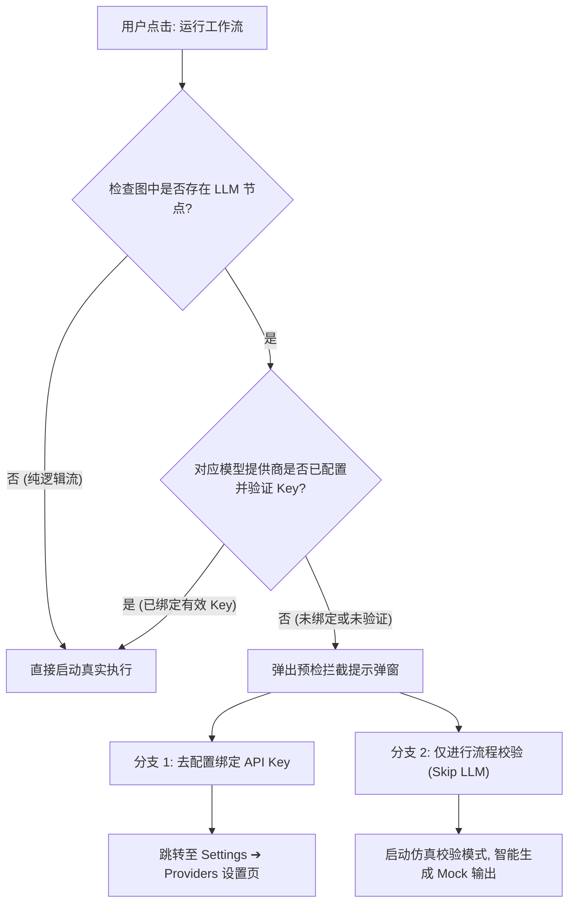

# 运行前模型校验与流程仿真验证 (Preflight Check & Dry-Run Validation)

> **模块名称**: Preflight Model Check & Flow Simulation Engine  
> **文档版本**: 1.0.0  
> **作者**: PatchCat 核心架构组  
> **最后更新**: 2026-09-02  

---

## 1. 业务场景与痛点

在可视化 AI 工作流编排中，用户经常在未配置对应大模型 API Key（或刚导入新模板）的情况下直接点击“运行工作流”。这会导致：
1. **调用中断与异常报错**：节点执行到中途突然报 401 Unauthorized，导致下游节点无法继续，浪费排查时间。
2. **调试成本高**：开发者可能只是想验证 DAG 拓扑、连线是否正确、JavaScript 代码节点逻辑是否通顺，并不想立即消耗真实的 Token 或配置外部 Key。

---

## 2. 解决方案设计：双分支预检交互机制

在用户点击“运行工作流 (Run Workflow)”时，系统首先执行**前置飞行检查 (Preflight Model Check)**：



---

## 3. 仿真校验模式 (Dry-Run Flow Validation) 技术实现

### 3.1 引擎参数扩展 (`src/engine/types.ts`)
```typescript
export interface ExecutionContext {
  // ...
  skipLLM?: boolean; // 为 true 时跳过真实网络请求，进入仿真模式
}
```

### 3.2 智能 Mock 数据模拟 (`src/engine/browser-engine.ts`)
在 `skipLLM` 模式下，大模型调用节点（LLM Node）不会发起真实的 `fetch` 请求，而是根据当前节点的目标用途生成结构合理的仿真数据：
- **JSON 路由/分类器节点**：若提示词中包含 `category`、`intent`、`JSON` 等关键词，自动模拟结构化 JSON 输出（如 `{"category": "logistics", "urgency": "high"}`），确保下游的 JavaScript Code 路由节点可以顺利解析并分发到对应分支。
- **通用问答/润色节点**：输出标准模拟回复文本 `[Simulated LLM Output] Workflow validation completed for node ...`。

### 3.3 单元测试保证 (`tests/engine.node.test.ts`)
通过完整的自动化测试验证了：
1. 包含未绑定 Key 的多节点工作流在 `skipLLM: true` 下能够跑通全部下游链路。
2. 结构化 JSON 分支决策逻辑在仿真模式下能准确走向预期分支。
