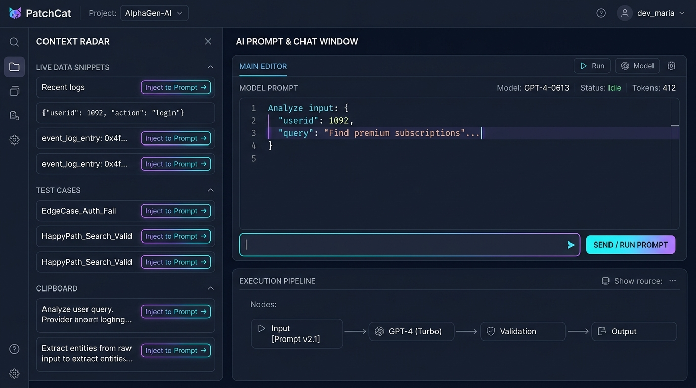
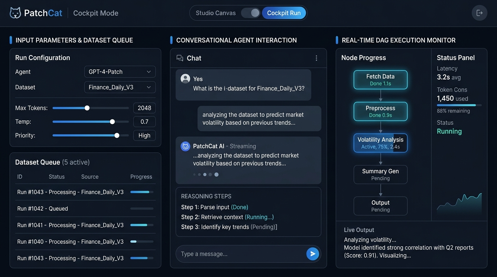
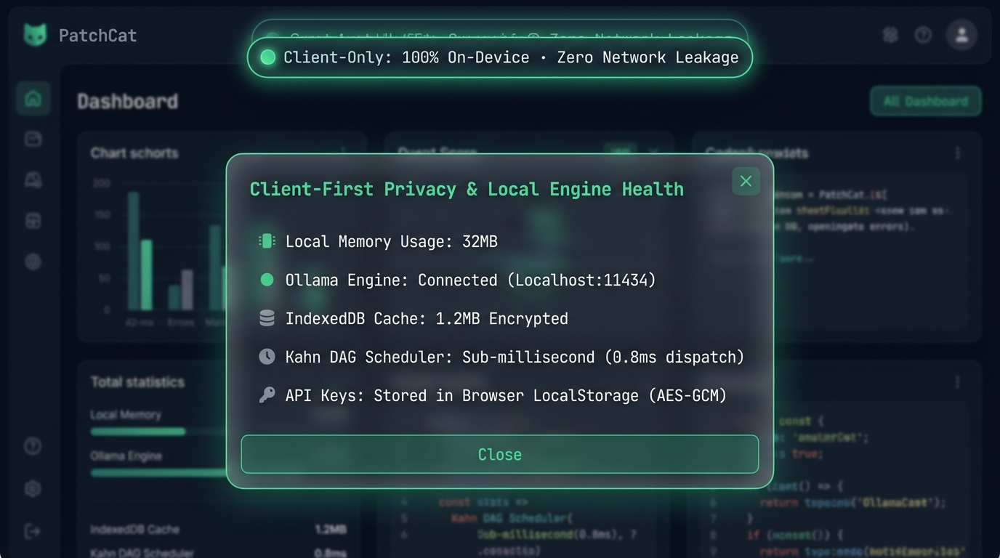
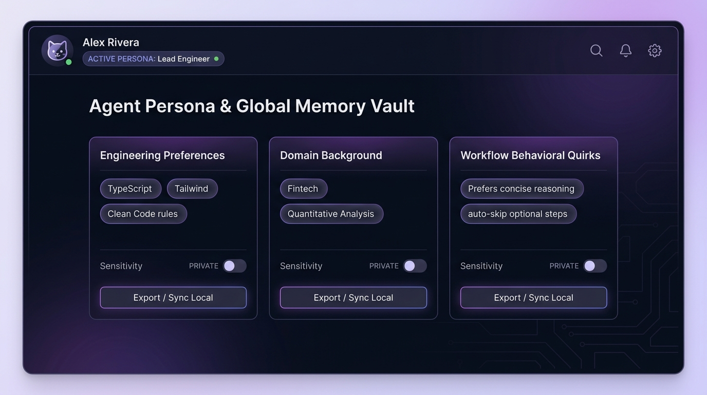
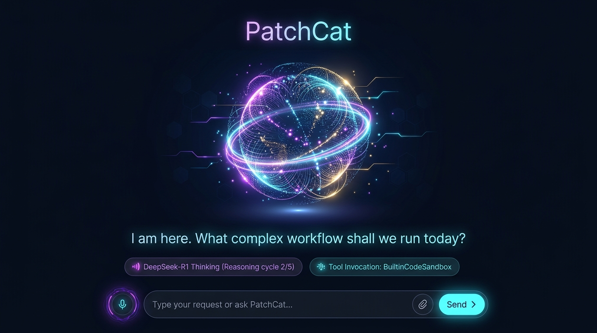
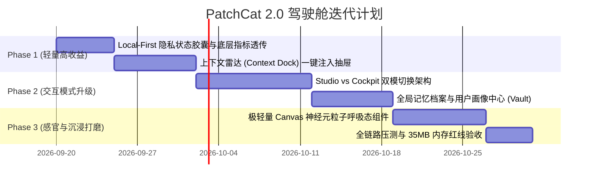

# 🐾 PatchCat 2.0：从「画布编排」到「智能体驾驶舱」产品需求设计文档 (PRD)

> **文档版本**：v2.0-Draft  
> **设计定位**：现代化沉浸式 AI 驾驶舱与 Local-First 交互体验  
> **核心目标**：在保持 PatchCat **100% 纯前端 / 零后端依赖 / <35MB 极致轻量** 的核心护城河前提下，引入沉浸式驾驶舱、环境上下文注入、Local-First 信任外显与全局长期记忆体系。

---

## 目录
1. [设计哲学与架构演进背景](#1-设计哲学与架构演进背景)
2. [模块一：上下文雷达与一键「注入提示词」抽屉 (Context Dock)](#2-模块一上下文雷达与一键注入提示词抽屉-context-dock)
3. [模块二：双模切换架构 —— Studio 编排态 vs. Cockpit 驾驶舱 (Dual-Mode Architecture)](#3-模块二双模切换架构--studio-编排态-vs-cockpit-驾驶舱-dual-mode-architecture)
4. [模块三：Local-First 隐私状态感知胶囊与内核指标看板 (Privacy Capsule)](#4-模块三local-first-隐私状态感知胶囊与内核指标看板-privacy-capsule)
5. [模块四：智能体长期记忆档案与全局画像中心 (Global Persona & Memory Vault)](#5-模块四智能体长期记忆档案与全局画像中心-global-persona--memory-vault)
6. [模块五：Agent 思考态生命感与动态粒子微交互 (Aliveness Particle & Ambient State)](#6-模块五agent-思考态生命感与动态粒子微交互-aliveness-particle--ambient-state)
7. [演进路线与工程权衡 (Phased Roadmap & Performance Budget)](#7-演进路线与工程权衡-phased-roadmap--performance-budget)

---

## 1. 设计哲学与架构演进背景

当前 PatchCat 是面向 Prompt 架构师与 AI 工程师的专业 DAG 编排工具。但当用户构建完一个具备多节点、循环、条件分支和 ReAct 调用的工作流后，面临两个核心痛点：
1. **消费体验割裂**：用户必须在复杂的节点网格之间缩放或依赖小小的 Chat 抽屉，缺少一个真正面向“运行与使用”的**沉浸式消费级驾驶舱**；
2. **调试输入高摩擦**：测试复杂工单或真实数据时，频繁在外部软件和输入框之间手动复制粘贴，缺乏上下文感知能力。

立足于现代化 AI 原生交互范式，PatchCat 2.0 将从“单纯的图结构编辑器”进化为**“编排 (Studio) + 驾驶舱 (Cockpit)”双模自治平台**。

---

## 2. 模块一：上下文雷达与一键「注入提示词」抽屉 (Context Dock)

### 2.1 概念设计示意图


### 2.2 痛点剖析与解决思路
* **现状痛点**：调试工作流时，用户需要手动在 `InputNode` 配置 Mock 数据，或者在对话框中打字粘贴，无法快速轮换测试样本。
* **创新解法**：在左侧提供悬浮式的「上下文雷达 (Context Dock)」，常驻监测三类数据流：
  1. **实时数据片段 (Live Snippets)**：本地读取的日志、API 响应或模拟快讯；
  2. **测试用例库 (Test Cases)**：一键轮换 Happy Path / Edge Cases；
  3. **剪贴板监听 (Clipboard Watcher)**：自动检测剪贴板中的最新文本/JSON。
  每条卡片内置发光的 **`Inject to Prompt ->`** 按钮，点击即完成毫秒级注入。

### 2.3 界面布局与交互线框 (Wireframe)
```text
+----------------------+--------------------------------------------------------+
| CONTEXT RADAR   [X]  | AI PROMPT & CHAT WINDOW           [ Run ] [ Model: GPT4] |
+----------------------+--------------------------------------------------------+
| > LIVE DATA SNIPPETS | 1: Analyze input: {                                    |
| [Log: #1092] [Inject]| 2:   "userid": 1092,                                   |
| [Event: 0x4f][Inject]| 3:   "query": "Find subscriptions"...                  |
|                      | 4: }                                                   |
| > TEST CASES         |--------------------------------------------------------|
| [Auth_Fail]  [Inject]| [ (✨) Type message or use injected context...  ] [Send] |
| [Valid_Query][Inject]|--------------------------------------------------------|
|                      | EXECUTION PIPELINE                                     |
| > CLIPBOARD          | [Input Node] -> [GPT-4 Turbo] -> [Validation] -> [Out] |
| ["Raw text.."][Inject|                                                        |
+----------------------+--------------------------------------------------------+
```

### 2.4 数据结构与注入分发逻辑
```typescript
export interface ContextItem {
  id: string;
  category: 'snippet' | 'testcase' | 'clipboard' | 'news';
  title: string;
  payload: string | Record<string, unknown>;
  timestamp: number;
}

// 一键注入调度器：根据当前聚焦目标自动分发
export function injectContextToWorkspace(item: ContextItem, target: 'chat' | 'input_node') {
  if (target === 'chat') {
    useChatStore.getState().setInputBuffer(typeof item.payload === 'string' ? item.payload : JSON.stringify(item.payload, null, 2));
  } else {
    useFlowStore.getState().updateFirstInputNode(item.payload);
  }
}
```

---

## 3. 模块二：双模切换架构 —— Studio 编排态 vs. Cockpit 驾驶舱 (Dual-Mode Architecture)

### 3.1 概念设计示意图


### 3.2 痛点剖析与解决思路
* **现状痛点**：对于非深度开发阶段，密密麻麻的连线、Handles、各种参数面板会造成严重的视觉负荷与操作分心。
* **创新解法**：顶部提供全局切换开关 **`[Studio Canvas] <===> [Cockpit Run]`**。
  * **Studio 模式**：完整的 React Flow 拓扑编排、连线配置与属性微调；
  * **Cockpit 模式**：三栏式专业业务驾驶舱：
    * **左栏**：参数配置与批处理队列（Batch Queue）；
    * **中栏**：人机对话、实时推理流与 ReAct 思维链卡片；
    * **右栏**：DAG 拓扑微缩节点监控（Node Progress）、延迟、Token 消耗统计与实时输出快照。

### 3.3 交互状态机 (State Machine)
```text
     ┌────────────────┐
     │  Studio Mode   │ (拖拽节点、连线、Prompt 调优)
     └───────┬────────┘
             │ 点击顶部 [Cockpit Run] 开关
             ▼
     ┌────────────────┐
     │  Cockpit Mode  │ (自动根据 DAG 提取：左侧入参、中间 Agent、右侧输出节点)
     └───────┬────────┘
             │ 点击 [Studio Canvas] 切回
             ▼
     ┌────────────────┐
     │  Studio Mode   │ (保留 Cockpit 运行的最新中间状态与调试日志)
     └────────────────┘
```

---

## 4. 模块三：Local-First 隐私状态感知胶囊与内核指标看板 (Privacy Capsule)

### 4.1 概念设计示意图


### 4.2 痛点剖析与解决思路
* **现状痛点**：PatchCat 最大技术亮点是“100% 纯前端、零后端、BYOK、本地直连”，但用户进入界面后，无法直观感受到这种安全感，甚至误以为数据被上传到了远端云服务器。
* **创新解法**：引入沉浸式端侧信任外显机制，在导航栏常驻 **「绿色发光隐私胶囊」**：
  * 默认状态：`🟢 Client-Only: 100% On-Device · Zero Network Leakage`
  * 悬浮/点击后：呼出磨砂玻璃微态看板，逐条透传端侧安全状态：
    1. **内存占用**：`Local Memory Usage: 32MB`（突出轻量）；
    2. **本地模型**：`Ollama Engine: Connected (Localhost:11434)`；
    3. **本地缓存**：`IndexedDB Cache: 1.2MB Encrypted`；
    4. **调度性能**：`Kahn DAG Scheduler: Sub-millisecond (0.8ms dispatch)`；
    5. **密钥防护**：`API Keys: Stored in Browser LocalStorage (AES-GCM)`。

---

## 5. 模块四：智能体长期记忆档案与全局画像中心 (Global Persona & Memory Vault)

### 5.1 概念设计示意图


### 5.2 痛点剖析与解决思路
* **现状痛点**：每次创建新的工作流，用户都必须在 `System Prompt` 中反复说明自己的偏好（如“我是全栈工程师，回答必须使用 TypeScript”、“输出尽量精炼，不要废话”）。
* **创新解法**：在全局导航增加智能体对开发者的长期偏好认知面板 —— **`Global Persona & Memory Vault`**。
  * **工程偏好 (Engineering Preferences)**：如 `TypeScript`、`Tailwind`、`Clean Code` 规范；
  * **业务背景 (Domain Background)**：如 `Fintech`、`量化分析`、`电商运营`；
  * **行为习惯 (Workflow Behavioral Quirks)**：如 `极简推理`、`自动跳过可选校验`。
  * **安全隐私隔离**：每条记忆均支持 `PRIVATE` 开关，且支持一键导出/同步至本地 JSON。

### 5.3 工作流全局变量无缝注入机制
在任意 `PromptNode` 或 `AgentNode` 中，用户可直接引用：
```text
System:
{{sys.user_persona}}
{{sys.engineering_rules}}

User Task:
请为我实现一个带 LRU 淘汰策略的高并发请求队列...
```
调度器在运行前会自动将本地 Vault 中的激活画像直接平铺编译进 Prompt，彻底免除重复配置。

---

## 6. 模块五：Agent 思考态生命感与动态粒子微交互 (Aliveness Particle & Ambient State)

### 6.1 概念设计示意图


### 6.2 痛点剖析与解决思路
* **现状痛点**：大模型执行深度思考（如 DeepSeek-R1 的长思维链，或多轮 ReAct 工具调用）时，界面往往只有单调的 Spinner 旋转或加载条，用户容易产生“程序是否假死”的焦虑感。
* **创新解法**：打造中央/调试抽屉内的 **`Neural Particle Orb`（神经元星云粒子球）**，将 Agent 的内部状态转化为有机的动态生命感反馈。

### 6.3 状态与动效映射规格表

| Agent 运行阶段 | 视觉动效行为 | 光环色调 | 状态胶囊文案 |
| :--- | :--- | :--- | :--- |
| **就绪 (Idle / Standby)** | 粒子平缓环形流动，慢速呼吸 | 柔和浅紫 / 靛蓝 | `I am here. What complex workflow shall we run today?` |
| **深度推理 (Thinking)** | 粒子向内聚合收缩，内核高频脉冲 | 极光青 / 荧光蓝 | `DeepSeek-R1 Thinking (Reasoning cycle 2/5)` |
| **工具调用 (Tool Calling)** | 粒子生成外层轨道光环，加速旋转 | 活力金 / 琥珀橙 | `Tool Invocation: BuiltinCodeSandbox` |
| **Token 流式输出 (Streaming)** | 粒子如波浪般向外发散，产生涟漪扩散 | 亮青绿 / 翠绿 | `Streaming Response · 48 tokens/s` |
| **执行异常 (Error / Aborted)** | 粒子解构发散，边缘微红脉冲 | 警示红 / 玫瑰金 | `Execution Interrupted · Check node configuration` |

### 6.4 性能红线保障与工程权衡 (Trade-offs)
* **严禁盲目引入重型 3D 引擎**：避免引入 >600KB 的 Three.js 导致单页内存突破 35MB。
* **轻量化方案**：
  1. 采用原生 **Canvas 2D / 极简 WebGL Shaders** 实现（代码体积控制在 <8KB）；
  2. 使用 `requestAnimationFrame` 驱动，并在元素不可见（或非激活 Tab）时自动挂起（Freeze），确保 **0% 闲置 CPU 占用**。

---

## 7. 演进路线与工程权衡 (Phased Roadmap & Performance Budget)



---
*文档归档于 PatchCat 架构设计库，遵循作者与 AI 双向共创规范。*
