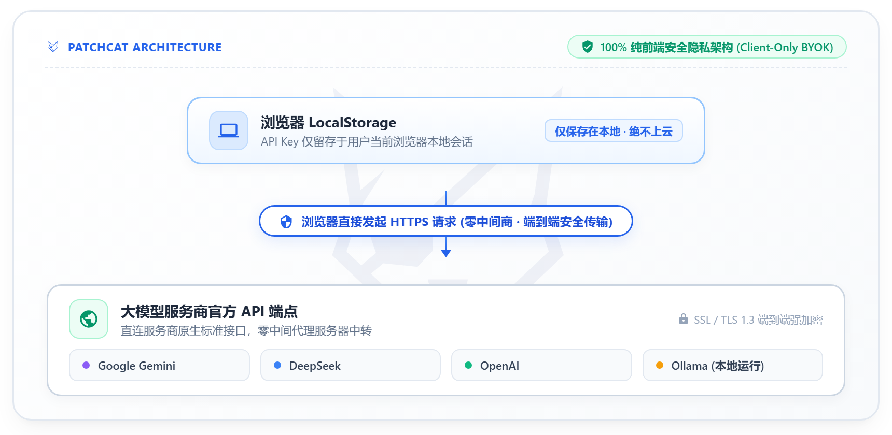
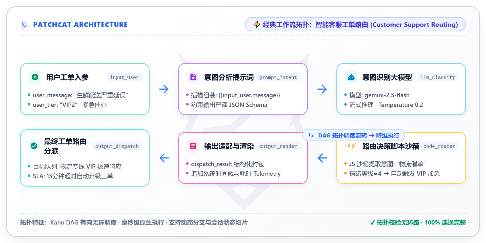

# 🚀 PatchCat 快速入门指南 (Quick Start)

> **定位**：确定性 AI 工作流引擎 · 交互式实验工坊 (Deterministic AI Workflow Engine · Interactive Playground)

欢迎来到 **PatchCat**！PatchCat 既是一套工业级高可靠的确定性 AI 工作流编排引擎，也是专为 AI 工程师、架构师与学习探索者打造的“白盒化交互式实验工坊”（Playground）。本指南将带您在 **5 分钟内** 从零上手——无论您是否拥有商业模型 API Key，均可沉浸式探索拓扑调度、容错验证与真实模型编排。

---

<div align="center">
  <p>
    <strong><a href="quick-start.md">English</a></strong> | <strong><a href="quick-start-zh.md">简体中文</a></strong>
  </p>
</div>

---

## 📋 您将学到什么

完成本快速上手教程后，您将掌握：
1. 如何在本地环境中**一键启动 PatchCat**。
2. 如何在**免 API Key 离线模式**下体验拓扑调度、变量插槽解析与环路死锁检测。
3. 如何通过自带 API Key 模式（BYOK）**直连主流大模型**（Google Gemini、DeepSeek、OpenAI 或本地 Ollama）。
4. 如何**运行工业级预置工作流**（智能客服意图识别与工单极速路由派发）。
5. 如何使用**字级流式吐字、DeepSeek 思考链可视化与三级安全脱敏日志控制台**。
6. 如何从零开始**搭建与自定义自己的可视化 DAG 工作流与实验场景**。

---

## 🛠️ 前置准备

在开始之前，请确保您的电脑具备以下环境：
- [Node.js](https://nodejs.org/) `>= 18.0.0`
- [npm](https://www.npmjs.com/) `>= 9.0.0` 或 [pnpm](https://pnpm.io/)
- 现代浏览器（Chrome、Edge、Firefox、Safari 等）
- *(可选，用于真实大模型调用)* 任意一个受支持的服务商 API Key（如暂无 Key，可直接使用内置免 Key 实验工坊体验）：
  - 🔵 **Google Gemini**（推荐，可在 [Google AI Studio](https://aistudio.google.com/app/apikey) 免费申请获取）
  - 🐳 **DeepSeek**（可在 [DeepSeek 开放平台](https://platform.deepseek.com/api_keys) 获取）
  - 🟢 **OpenAI**（可在 [OpenAI Platform](https://platform.openai.com/api-keys) 获取）
  - ⚡ **SiliconFlow 硅基流动**（可在 [SiliconFlow 控制台](https://cloud.siliconflow.cn/) 获取）
  - 🦙 **Ollama 本地大模型**（本地运行 `http://localhost:11434`）

---

## 📦 第一步：启动 PatchCat

### 1. 克隆代码仓库
```bash
git clone https://github.com/GuoBug/PatchCat.git
cd PatchCat
```

### 2. 安装项目依赖
```bash
npm install
```

### 3. 启动开发服务器
```bash
npm run dev
```
打开浏览器访问 **`http://localhost:5173`**，即可看到 PatchCat 的可视化编排画布。

---

## 🔑 第二步：配置大模型服务商（自带 Key 模式）

PatchCat 采用 **100% 纯前端安全隐私架构**：您的 API Key 仅保存在当前浏览器的 `LocalStorage` 中，发起请求时直连模型服务商官方 API，**绝不会经过任何第三方中间服务器**。

<p align="center">
  
</p>


1. 点击顶栏右侧的 **`API Key`** 按钮（或钥匙图标）。
2. 在左侧服务商列表中选择您要使用的服务商（例如 **Google Gemini**）。
3. 将您的 API Key 粘贴到输入框中。
4. 点击 **`测试连通性 (Test Connection)`**：
   - 系统将自动探测端点连通性，并自动拉取所有可用模型（如 `gemini-2.5-flash`、`gemini-2.5-pro`、`gemini-2.0-flash`）。
5. 点击左上角的 **`← 返回画布 (Back to Canvas)`**，顶栏服务商指示灯将变为绿色，表示已就绪！

> [!TIP]
> **推荐模型**：针对 Google Gemini 服务商，强烈推荐选择 **`gemini-2.5-flash`**，响应速度极快且在高并发免费层下稳定性极佳。

---

## 🎯 第三步：运行您的第一个智能体工作流

首次进入系统时，PatchCat 会默认加载 **`Customer Support Routing (智能客服工单路由)`** 预设模板。

### 了解工作流拓扑结构
该工作流由 5 个经典节点组成：

<p align="center">
  
</p>

### 执行工作流
1. 点击右上角蓝色的 **`▶ Run Workflow`** 按钮。
2. 观察实时执行流：
   - 节点状态由 `idle` ➔ `running`（带旋转动画）➔ `success`（显示耗时徽章）。
   - 大模型节点在画布上以流式打字机效果吐出结果。
   - JavaScript 代码节点自动清洗提取 JSON，识别到意图为 `物流催单` 且情绪等级为 `4`，自动派发至 **`🚀 物流专线极速客服队列 (Logistics VIP)`**。
3. 点击画布上的任意节点，右侧将弹出**属性检查面板**，可实时查看入参配置、Prompt 模板或执行结果 JSON。

---

## 🔍 第四步：查看实时遥测与三级安全脱敏日志

PatchCat 内置了专业的遥测日志引擎与设置中心控制台。

1. 点击顶栏的 **`设置 (Settings)`** 按钮，在左侧导航栏切换至 **`运行日志 (Logs)`** 标签页。
2. 自由切换 **三级日志登记等级**：
   - **`概要 (Summary)`**：记录系统启停（`START` / `COMPLETE` / `ERROR`）、请求方法/状态码/耗时与异常报错。
   - **`详细 (Detailed)`**：补充记录节点 ID、模型运行参数（`model`, `temperature`, `max_tokens`）与拓扑波次。
   - **`开发 (Development)`**：记录完整的 Prompt 输入、变量解析全文与大模型输出。
3. **严格安全脱敏保障**：在任何日志级别（包括开发版）中，所有的 API Key（`sk-***`、`AIzaSy***`）、Bearer 令牌及密码字段一律自动掩码为 `***[MASKED]***`，杜绝任何信息泄露。
4. **控制台实用功能**：
   - **类型过滤**：按 `全部`、`系统`、`请求`、`节点`、`异常`、`安全` 快速筛选。
   - **搜索日志**：支持关键词与节点 ID 实时高亮搜索。
   - **展开 Payload**：点击 `详情 Payload` 查看格式化 JSON 树并一键复制。
   - **一键导出**：支持导出为 `.json` 或 `.txt` 文件。

---

## 🎨 第五步：从零构建自定义工作流

想编排属于自己的全新 AI 流水线？只需简单四步：

### 1. 添加节点
点击顶部导航栏的 **`+ Add Node`** 下拉菜单，可随时添加 5 种标准节点：
- **`Input (输入)`**：定义自定义入参字段与数据类型（字符串、数值、布尔值、JSON）。
- **`Prompt (提示词)`**：编写带有 `{{nodeId.property}}` 插槽的动态提示词。
- **`LLM (大模型)`**：选择模型（Gemini, DeepSeek, OpenAI）、调整 Temperature 采样温度与 System Prompt。
- **`Code (代码脚本)`**：编写自定义 JavaScript 脚本，处理数据转换与条件分支。
- **`Output (输出)`**：格式化展示最终运行结果。

### 2. 连接连线
按住源节点的右侧锚点（输出端口），拖拽连线至目标节点的左侧锚点（输入端口）。

### 3. 动态插槽变量解析语法
PatchCat 支持优雅强大的 Mustache 风格变量插槽：
```handlebars
// 基础节点字段引用
{{input_node.user_query}}

// 深层嵌套对象与数组索引访问
{{llm_node.response.items[0].name}}

// 安全容错默认值（防止字段为空导致异常）
{{input_node.optional_vip_tag | "STANDARD_USER"}}
```

### 4. Kahn 拓扑排序与环路安全防护
PatchCat 底层运行高效的 **Kahn 拓扑算法**：
- **同层并行波次加速**：无上下游依赖的节点自动以 `Promise.all` 并发执行。
- **毫秒级环路死锁检测**：若连线形成循环（如 $A \to B \to A$），系统会毫秒级检测并标红报错，弹出告警横幅阻止无限死循环。

---

## 🧪 第六步：免 Key 交互式实验工坊 (Zero-Key Playground)

PatchCat 不仅是一个工业级的工作流运行时，更是一个面向 AI 编排算法与确定性架构的**交互式实验工坊**。即使在完全离线或无 API Key 的情况下，您也可以完整体验和研究核心工程原语：

### 1. 流程流转与拓扑调度校验（Validate Flow Only）
无需配置任何 API Key，在未绑定 Key 状态下点击 **`Run Workflow`**，选择 **`仅校验流程流转 (Validate Flow Only)`**：
- 引擎将安全跳过真实网络调用，专注于验证整张 DAG 的 Kahn 拓扑排序、同层并发波次与连线依赖；
- 验证 Mustache 变量插槽（如 `{{nodeId.property}}`）的解析正确性与默认值容错；
- 实时追踪单步节点状态与下游上下文传递。

### 2. 环路死锁攻防实验 (Cycle Deadlock Testing)
- 尝试在画布中拖拽连线，从节点 B 连回节点 A，构建闭环；
- 点击运行，观察 PatchCat 调度器如何在毫秒级拦截环路、定位并高亮标红成环节点，给出确定性阻断告警。

### 3. 本地确定性契约测试套件
在终端中执行内置的架构断言套件，深入探究确定性状态机与结构化输出契约：
```bash
# 运行全部确定性契约测试
npm test

# 运行真实模型结构化输出对比评测
npm run test:ab
```

---

## ❓ 常见问题排查 (FAQ)

### Q1: 调用 Google Gemini 时出现 `HTTP 503 (Model Overloaded)`？
**原因**：Google 免费层针对部分预览或高并发模型（如 `gemini-3.7-flash`）偶发全球流量峰值。  
**解决办法**：点击 LLM 节点，在右侧属性面板将模型切换为稳定高吞吐的 **`gemini-2.5-flash`** 或 **`gemini-2.0-flash`**。PatchCat 也内置了 1.5 秒退避自动重试机制。

### Q2: 切换服务商后，预设模板里的模型名称不兼容怎么办？
无需担心！PatchCat 具备**跨厂商模型智能自适应映射 (`resolveTargetModel`)** 引擎，如果您将服务商切换为 Google Gemini，而模板中保留着 `gpt-4o-mini`，系统在执行时会自动平滑将其映射为 `gemini-2.5-flash`，杜绝 400/404 报错。

### Q3: 如何运行自动化测试？
PatchCat 对核心 DAG 调度、变量解析、LLM 客户端与日志脱敏实现了 100% 测试覆盖：
```bash
npm test
```

---

## 📚 延伸阅读

- 📖 查看 [系统架构详细设计文档](02-architecture/system-architecture.md)
- 📐 查看 [工作流 Graph Schema 规范](02-architecture/graph-schema-specification.json)
- 💡 查阅 [开发笔记与架构决策记录 ADR](04-dev-notes/adr-001-canvas-engine-selection.md)
- ⭐️ 前往 [GitHub 仓库](https://github.com/GuoBug/PatchCat) 点赞 Star 与参与贡献
